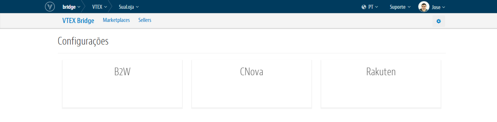
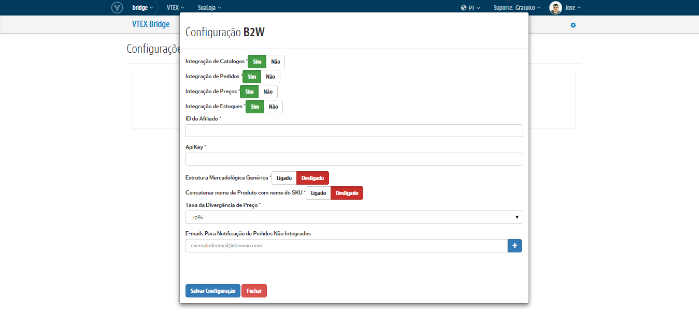

#Bridge
O **VTEX Bridge** é o módulo responsável por intermediar e gerenciar todas as comunicações entre a sua loja VTEX e os Marketplaces que a VTEX realiza a integração. Nele você controla os possíveis erros e os sucessos que ocorrer nas diversas interfaces de Pedidos, Produtos, Preços, Estoques e Tracking. Além de poder tratar esses erros e reprocessar você mesmo a reintegração na interface que se encontrar. Também terá as configurações que ativam essa integração diretamente em sua Loja.

## Visão geral

Nas diversas interfaces do Bridge teremos as coluna de **Código**, **Afiliado**, **Status** e **Data de Processamento** indicando diferentes informações sobre os registros que lhe auxiliarão a melhor controlora-los:

>Para cada uma temos:

**Código**: Indica o código do Pedido no Marketplace ou do ID do SKU na VTEX cujo o qual está relacionado o erro ou o sucesso do registrado no Bridge.

**Afiliado**: Indica qual o Marketplace que originou o respectivo registro.

**Status**: Indica o atual status do registro, podendo variar entre sucesso, erro e em processamento.

**Data de Processamento**: Indica quando a captura do sucesso ou do erro foi realizada. Isto é, por exemplo, para os pedidos com sucesso, será essa a data que indicará a criação do Pedido.

## Configurações de Marketplaces
Temos hoje integrações de caráter nativo, isto é, onde parte da VTEX a exportação do Catálogo e o consumo dos Pedidos desde o Parceiro, com os Marketplaces da **B2W**, da **CNova**, do **Walmart** (apenas para catálogo) e o da **Rakuten**:

Onde cada um destes terá um formulário de configuração com suas ações, funções, particularidades e dados que precisam ser fornecidos para ativa-las na seguin. Por exemplo na seguinte estrutura de configuração da **B2W**:

##Começando a usar

Criado para oferecer a flexibilidade máxima em relação às Configurações de Marketplace e controle do fluxo de integração tanto do Catálogo quanto de Pedidos, o VTEX Bridge também fornece a possibilidade de reprocessar eventuais erros que podem surgir durante essa comunicação com esses Parceiros. Entenda cada um deles:
> [Configurações de Marketplaces](Configurações de Marketplace.md)
> [Interface de Pedidos](interface_de_pedidos.md)
> [Interface de Produtos](interface_de_produtos.md)
> [Interface de Tracking](interface_de_tracking.md)
> [Interface de Preço](interface_de_preco.md)
> [Interface de Estoque](interface_de_estoque.md)
