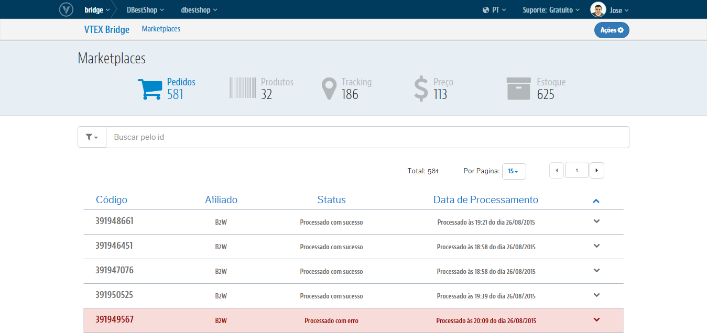

#  VTEX Bridge
O **VTEX Bridge** é o módulo responsável por intermediar e gerenciar as comunicações entre a sua loja VTEX e os Marketplaces. Nele, é possível visualizar dados sobre erros e sucessos, que ocorrem nas diversas interfaces de **Pedidos**, **Produtos**, **Preço**, **Estoque** e **Tracking**. Além de poder tratar esses erros e reprocessar você mesmo a integração na interface que se encontra.
O módulo também é encarregado das configurações que ativam as integrações diretamente em sua Loja.

>As movimentações que serão registradas no VTEX Bridge serão apenas para aqueles Marketplaces que hoje integramos de forma **ativa**. Isto é, onde somos nós quem realizamos as exportações de Produtos, Preços e Estoque e/ou onde nós capturamos os Pedidos realizados no Marketplace. Os Marketplaces que temos hoje com a integração ativa são: B2W, CNova, Rakuten, Csu, Mercado Livre, Buscapé e Walmart (apenas na parte de Produtos, Preços e Estoque. Pedidos o próprio Walmart quem insere na VTEX).

#### Observações importantes :
- O acesso ao Bridge pode ser feito no Admin da sua loja, exatamente na barra de navegação dos módulos da VTEX.
- As informações que estão no Bridge são logs da última interação de um item com o Marketplace.
- O Bridge **não** altera nenhuma informação do pedido ou do sku que está sendo integrado.
- O Bridge **não** recebe informações das integrações que não são nativas da VTEX.
- O Bridge **não** faz o reprocessamento em lote. Uma vez que cada item deve ser analisado individualmente e cada um tem uma ação necessária diferente.
- O Bridge **não** tem integração com os ERP’s.

## Visão geral

Todas as interfaces do VTEX Bridge contém as colunas de **Código**, **Afiliado**, **Status** e **Data de Processamento**. Indicando diferentes informações sobre os registros, auxiliando melhor a manipulação dos dados.

>Para cada entrada de dados temos as seguintes caracteristicas:

**Código**: Indica o código do Pedido no Marketplace ou o ID do SKU na VTEX. Também está relacionado ao registro de sucesso ou erro no VTEX Bridge.

**Afiliado**: Indica qual o Marketplace que originou o respectivo registro.

**Status**: Indica o atual status do registro, podendo variar entre sucesso, erro e em processamento.

**Data de Processamento**: Indica quando a captura do sucesso ou do erro foi realizada. Como por exemplo, para os pedidos com sucesso, onde esta será a data que indicará a criação do Pedido.

## Configurações de Marketplaces
Temos hoje integrações de caráter nativo, onde parte da VTEX a exportação do Catálogo e o consumo dos Pedidos de seus Parceiros, para os Marketplaces da **B2W**, da **CNova**, da **Csu**, do **Buscapé** e o da **Rakuten**.
Os Marketplaces que isso não occorre são o do **Mercado Livre** (pois realiza sua propria importação de catálogo) e o **Walmart** (que insere seus pedidos e o Vtex exporta).  

Onde cada um destes integradores terá um formulário de configuração com suas ações, funções, particularidades e dados que precisam ser fornecidos para ativa-las na seguinte figura. Por exemplo, na  estrutura de configuração da **CNova**:

## Combinações de Filtros

Os filtros do VTEX Bridge permitem agrupar os registros de Pedidos por **erro**, **sucesso** ou **processando**. Além de poder combinar esses filtros, com a origem de qual **Marketplace** se refere.

## Buscas Específicas

É possível buscar um registro específico de acordo com seu Código. Permitindo a busca pelo o ID do **Pedido** para as interfaces de **Pedidos** e **Tracking**. E pelo ID do **SKU** para as interfaces de **Produtos**, **Preço** e **Estoque**.

Caso queira limpar a busca e voltar para a listagem que estava anteriomente, basta clicar no "**X**" ao lado direito do campo de Busca.

## Reprocessamento de registros

Caso uma transação de uma integração não tenha ocorrido por conta de um erro, esta possuirá opções de reprocessamento após seu tratamento, permitindo o reenvio correto para o Parceiro:

## Removendo registro

A ação de Remover Log, consiste em retirar o registro da interface, a fim de "limpar" a tela. Para remover o log, clique sobre a linha e em seguida no botão "Ações", e então em "Remover Log". Esta ação pode ser feita nas integrações com ambos os status (sucesso e erro).

## Começando a usar

Criado para oferecer a flexibilidade máxima em relação as Configurações de Marketplace e controle do fluxo de integração, tanto do Catálogo quanto de Pedidos. O VTEX Bridge também fornece a possibilidade de reprocessar eventuais erros, que podem surgir durante essa comunicação com esses Parceiros. Entenda cada um deles:

* [Interface de Pedidos](interface-de-pedidos/index.html)

* [Interface de Produtos](interface-de-produto/index.html)

* [Interface de Tracking](interface-de-tracking/index.html)

* [Interface de Preço](interface-de-preco/index.html)

* [Interface de Estoque](interface-de-estoque/index.html)

* [Configurações de Marketplaces](configuracoes-de-marketplace/index.html)

---

Autor: _Ana Izabel Jacobsen_ 
Propriedade: _VTEX_ &copy; 
