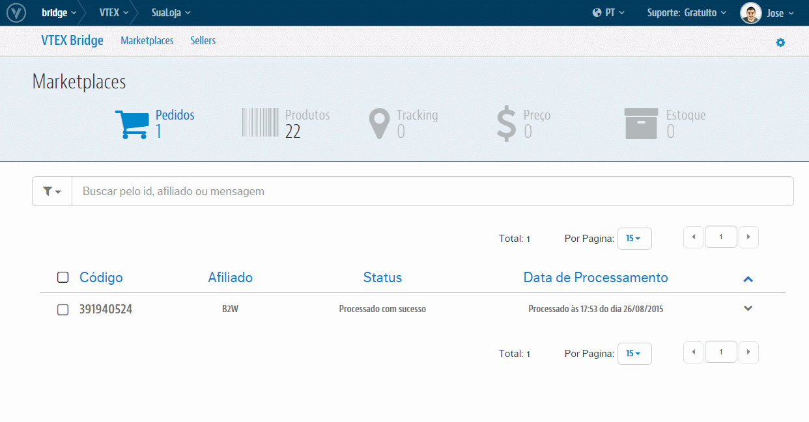

# Configurações de Marketplace

A VTEX possui hoje integrações de caráter ativo (em que nós VTEX realizamos a integração) com os Marketplaces da **B2W**, **CNova** e **Rakuten**. Teremos em seguida para cada um temos onde e o que deve ser feito para ativar essas integrações.

## Visão geral

> Para cada um destes Parceiro temos as seguintes configurações:
  > [B2W](b2wmd.md)
  > [CNova](cnova.md)
  > [Rakuten](rakuten.md)
