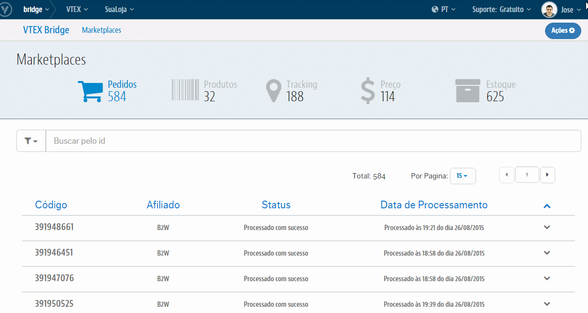

##Configurações B2W
>Visão do painel de configuração:

>>Para cada campo temos:

* **Integração de Produtos**: Liga ou Desliga a exportação de Produtos

* **Integração de Pedidos**: Liga ou Desliga a exportação de Pedidos

* **Integração de Preço**: Liga ou Desliga a exportação de Preços

* **Integração de Estoques**: Liga ou Desliga a exportação de Estoque

* **ApiKey**: Chave de identificação da sua Loja no Marketplace fornecida diretamente pela B2W

* **Id do Afiliado**: ID do Afiliado da Rakuten cadastrado em OMS > Configurações > Afiliados > ID

* **Taxa da Divergência de Preço**: Taxa de aceitação da divergência de valor no Pedido integrado

* **Estrutura Mercadológica Genérica**: Quando ativada essa função, caso o dado de EAN cadastrado no SKU seja inválido ou esteja nulo, não enviaremos a tag deste campo no objeto do SKU.

* **Concatenar nome de Produto com nome do SKU**: Quando ativada essa função, a exportação dos SKUs para a B2W terá um tratamento onde o nome do Produto irá concatenar com o nome do SKU

* **Mapeamento de Especificações de SKU**:  Essa função, se ativa, surge efeito apenas se acordado sua necessidade com a B2W. Por exemplo para uma Loja que vende anéis e usa uma especificação de nome "Aro". Este precisa ser mapeado de "Aro" para "TAMANHO" para atender o consuma do Parceiro

* **E-mails Para Notificação de Pedidos Não Integrados**: Caso um Pedido sofra algum erro no ato de integrar na VTEX, será enviado um email com sua possível causa para o(s) email(s) aqui cadastrado(s)

>>>Feitas as devidas configurações no VTEX Bridge, basta finalizar o restante das configurações nos demais módulos da VTEX:

* [Demais configurações para o Marketplace da B2W](http://help.vtex.com/hc/pt-br/articles/206105948-B2W-Configura%C3%A7%C3%B5es-de-Marketplace)
