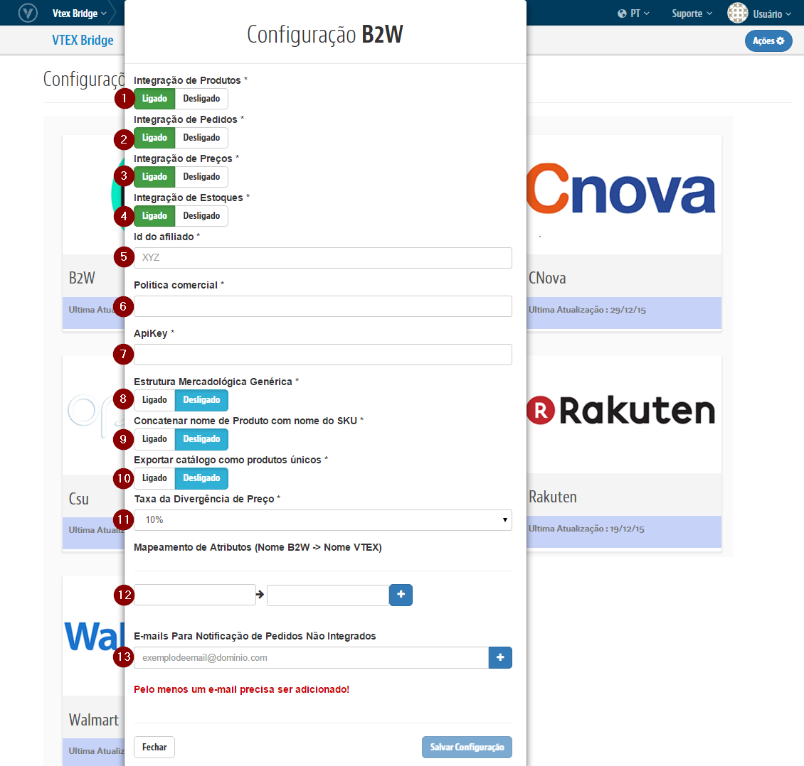

# Configurações iniciais com a  B2W

## Primeiros Passos

> A B2W **não** precisa de contratação de Channel.

1. Caso deseje usar a mesma politica (Ou seja, as mesmas regras para sortimento, promoções e condições de entrega da loja) use a politica comercial "1".
Caso contrario leia este link [Seleção de política comercial.](http://help.vtex.com/hc/pt-br/articles/214166227)

2. Caso sua politica comercial seja diferente de 1: [Configure a logística para essa política comercial.](http://help.vtex.com/hc/pt-br/articles/214166667-Atualiza%C3%A7%C3%A3o-de-estoque)

3. Entrar em contato com a B2W e obtenha o Token de acesso a API:

 http://www.submarino.com.br/marketplace

## Bridge - Visão geral

>**Importante: As configurações realizadas no Bridge para B2W realiza a criação automatica do Afiliado no OMS e libera o Perfil de Acesso no E-Commerce.**

###Exemplo de acesso as Configurações de Marketplace

##Campos

>>Para cada campo temos:

* **Integração de Produtos**: Liga ou Desliga a exportação de Produtos.
* **Integração de Pedidos**: Liga ou Desliga a exportação de Pedidos.
* **Integração de Preço**: Liga ou Desliga a exportação de Preços.
* **Integração de Estoques**: Liga ou Desliga a exportação de Estoque.
* **Id do Afiliado**: ID do Afiliado da B2W que irá ser cadastrado no OMS.
* **Política Comercial**: ID da Política Comercial que será utilizada para o parceiro B2W.
* **ApiKey**: Chave de identificação da sua Loja no Marketplace fornecida diretamente pela B2W.
* **Estrutura Mercadológica Genérica**:
Quando essa função estiver ativa, o produto será enviado na categoria 9999 da B2W, caso o EAN (codigo de barra) cadastrado no SKU seja inválido ou  nulo, não o enviaremos.
* **Concatenar nome de Produto com nome do SKU**: Quando ativada essa função, a exportação dos SKUs para a B2W terá um tratamento onde o titulo do SKU será formado pelo nome do produto acrescido do nome do SKU (Exemplo : Sapato Social Nike - 38, onde o Sapato Social Nike é o nome do produto e  o 38 numero do SKU).
* **Exportar catálogo como produtos únicos**: Quando ativada essa opção todos os SKUS serão enviados como produtos, ou seja, não haverá agrupamento de produto.
* **Taxa da Divergência de Preço**: Taxa de tolerancia de diferença de preço entre a Vtex e o Parceiro nos Pedidos integrados [padrão: até 10% de diferença].
* **Mapeamento de Atributos (Nome B2W -> Nome VTEX)**: serve para lojistas que possuem suas especificações diferentes da B2W (Marca, tamanho, etc.).No primeiro campo deve-se colocar o nome da especificação, na B2W, que deseja mapear. No segundo campo deve colocar o nome da especificação aqui na VTEX. Exemplo: Tamanho -> TAM. Lembrando que atualmente a B2W só aceita duas especificações, COR e TAMANHO. Qualquer outro mapeamento será ignorado.
* **E-mails Para Notificação de Pedidos Não Integrados**: Caso um Pedido sofra algum erro no ato de integrar na VTEX, será enviado um email com sua possível causa para o(s) email(s) aqui cadastrado(s).

##Sobre a integração

Após as configuração acima forem concluídas, será necessário reindexar a base para que todos os itens sejam integrados corretamente.

Para isso, siga os passos abaixo:

* Com o usuário master, entre no link [nomedasualoja].vtexcommercestable.com.br/admin/Site/FullCleanUp.aspx
* Clique no botão "Reidexar Base"

> Obs.: É possível acompanhar quantos produtos estão na fila acessando o módulo de E-Commerce. Lá existe vários dashboards que mostram: o total indexado, itens ainda não enfileirado, total na fila, na fila recentemente, entre outros.

Os itens passarão por um processo de catalogação até serem de fato disponibilizados no Marketplace. Esse prazo é variável de acordo com a demanda que o MarketPlace tiver. À medida que forem exportados, serão informados os preços e itens disponíveis em estoque de cada produto. Toda vez que houver uma alteração no preço de um produto, as informações serão atualizadas junto ao Marketplace. As atualizações relacionadas aos itens em estoque funcionam online toda vez que tiverem 5 unidades ou menos em estoque. Movimentações de estoques diferente dessa regra, não é indexada.
