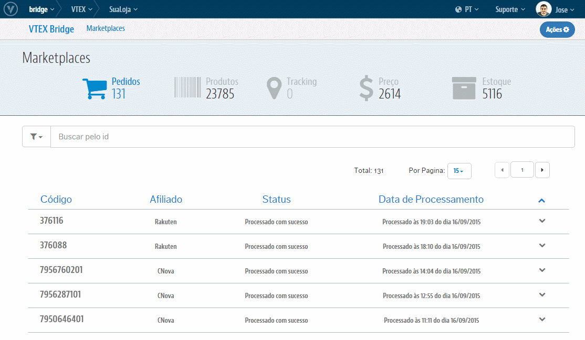
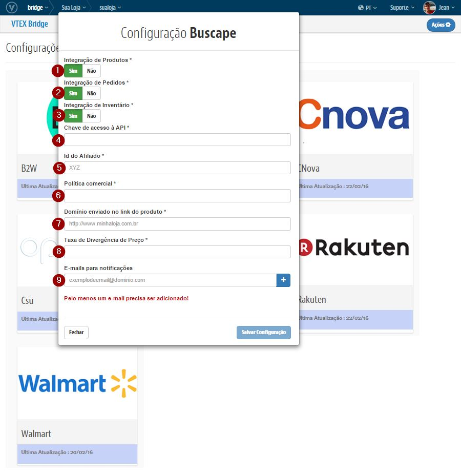

## Configurações iniciais com o Buscapé

## Primeiros Passos

> O Buscapé **não** precisa de contratação de Channel.

1. [Seleção de política comercial.](http://help.vtex.com/hc/pt-br/articles/214166227)

2. [Configure a logística para essa política comercial.](http://help.vtex.com/hc/pt-br/articles/214166667-Atualiza%C3%A7%C3%A3o-de-estoque)

3. Entrar em contato com a Buscapé e obtenha o Token de acesso a API:

 thiago.rotondo@buscapecompany.com

## Bridge - Visão geral

>**Importante: As configurações realizadas no Bridge para Buscapé realiza a criação automatica do Afiliado no OMS e libera o Perfil de Acesso no E-Commerce.**

### Exemplo de acesso as Configurações de Marketplace

## Campos

>>Para cada campo temos:

* **Integração de Produtos**: Liga ou Desliga a exportação de Produtos

* **Integração de Pedidos**: Liga ou Desliga a exportação de Pedidos

* **Integração de Inventário**: Liga ou Desliga a exportação de Preços e Estoques

* **Chave de Acesso à API**: Chave fornecida pelo próprio Buscapé para identificar a Loja no sistema do Parceiro

* **Id do Afiliado**: No caso do Buscapé, utilizar o padrão "BSC" (será o mesmo indicado no OMS > Afiliados)
