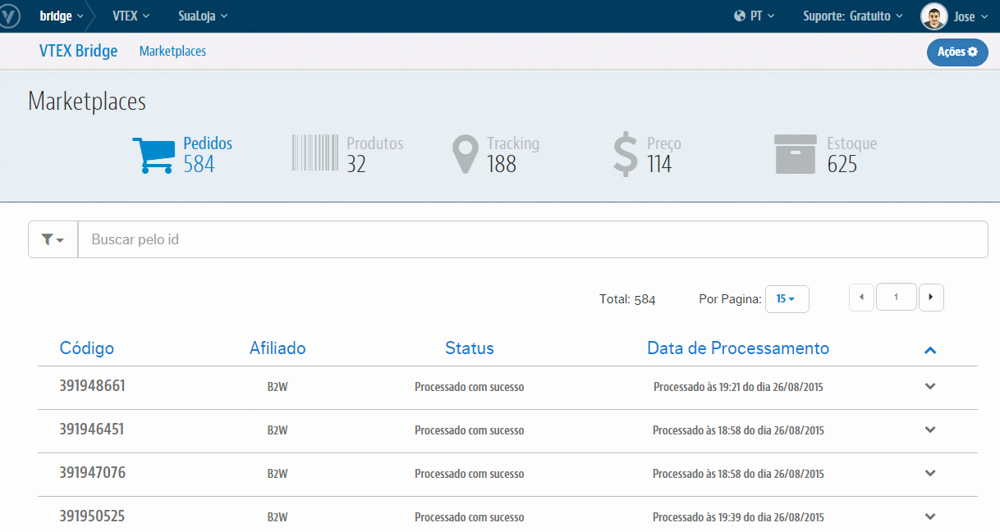
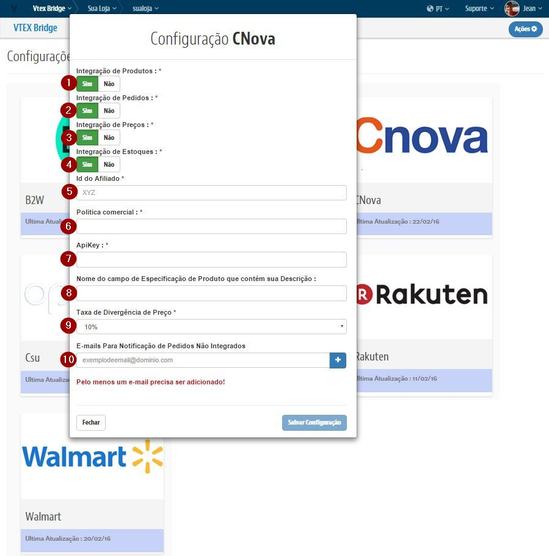

# Configurações iniciais com a Cnova

## Primeiros Passos

> A Cnova **não** precisa de contratação de Channel.

1. Caso deseje usar a mesma politica (Ou seja, as mesmas regras para sortimento, promoções e condições de entrega da loja) use a politica comercial "1".
Caso contrario leia este link [Seleção de política comercial.](http://help.vtex.com/hc/pt-br/articles/214166227)

2. Caso sua politica comercial seja diferente de 1: [Configure a logística para essa política comercial.](http://help.vtex.com/hc/pt-br/articles/214166667-Atualiza%C3%A7%C3%A3o-de-estoque)

3. Entrar em contato com a Cnova pedindo a contratação do serviço marketplace
 http://www.extra.com.br/marketplace/venda-no-extra.aspx

4. Para ter o Token de acesso entre em contato com o seu suporte (Community, Suporte Vtex ou Agência).

## Bridge - Visão geral

>**Importante: As configurações realizadas no Bridge para Cnova realiza a criação automatica do Afiliado no OMS e libera o Perfil de Acesso no E-Commerce.**

###Exemplo de acesso as Configurações de Marketplace

##Campos

>>Para cada campo temos:

* **Integração de Produtos**: Liga ou Desliga a exportação de Produtos.

* **Integração de Pedidos**: Liga ou Desliga a exportação de Pedidos.

* **Integração de Preços**: Liga ou Desliga a exportação de Preços.

* **Integração de Estoques**: Liga ou Desliga a exportação de Estoque.

* **ApiKey**: Chave de identificação da sua Loja no Marketplace fornecida diretamente pela Cnova.

* **Id do Afiliado**:ID do Afiliado da Cnova que irá ser cadastrado no OMS.

* **Politica Comercial**: ID da Política Comercial que será utilizada para o parceiro Cnova.

* **Taxa da Divergência de Preço**: Taxa de tolerancia de diferença de preço entre a Vtex e o Parceiro nos Pedidos integrados [padrão: até 10% de diferença].

* **Nome do campo de Especificação de Produto que contém sua Descrição**:Caso não utilize o campo "descrição" para guardar a descrição do SKU, informe o nome do campo que contenha essa informação.

* **E-mails Para Notificação de Pedidos Não Integrados**: Caso um Pedido sofra algum erro no ato de integrar na VTEX, será enviado um email com sua possível causa para o(s) email(s) aqui cadastrado(s).

##Sobre a integração

Após as configuração acima forem concluídas, será necessário reindexar a base para que todos os itens sejam integrados corretamente.

Para isso, siga os passos abaixo:

* Com o usuário master, entre no link [nomedasualoja].vtexcommercestable.com.br/admin/Site/FullCleanUp.aspx
* Clique no botão "Reidexar Base"

> Obs.: É possível acompanhar quantos produtos estão na fila acessando o módulo de E-Commerce. Lá existe vários dashboards que mostram: o total indexado, itens ainda não enfileirado, total na fila, na fila recentemente, entre outros.

Os itens passarão por um processo de catalogação até serem de fato disponibilizados no Marketplace. Esse prazo é variável de acordo com a demanda que o MarketPlace tiver. À medida que forem exportados, serão informados os preços e itens disponíveis em estoque de cada produto. Toda vez que houver uma alteração no preço de um produto, as informações serão atualizadas junto ao Marketplace. As atualizações relacionadas aos itens em estoque funcionam online toda vez que tiverem 5 unidades ou menos em estoque. Movimentações de estoques diferente dessa regra, não é indexada.
