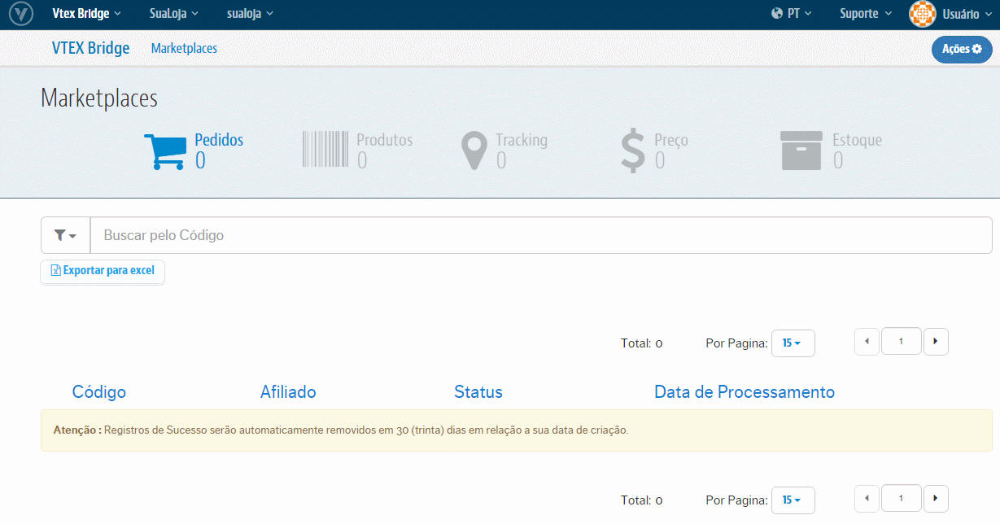
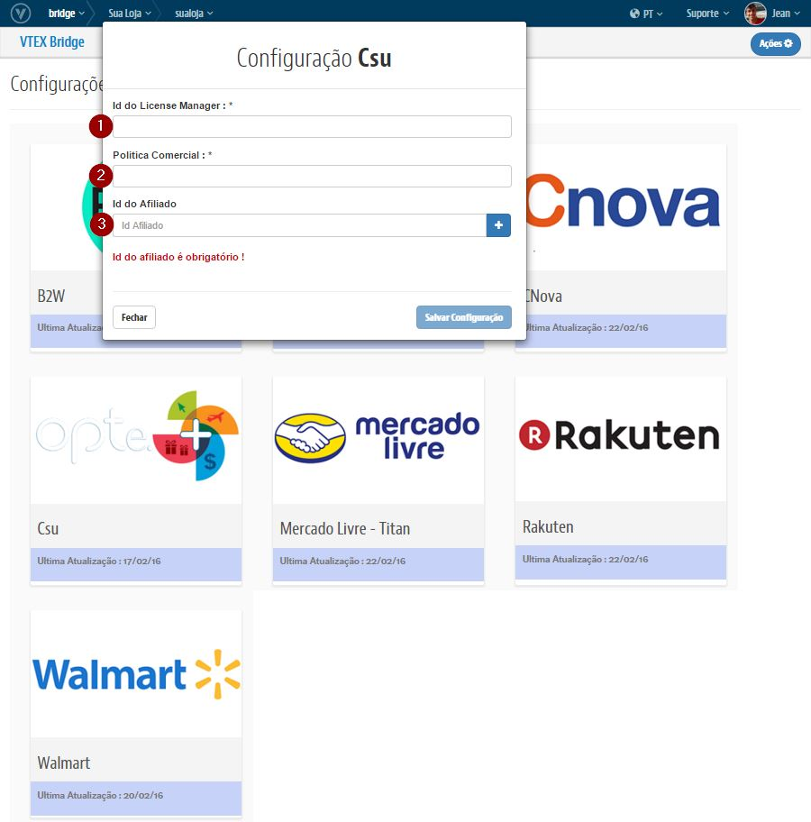

## Configurações iniciais com o CSU

## Primeiros Passos

> A CSU **não** precisa de contratação de Channel.

1. [Seleção de política comercial.](http://help.vtex.com/hc/pt-br/articles/214166227)

2. [Configure a logística para essa política comercial.](http://help.vtex.com/hc/pt-br/articles/214166667-Atualiza%C3%A7%C3%A3o-de-estoque)

3. Entrar em contato com a Buscapé e obtenha o Token de acesso a API:

 contato@optemais.com.br

## Bridge - Visão geral

### Exemplo de acesso as Configurações de Marketplace

##Campos

>>Para cada campo temos:

* **Id do LicenseManager**: Id da sua Loja presente no campo "ID*" dentro do LicenseManager;
* **Política Comercial**: ID da Política Comercial do Walmart cadastrada em OMS > Configurações > Afiliados > Política Comercial;
* **Id do Afiliado**: ID do Afiliado da B2W cadastrado em OMS > Configurações > Afiliados > ID.

## OMS

Acessar: Configurações > Afiliados > Novo Afiliado

Aqui você terá os seguintes campos para serem preenchidos:
