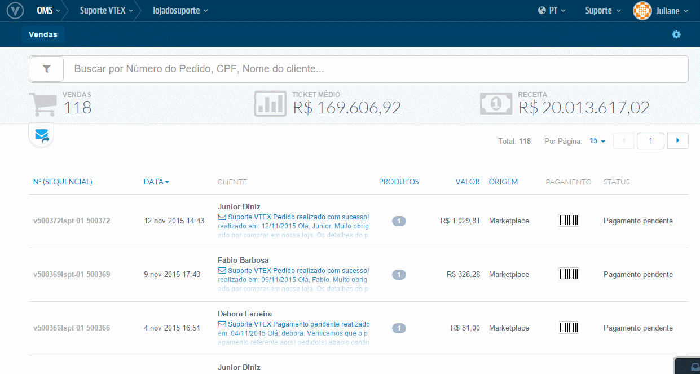
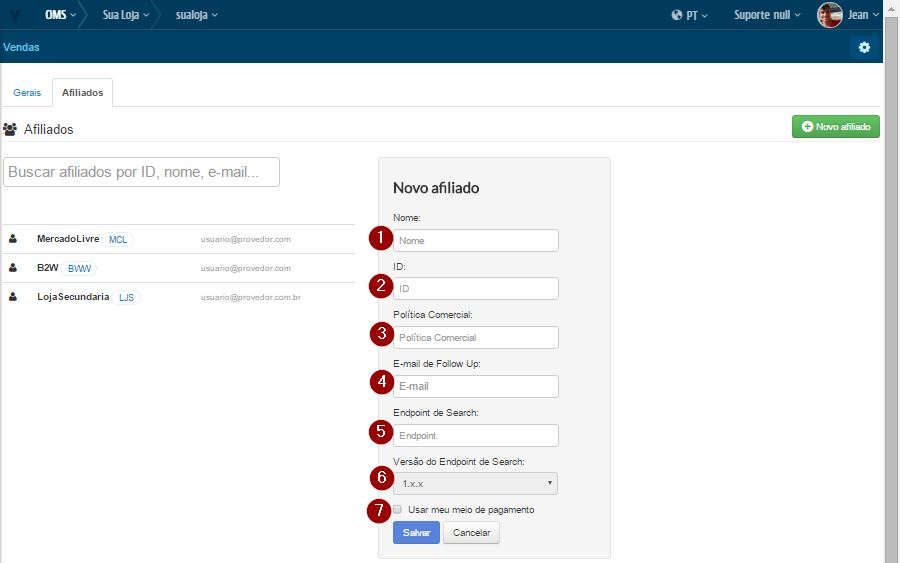
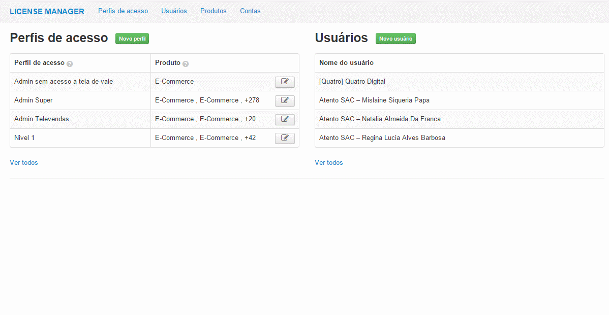
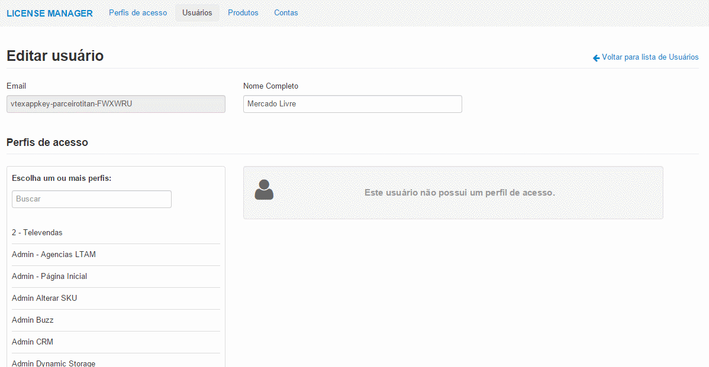

# Configurações iniciais com o CSU

Existem dois modelos de marketplace da CSU :

* **Shopping** onde pagamento é processado no gateway do seller.

* **Loyalty** onde todo processo de pagamento é feito na CSU e o Seller só recebe o pedido e autorização para despachar o pedido.

    O Bridge por enquanto só configura o modelo Shopping.

## Primeiros Passos

> A CSU **não** precisa de contratação de Channel.

1. Caso deseje usar a mesma politica (Ou seja, as mesmas regras para sortimento, promoções e condições de entrega da loja) use a politica comercial "1".
Caso contrario leia este link [Seleção de política comercial.](http://help.vtex.com/hc/pt-br/articles/214166227)

2. Caso sua politica comercial seja diferente de 1, [Configure a logística para essa política comercial.](http://help.vtex.com/hc/pt-br/articles/214166667-Atualiza%C3%A7%C3%A3o-de-estoque)

 ## OMS

 Antes de realizar as configurações do Bridge, é preciso cadastrar o afiliado no modulo OMS
 Exemplo :

 

### Campos

 

 * **Nome**: Nome do Afiliado.
 * **Política Comercial**: ID da Política Comercial onde está definido o sortimento de Produtos a serem trabalhados no Marketplace
 * **E-mail de FollowUp**: Endereço de e-mail que receberá qualquer notificação de conflito nas integrações de Pedidos.
 * **Endpoint de Search**: Será o mesmos para os diversos Marketplaces da CSU: http://www.optemais.com.br/WebServices/wsIntegracaoWeb/Proxy.svc/NotificacaoSku
 * **Versão do Endpoint de Search**: 1
 Usar meu meio de pagamento: marcar somente quando for utilizar o seu meio de pagamento. **Obs**.: Para todos os loyaltys a flag não deverá ser marcada.

 ## License Manager

Uma vez criado o afiliado no OMS, é preciso ter permissão para a CSU.
Exemplo:

 

 Para cada Marketplace temos usuários específicos associados à aplicação do Parceiro e também perfis diferentes que devem ser associados. Para os diversos Marketplaces da CSU teremos o mesmo seguinte usuário e perfil:

 * **Email (appKey)**: vtexappkey-parceirocsu-ERUXDY
 * **Perfil**: IntegrationProfile-Fulfillment_Gateway_GetOrder
 Fazendo-o da seguinte forma:

 

## Bridge - Visão geral

### Exemplo de acesso as Configurações de Marketplace

## Campos

>>Para cada campo temos:

* **Id do LicenseManager**: Id da sua Loja presente no campo "ID*" no modulo do LicenseManager.
* **Política Comercial**: ID da Política Comercial que será utilizada para o parceiro CSU.
* **Id do Afiliado**: ID do Afiliado da B2W que está cadastrado no OMS.
