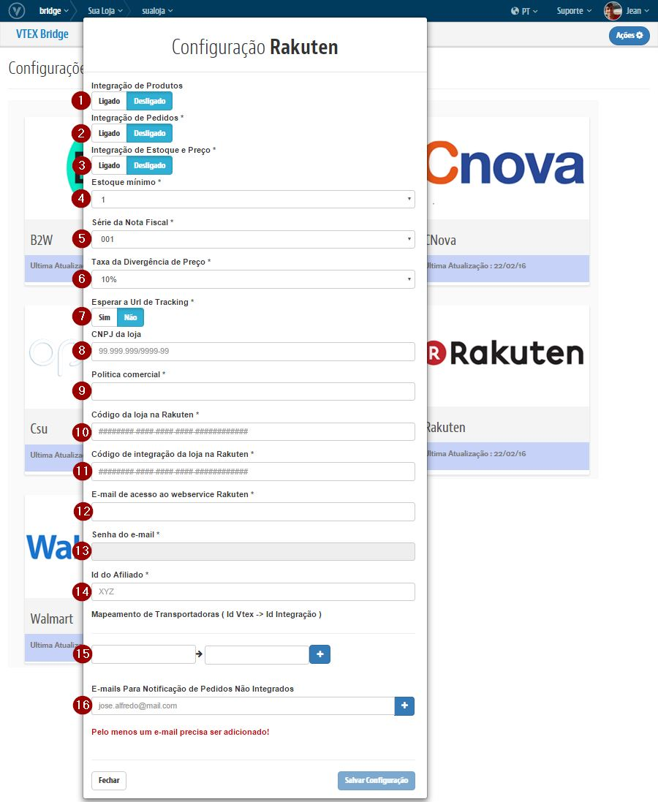

# Configurações iniciais com a Rakuten

## Primeiros Passos

1. Caso deseje usar a mesma politica (Ou seja, as mesmas regras para sortimento, promoções e condições de entrega da loja) use a politica comercial "1".
Caso contrario leia este link [Seleção de política comercial.](http://help.vtex.com/hc/pt-br/articles/214166227)

2. Caso sua politica comercial seja diferente de 1, [Configure a logística para essa política comercial.](http://help.vtex.com/hc/pt-br/articles/214166667-Atualiza%C3%A7%C3%A3o-de-estoque)

4. [Configure a logística para essa política comercial.](http://help.vtex.com/hc/pt-br/articles/214166667-Atualiza%C3%A7%C3%A3o-de-estoque)

5. Entrar em contato com a Rakuten e obtenha o Token de acesso a API:

http://ecservice.rakuten.com.br/rakuten-shopping/

## Bridge - Visão geral

>**Importante: As configurações realizadas no Bridge para Rakuten realiza a criação automatica do Afiliado no OMS e libera o Perfil de Acesso no E-Commerce.**

###Exemplo de acesso as Configurações de Marketplace

##Campos

>>Para cada campo temos:

* **Integração de Produtos**: Liga ou Desliga a exportação de Produtos.
* **Integração de Pedidos**: Liga ou Desliga a exportação de Pedidos.
* **Integração de Estoque e Preço**: Liga ou Desliga a exportação de estoque e preço.
* **Estoque mínimo**: Define a quantidade mínima em Estoque para o SKU ficar indisponível na Rakuten.
* **Série da Nota Fiscal**: Número de série da Nota Fiscal utilizada na atualização de Tracking.
* **Taxa da Divergência de Preço**: Taxa de aceitação da divergência de valor no Pedido integrado.
 Qualquer pedido que possua uma divergência entre o preço que veio do marketplace e o preço praticado na plantaforma, será comparado com esse valor. Se a divergência (em porcentagem) for menor que o valor definido nesse campo, o pedido será integrado. Caso contrário, o pedido será negado e lojista, notificado.
* **Esperar a Url de Tracking**: A integração atualiza o status do Pedido no Marketplace para "Despachado" quando os campos da nota fiscal "Numero de Rastreio" e "URL de Rastreio" forem preenchidos.
* **CNPJ da loja**: CNPJ da Loja
* **Código da loja na Rakuten**: Código da Loja na Rakuten.
* **Código de integração da loja na Rakuten**: Código da integração na Rakuten.
* **E-mail de acesso ao webservice Rakuten**: E-mail utilizado pela integraçõa para a atualização de Tracking dos Pedidos.
* **Senha do e-mail**: Senha utilizada pela integração, junto ao email acima, para a atualização de Tracking dos Pedidos.
* **Id do Afiliado**: ID do Afiliado da Rakuten que será cadastrado no modulo do OMS.
* **Mapeamento de Transportadoras**: Mapeamente de frete entre a Vtex e a Rakuten.
* **E-mails Para Notificação de Pedidos Não Integrados**: Caso um Pedido sofra algum erro no ato de integrar na VTEX, será enviado um email com sua possível causa para o(s) email(s) aqui cadastrado(s).

##Parceiro Rakuten

Realizadas essas configurações, deve-se enviar os seguintes dados para o suporte da Rakuten, Thasmine Colen <thasmine.colen@rakuten.com.br>, realizar consultas de Frete aqui na VTEX:

* Nome da Loja
* Rakuten StoreCode
* URL de Frete: http://rakutenintegration.vtexcommerce.com.br/wcfservice/ShippingService.svc

**Pronto! Em questão de tempo os produtos irão ser exportados para o Marketplace da Rakuten.**

##Sobre a integração

Após as configuração acima forem concluídas, será necessário reindexar a base para que todos os itens sejam integrados corretamente.

Para isso, siga os passos abaixo:

* Com o usuário master, entre no link [nomedasualoja].vtexcommercestable.com.br/admin/Site/FullCleanUp.aspx
* Clique no botão "Reidexar Base"

> Obs.: É possível acompanhar quantos produtos estão na fila acessando o módulo de E-Commerce. Lá existe vários dashboards que mostram: o total indexado, itens ainda não enfileirado, total na fila, na fila recentemente, entre outros.

Os itens passarão por um processo de catalogação até serem de fato disponibilizados no Marketplace. Esse prazo é variável de acordo com a demanda que o MarketPlace tiver. À medida que forem exportados, serão informados os preços e itens disponíveis em estoque de cada produto. Toda vez que houver uma alteração no preço de um produto, as informações serão atualizadas junto ao Marketplace. As atualizações relacionadas aos itens em estoque funcionam online toda vez que tiverem 5 unidades ou menos em estoque. Movimentações de estoques diferente dessa regra, não é indexada.
