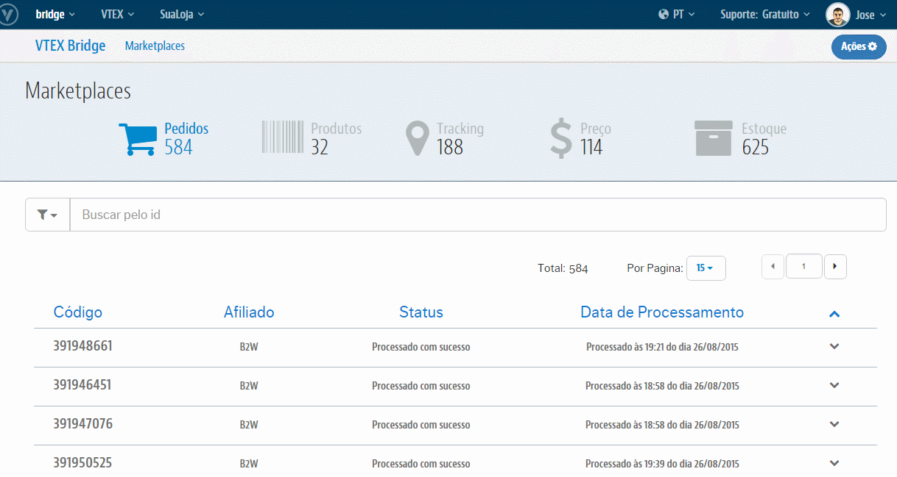

## Rakuten
>Visão do painel de configuração:

>>Para cada campo temos:

* **Integração de Produtos**: Liga ou Desliga a exportação de Produtos

* **Integração de Pedidos**: Liga ou Desliga a exportação de Pedidos

* **Integração de Estoque e Preço**: Liga ou Desliga a exportação de Preços

* **Id do License Manager**: Id da sua Loja presente no campo "ID*" dentro do LicenseManager

* **Estoque mínimo**: Define a quantidade mínima em Estoque para o SKU ficar indisponível na Rakuten

* **Série da Nota Fiscal**: Número de série da Nota Fiscal utilizada na atualização de Tracking

* **Taxa da Divergência de Preço**: Taxa de aceitação da divergência de valor no Pedido integrado

* **Esperar a Url de Tracking**: Atualiza o status do Pedido no Marketplace para "Despachado" quando com o Tracking preenchido

* **CNPJ da loja**: CNPJ da Loja

* **Código da loja na Rakuten**: Código da Loja que identifica sua Loja no sistema da Rakuten

* **Código de integração da loja na Rakuten**: Código da integração cadastrada em sua Loja na Rakuten

* **E-mail de acesso ao webservice Rakuten**: E-mail utilizado pela integraçõa para a atualização de Tracking dos Pedidos

* **Senha do e-mail**: Senha utilizada pela integração, junto ao email acima, para a atualização de Tracking dos Pedidos

* **Id do Afiliado**: ID do Afiliado da Rakuten cadastrado em OMS > Configurações > Afiliados > ID

* **Mapeamento de Transportadoras**: Caso for usar o sistema de Frete da VTEX, nos fornecer um De-Para com o ID do serviço de frete da Rakuten (o ID precisa que ser NUMÉRICO, NÃO INICIADO POR ZERO) e o ID da transportadora. Se **não**, também deve nos fornecer esse De-Para, mas além disto, dar frete grátis para o Marketplace da Rakuten para não conflitar com os valores usados pelo Parceiro. Maiores dúvida, acesse o 6º passo da seguinte documentaçã: [Rakuten - Configurações iniciais](http://help.vtex.com/hc/pt-br/articles/206863767-Rakuten-Configura%C3%A7%C3%B5es-iniciais)

* **E-mails Para Notificação de Pedidos Não Integrados**: Caso um Pedido sofra algum erro no ato de integrar na VTEX, será enviado um email com sua possível causa para o(s) email(s) aqui cadastrado(s)
