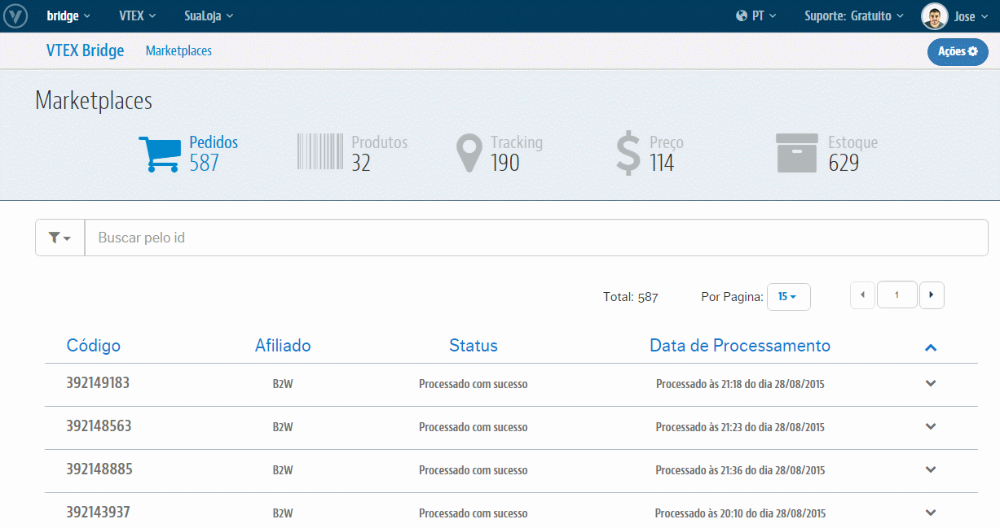

# Interface de Estoque
Teremos aqui toda a relação de Sucessos e de Erros que podem ocorrer nas atualizações dos valores de **Estoques** desde a VTEX para o respectivo Marketplace. Além também do controle dos erros ao passo de trata-los e reprocessá-los pontualmente ou em massa diretamente nessa própria interface.

**Importante**: Quando houver **apenas alterações do Estoque** no SKU na VTEX, entrará na seguinte regra de que, só serão consideradas mudanças a serem exportadas, onde o saldo "De" ou saldo "Por" for menor ou igual a 5 unidades: [Atualização de Estoque entre Marketplace e VTEX](http://help.vtex.com/hc/pt-br/articles/206572797-Atualiza%C3%A7%C3%A3o-de-Estoque-entre-Marketplace-e-VTEX)

> Lembrando que, as movimentações entre a VTEX e os Marketplaces atuam por uma interface Web que possui protocolo HTTP que impede a ter uma unidade de tempo definida para o reflexo no Parceiro. Identificaremos como anormal, aqueles atualizações que levaram mais de 1 (uma) hora após a alteração.

## Visão geral

## O que posso fazer com isso?
O **VTEX Bridge** lhe permitirá realizar o controle daqueles Estoques que integraram com sucesso tanto quanto os que não integraram por algum erro além de poder trata-los e reprocessa-los para reverter o cenário de erro e exportar esses Produtos. Para essa interface temos as seguinte ações possíveis:

* [Análises de Sucessos](analises-de-sucessos/index.html)

* [Análises de Erros](analises-de-erros/index.html)

* [Reprocessamento de Estoque com erro](reprocessamento-de-estoque-com-erro/index.html)
