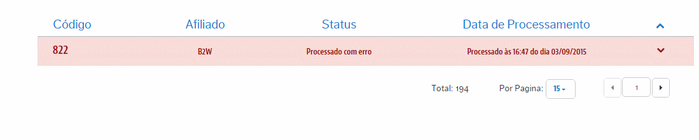

# Análises de Erros
Aqui teremos o controle dos **Estoques** que não integraram desde a VTEX para o Marketplace por algum erro. Como é um registro de erro, aqui conseguiremos tomas ações sobre o esses que sofreram algum conflito!
> Ações possíveis

Quando com um registro de erro associado a um **Estoque** não integrado, basta clicar no mesmo registro para visulizar exatamente a origem que levou a este não ser integrado:

> IMPORTANTE

Dependendo do erro, demandará de contatar o Parceiro para entender como encontra-se o **Precesso de Catalogação** dos seus Produtos, pois, nesta fase, o próprio parceiro impede que valores de Estoque sejam importados.

Para entender os tipos de erros que podem ser ilustrados em relação ao seu tratamento e reprocessamento, acesse:

* [Reprocessamento de Estoque com erro](reprocessamento-de-estoque-com-erro\README.md)
