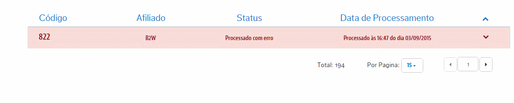
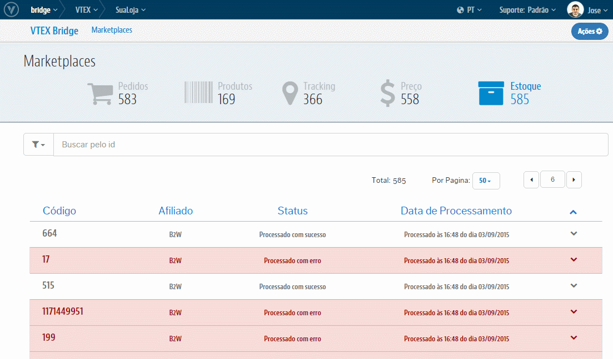

# Reprocessamento de Estoque

Clique no Estoque sinalizado com erro para ter maiores detalhes da causa que originou esse registro:

> Tipos mais comuns de erros

* "*Não foi possível atualizar o Estoque do SKU no Parceiro. Este SKU já foi exportado para o Parceiro, mas não está ainda catalogado. Neste status, não é possível inserir valores de Estoque. Para maiores dúvida, por favor, entre em contato com a B2W.*"

Realizado o devido tratamento que dê condições para o Estoque ser integrado, abra a combo da ações posicionada à esquerda do registro e selecione "**Reprocessar**":

> Reprocessamento em massa

Caso vários registros ilustrem erros em que a resolução acertar sua marioria, você pode seleciona-los e, pelo botão de ação em massa, reprocessa-los todos de uma vez só! Veja como:

>>! EM BREVE !

Pronto! Internamente este Estoque será reintegrado e sejá ilustrado no próprio registro o seu sucesso ou algum eventual erro.
