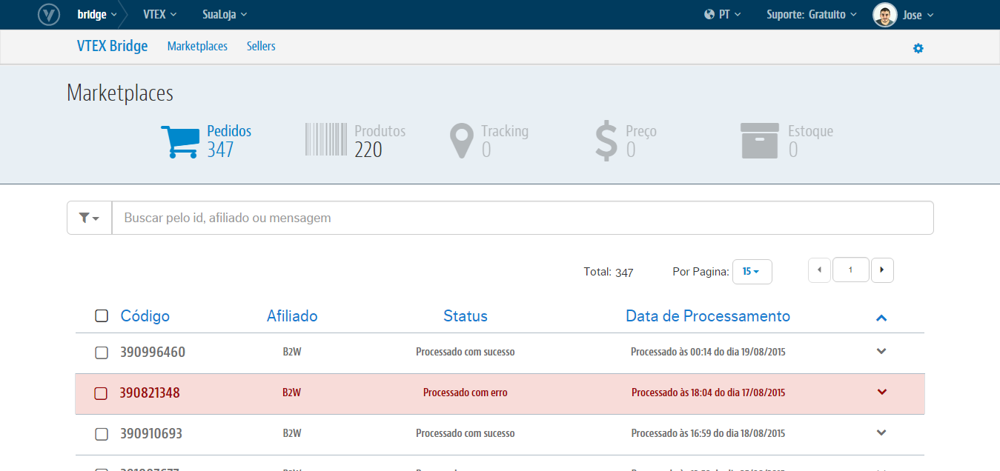
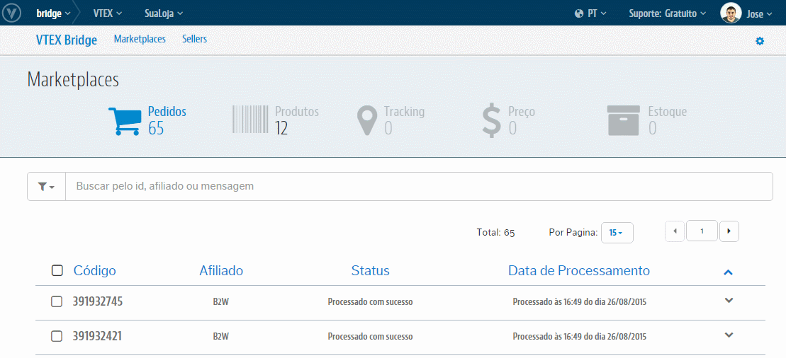

# Interface de Pedidos
Teremos aqui toda a relação de Sucessos e de Erros que ocorrem nas integrações dos Pedidos na VTEX tanto quanto sua evolução com a atualização de Status. Além também do controle dos erros ao passo de trata-los e reprocessá-los diretamente nessa própria interface.

## Visão geral

## Utilizando os filtros
Os filtros do Bridge lhe permitem agrupar os registros de Pedidos por apenas os que deram **erro**, por apenas o que integraram com **sucessos** e por aquele que todavia encontram-se em processamento. Além também de poder combinar esse agrupamento com a origem de qual Marketplace refere-se o registro:

[FAZENDO FILTRO/IMAGEM EM GIF]

## Realizando buscas

A busca no Bridge abrange desde o ID do Pedido, ao Afiliado de Origem dos registros e até a mensagem de erro que impediu a integração de um Pedido:

Caso queira limpar a busca e voltar para a listagem que estava anteriomente, basta clicar no "**X**" ao lado direito do campo de Busca.

Lembre-se que o que **Código** do Pedido é o ID do Pedido no Marketplace.

## O que posso fazer com isso?
O **VTEX Bridge** lhe permitirá realizar o controle daqueles Pedidos que integraram com sucesso tanto quanto os que não integraram por algum erro além de poder trata-los e reprocessa-los para reverter o cenário de erro e consumir esses Pedidos. Para essa interface temos as seguinte ações possíveis:

>>[**Análises de Sucessos**](analises_de_sucessos.md)
>>[**Análises de Erros**](analises_de_erros.md)
>>[**Reprocessamento de Pedidos com erro**](reprocessamento_de_pedidos_com_erro.md)
