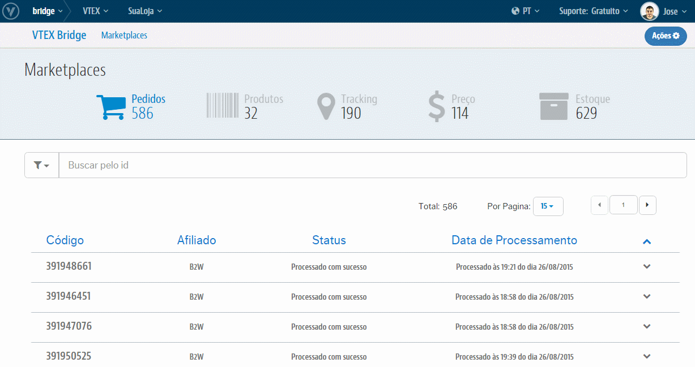

# Interface de Pedidos
Teremos aqui toda a relação de Sucessos e de Erros que ocorrem nas integrações dos Pedidos na VTEX tanto quanto sua evolução com a atualização de Status. Além também do controle dos erros ao passo de trata-los e reprocessá-los diretamente nessa própria interface.

## Visão geral

## O que posso fazer com isso?
O **VTEX Bridge** lhe permitirá realizar o controle daqueles Pedidos que integraram com sucesso tanto quanto os que não integraram por algum erro além de poder trata-los e reprocessa-los para reverter o cenário de erro e consumir esses Pedidos. Para essa interface temos as seguinte ações possíveis:

* [Análises de Sucessos](analises-de-sucessos/index.html)

* [Análises de Erros](analises-de-erros/index.html)

* [Reprocessamento de Pedidos com erro](reprocessamento-de-pedidos/index.html)
