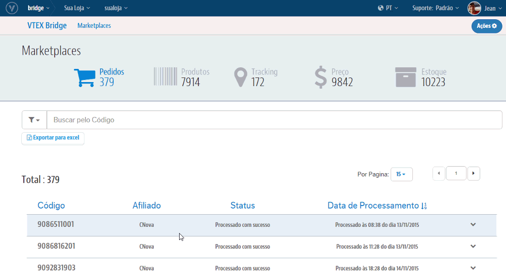
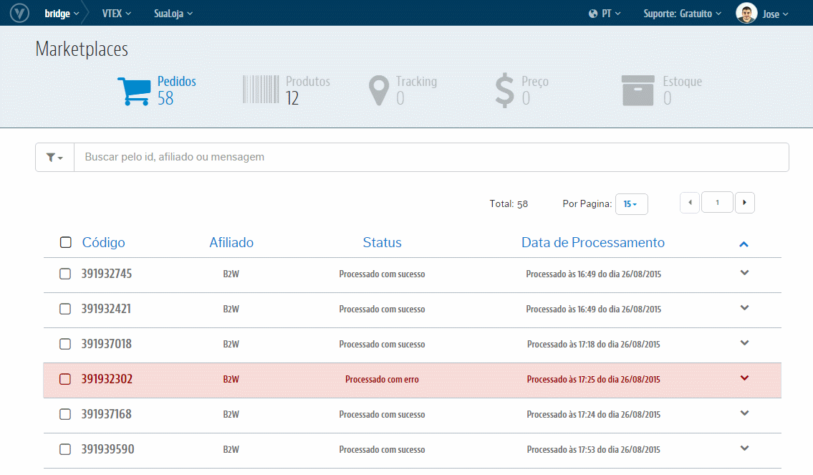

# Interface de Pedidos
Temos aqui todas as relações de sucessos e de erros que ocorrem nas integrações de **Pedidos**, desde a VTEX até o respectivo Marketplace. Além da visualização dos erros e sucessos, é possível reprocessá-los manualmente pela própria interface ou limpar essa informação.

## Visão geral

## Pedido integrado com sucesso

Controlamos a visualização dos pedidos que integraram com sucesso no maketplace. Por ser um registro de sucesso, apenas uma única ação é possível, a de excluir registro. Essa ação consiste em limpar o registro da tela.

Exemplo:

Para excluir um registro, primeiro clique na linha do pedido. Em seguida clique no box de nome Ações. Uma nova opção chamada "Remover Log" irá surgir, clique nela.

## Pedido não integrado com erro

Controlamos a visualização dos pedidos que não integraram no marketplace a VTEX por algum erro. Como é um registro de erro, nesta tela conseguiremos tomar mais ações sobre esses.
Para visualizar o motivo do erro, basta clicar no mesmo registro e visualizar a origem que o levou a não ser integrado.

Exemplo:

## Reprocessamento de Pedidos

>> Atenção: O reprocessamento não necessariamente consegue mudar o status do registro para "sucesso". A ação de reprocessar também não é instantânea, ela demora para ser concluida pois é colocada em uma fila de ações.

Para solicitar o reprocessamento, clique no registro sinalizado com erro, abra a combo de ações e selecione a opção "Reprocessar".

Exemplo:

## Remover Log

Essa ação nada mais é do que retirar o log da interface, a fim de "limpar" a tela.
Para remover o log, clique no registro, abra a combo de ações e selecione a opção "Remover Log". Esta ação pode ser feita nas integrações com ambos os status (sucesso ou erro).

Exemplo:

---

Autor: _Ana Izabel Jacobsen_ 
Propriedade: _VTEX_ &copy; 
