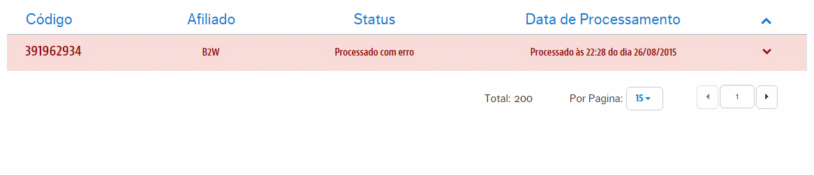
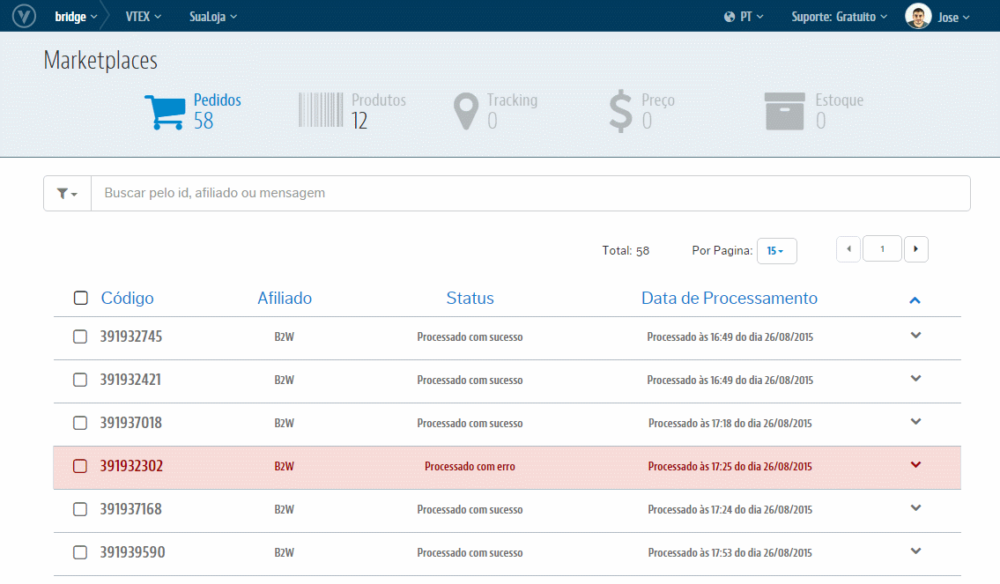

# Reprocessamento de Pedidos
> **Atenção**: Na interface de Pedido não existe a função de reprocessamento em massa. Assim como na interface de Tracking, cada diferente erro, quando gerado na integração, demanda um tratamento pontual na origem do conflito. Porém, seu reprocessamento, quando com mais de um tipo de registro de erro, também demanda de diferentes ações para obter sucesso.

Clique no Pedido sinalizado com erro para ter maiores detalhes da causa que originou esse registro:

> Tipos mais comuns de erros

* *"O Pedido não pode ser integrado desde o Parceiro. Há uma diferença entre o valor vendido para o Produto e/ou Frete no Marketplace em relação ao presente na sua Loja. Caso deseje reprocessa-lo, será alterado naquele momento apenas para o pedido em questão, a "Taxa da Divergência de Preço" ao ponto de considerar a divergência e consumir o Pedido. Isto, caso este esteja com um valor menor do Produto e/ou Frete em relação ao cadastrado na VTEX, será aceito esse valor menor de venda."*

* *"O Pedido não pode ser integrado desde o Parceiro. Não há condições de entrega para o(s) SKU(s) associado(s) a esse Pedido. Consulte valores de Estoque e se sua Logística está apta para realizar a entrega deste SKU ou acesse: [Meu Produtos não estão disponíveis no Marketplace. O que fazer?](http://help.vtex.com/hc/pt-br/articles/206897747)"*

* *"O Pedido não pode ser integrado desde o Parceiro. O ID do(s) SKU(s) associado(s) ao Pedido não existe na VTEX."*

* *"O Pedido não pode ser integrado desde o Parceiro. O(s) SKU(s) associado(s) ao Pedido não estão disponíveis na VTEX. Consulte valores de Estoque, Preço ou acesse: [Meu Produtos não estão disponíveis no Marketplace. O que fazer?](http://help.vtex.com/hc/pt-br/articles/206897747)"*

Realizado o devido tratamento que dê condições para o Pedido ser integrado, abra a combo da ações posicionada à esquerda do registro e selecione "**Reprocessar**":

Pronto! Internamente este pedido será reintegrado e sejá ilustrado no próprio registro o seu sucesso ou algum eventual erro.
