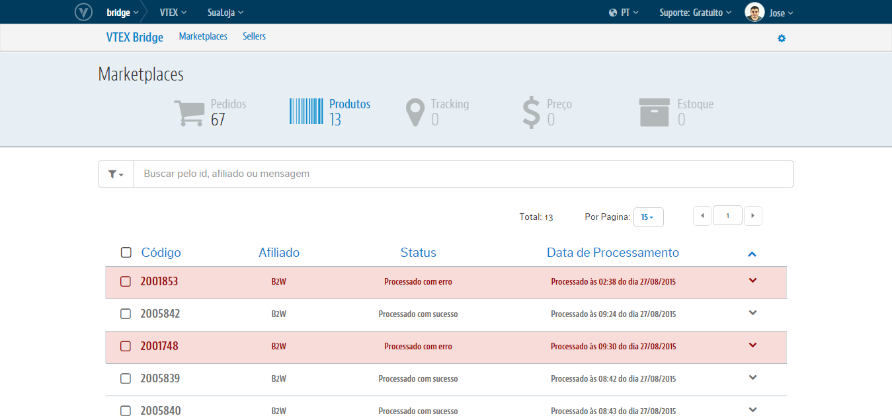

# Interface de Produtos
Teremos aqui toda a relação de Sucessos e de Erros que podem ocorrer nas integrações dos **Produtos** desde a VTEX para o respectivo Marketplace. Além também do controle dos erros ao passo de trata-los e reprocessá-los diretamente nessa própria interface.

## Visão geral

## Utilizando os filtros
Os filtros do Bridge lhe permitem agrupar os registros de Produtos por apenas os que deram **erro** e por apenas o que integraram com **sucessos**. Além também de poder combinar esse agrupamento com a origem de qual Marketplace refere-se o registro:

[FAZENDO FILTRO/IMAGEM EM GIF]

## Realizando buscas

A busca no Bridge abrange desde o ID do Produto, ao Afiliado de Origem dos registros e até a mensagem de erro que impediu a integração de um Pedido:

[BUSCANDO/IMAGEM EM GIF]

Caso queira limpar a busca e voltar para a listagem que estava anteriomente, basta clicar no "**X**" ao lado direito do campo de Busca.

Lembre-se que o que **Código** do Produto é o ID do SKU na VTEX.

## O que posso fazer com isso?
O **VTEX Bridge** lhe permitirá realizar o controle daqueles Produtos que integraram com sucesso tanto quanto os que não integraram por algum erro além de poder trata-los e reprocessa-los para reverter o cenário de erro e exportar esses Produtos. Para essa interface temos as seguinte ações possíveis:

>>[**Análises de Sucessos**](Produtos_analises_de_sucessos.md)
>>[**Análises de Erros**](Produtos_analises_de_erros.md)
>>[**Reprocessamento de Pedidos com erro**](Produto_reprocessamento_de_pedidos_com_erro.md)
