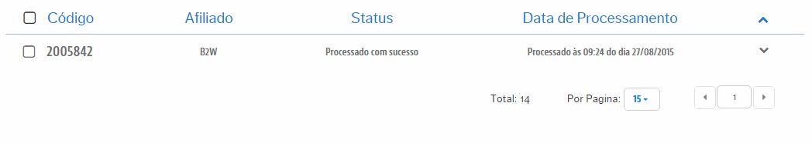
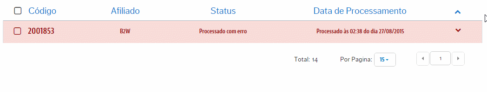
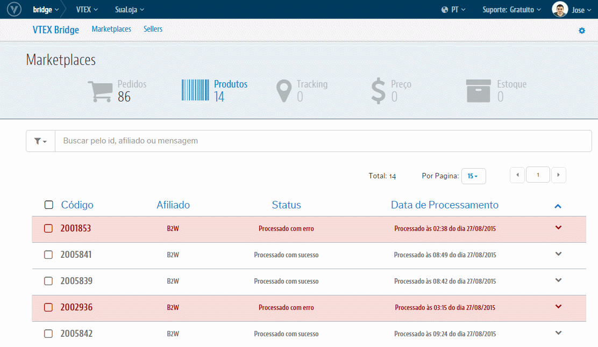

# Interface de Produtos
Teremos aqui toda a relação de Sucessos e de Erros que podem ocorrer nas integrações dos **Produtos** desde a VTEX para o respectivo Marketplace. Além da visualização dos erros e sucessos é possível reprocessá-los manualmente pela própria interface ou limpar essa informação.

## Visão geral

## Produto integrado com sucesso
Aqui teremos o controle dos produtos que integraram com sucesso no matketplace desde a VTEX. Como é um registro de sucesso, é um dado apenas para métrica, onde, a única ação possível sobre este é excluir esse registro de sucesso que serve unicamente para limpar esse registro na tela.
Exemplo:

Para excluir o registro, primeiro clique na linha do produto. Será ilustrado em seguida um box de nome Ações. Abra essa combo e selecione a única opção disponível de "Remover Log".

## Produto integrado com erro
Aqui teremos o controle dos produtos que não integraram no marketplace desde a VTEX por algum erro. Como é um registro de erro, nesta tela conseguiremos tomar ações sobre o esses.
Para isso, basta clicar no mesmo registro para visualizar a origem que levou a este não ser integrado.
Exemplo:

## Reprocessamento de Produtos

>> Atenção: O reprocessamento não necessariamente consegue mudar o status para "sucesso". A ação de reprocessar também não é instantânea, ela demora para ser concluida pois é colocada em uma fila de ações.

Para solicitar o reprocessamento, clique no produto sinalizado com erro, abra a combo da ações posicionada à esquerda do registro e selecione "Reprocessar".
Exemplo:

## Remover Log

Essa ação nada mais é do que retirar o log da interface, a fim de "limpar" a tela. Para remover o log, clique sobre a linha e  em seguida no botão "Ações" e então em "Remover Log". Esta ação pode ser feita nas integrações com ambos os status (sucesso e erro).
Exemplo:

