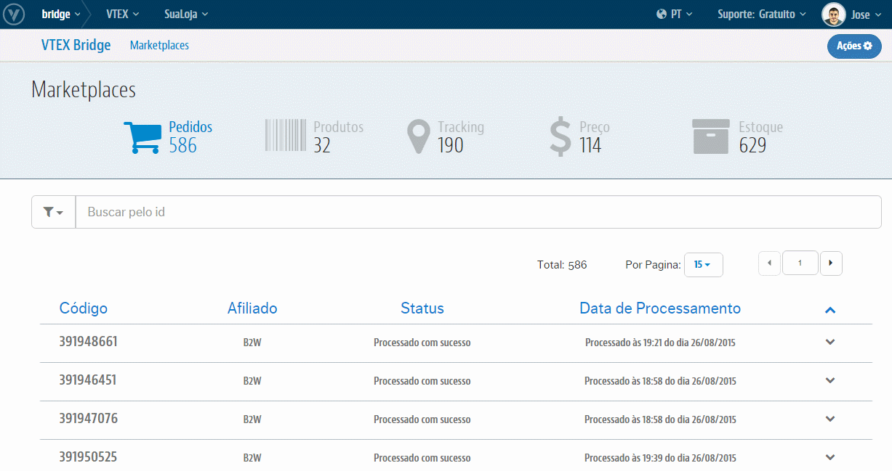

# Interface de Produtos
Teremos aqui toda a relação de Sucessos e de Erros que podem ocorrer nas integrações dos **Produtos** desde a VTEX para o respectivo Marketplace. Além também do controle dos erros ao passo de trata-los e reprocessá-los tanto manualmente quanto em massa diretamente nessa própria interface.

## Visão geral

## O que posso fazer com isso?
O **VTEX Bridge** lhe permitirá realizar o controle daqueles Produtos que integraram com sucesso tanto quanto os que não integraram por algum erro além de poder trata-los e reprocessa-los para reverter o cenário de erro e exportar esses Produtos. Para essa interface temos as seguinte ações possíveis:

* [Análises de Sucessos](analises-de-sucessos\README.md)

* [Análises de Erros](analises_de_erros\README.md)

* [Reprocessamento de Produto com erro](reprocessamento-de-produtos\README.md)
