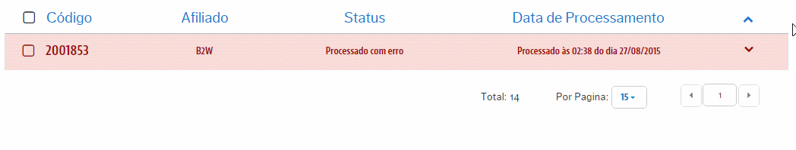

# Análises de Erros
Aqui teremos o controle dos **Produtos** que não integraram no Marketplace desde a VTEX por algum erro. Como é um registro de erro, aqui conseguiremos tomas ações sobre o esses que sofreram algum conflito!
> Ações possíveis

Quando com um registro de erro associado a um **Produto** não integrado, basta clicar no mesmo registro para visulizar exatamente a origem que levou a este não ser integrado:

Dependendo do erro, demandará de um tratamento pontual em algum valor de Estoque do SKU associado ao Pedido, ou um valor que não teve tempo hábil para ser replicado para o Parceiro.

Para entender os tipos de erros que podem ser ilustrados em relação ao seu tratamento e reprocessamento, acesse:

* [Reprocessamento de Produtos com erro](reprocessamento-de-produtos\README.md)
