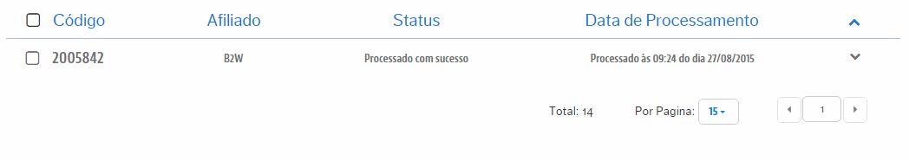

# Análises de Sucessos
Aqui teremos o controle dos Produtos que integraram com sucesso na VTEX desde os Marketplaces. Como é um registro de sucesso, é um dado apenas para métrica, onde, a única ação possível sobre este é excluir esse registro de sucesso.
> Ações possíveis

Como dito inicialmente, este é um registro de sucesso, que é um dado apenas para métrica. Onde, a única ação possível sobre este é excluir esse registro de sucesso caso desejado.

Para excluir o registro, primeiro clique na linha do pedido. Será ilustrado em seguida um box de nome **Ações**. Abra essa combo e selecione a única opção disponível de "*Remover Log*":

