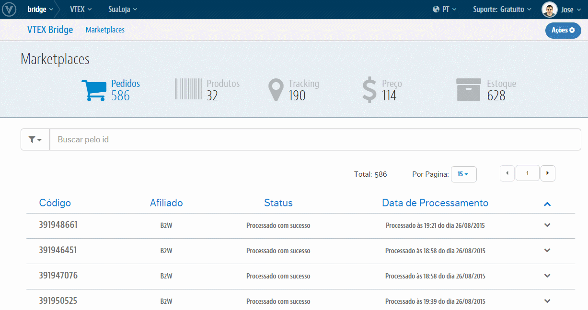

# Interface de Tracking
Teremos aqui toda a relação de **Tracking**, ou seja, após o Pedido já ter integrado, ocorrerá a integração da atualização do seu Status junto aos Marketplaces até seu Faturamento, além de possíveis erros que ocorrem nos envios destes novos Status. Também temos o controle desses erros ao passo de trata-los e reprocessá-los diretamente nessa própria interface.

> IMPORTANTE!

O Workflow dos Pedidos da VTEX seguem até o status de **Faturado**, onde é fornecida a Nota Fiscal e os dados de rastreio para os mesmos. Marketplaces que possuam Status além de Faturado, **que atendem ao processo logístico do Pedido** como Entregue à Transportador e Entregue (ao cliente final), precisarão do tratamento pela interface dos Parceiros.

## Visão geral

## O que posso fazer com isso?
O **VTEX Bridge** lhe permitirá realizar o controle daquelas atualizações que integraram com sucesso tanto quanto as que não integraram por algum erro além de poder trata-los e reprocessa-los para reverter o cenário de erro e exportar esses Status. Para essa interface temos as seguinte ações possíveis:

* [Análises de Sucessos](analises-de-sucessos/index.html)

* [Análises de Erros](analises-de-erros/index.html)

* [Reprocessamento de Tracking com erro](reprocessamento-de-tracking/index.html)
