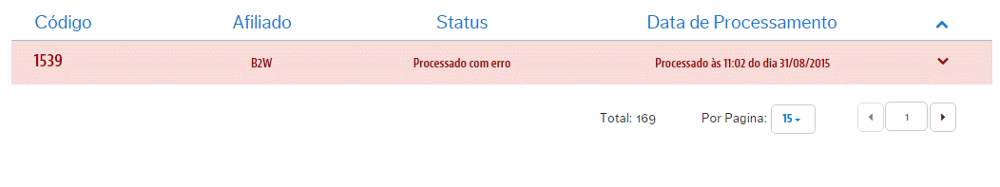

# Análises de Erros
Aqui teremos o controle das atualizações de Stauts que não foram integradas desde a VTEX para os Marketplaces por algum **erro**. Como é um registro de erro, aqui conseguiremos tomas ações sobre o esses que sofreram algum conflito!

> Ações possíveis

Quando com um registro de erro associado a uma atualização de Status não integradas, basta clicar no mesmo registro para visulizar exatamente a origem que levou a este não ser exportado:

Dependendo do erro, demandará de um tratamento pontual.

Para entender os tipos de erros que podem ser ilustrados em relação ao seu tratamento e reprocessamento, acesse:

*  [Reprocessamento de Tracking com erro](reprocessamento-de-tracking\README.md)
