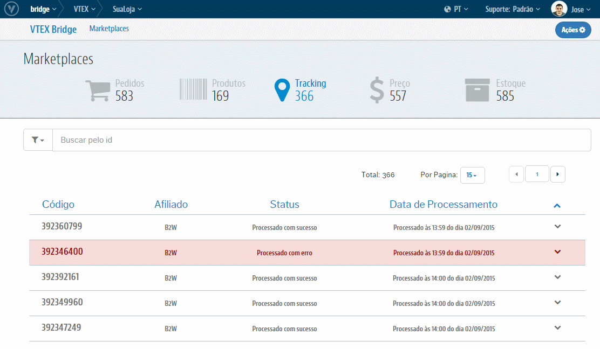

# Reprocessamento de Tracking
> **Atenção**: Na interface de Tracking não existe a função de reprocessamento em massa.Assim como para a Interface de Pedido, cada diferente erro, quando gerado na integração, demanda um tratamento pontual na origem do conflito. Porém, seu reprocessamento, quando com mais de um tipo de registro de erro, também demanda de diferentes ações para obter sucesso.

Clique no Tracking sinalizado com erro para ter maiores detalhes da causa que originou esse registro:

> Tipos mais comuns de erros

* *"Não foi possível realizar o Faturaramento do Pedido no Parceiro. Pedidos apenas no status "Processando" podem ser faturados no Parceiro."*

Realizado o devido tratamento que dê condições para o Tracking ser integrado, abra a combo da ações posicionada à esquerda do registro e selecione "**Reprocessar**":

Pronto! Internamente este Tracking será reintegrado e sejá ilustrado no próprio registro o seu sucesso ou algum eventual erro.
