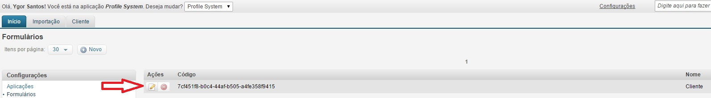

# Consultas na visualização

Um Cliente possui um ou mais endereços. Que tal visualizar os endereços na visualização desse Cliente. É possível? Sim. Através do atributo consultas na visualização dos Formulários.

Este é o nosso formulário "Cliente" atual.
<a href="../img/form-sheet-new-2.jpg" target="\_blank">

</a>

Agora, vamos configurar para aparecer a lista de endereços nessa visualização.

1. Em configurações, clique em "Formulários";
<a href="../img/config-2.jpg" target="\_blank">

</a>

2. Clique em "Editar";
<a href="../img/form-edit-update-1.jpg" target="\_blank">

</a>

3. Preencha com o valor "AD.userId";
<a href="../img/form-edit-search-list-1.jpg" target="\_blank">

</a>

4. Clique em "Salvar";

### Criando o formulário Endereços

Para que a consulta apareça precisamos que o formulário Endereço seja criado.
Ele é preciso para poder ajudar a renderizar a listagem de endereços.

1. Na listagem de "Formulários", clique em "Novo"
<a href="../img/form-list-1.jpg" target="\_blank">

</a>

2. Preencha os dados do formulário;
<a href="../img/form-edit-address-1.jpg" target="\_blank">

</a>

3. Configure os campos da listagem;
<a href="../img/form-edit-address-2.jpg" target="\_blank">

</a>

4. Configure o Schema de Layout;
<a href="../img/form-edit-address-3.jpg" target="\_blank">

</a>

5. Clique em "Salvar";

6. Clique em "Início" para carregar o formulário na aplicação;

### Visualizando a consulta

Agora, na visualização de "Cliente", temos a seção de "Endereços".
<br />
<a href="../img/form-sheet-list-search-1.jpg" target="\_blank">

</a>

Ao clicar na seção, o sistema busca todos os endereços do cliente.
Mas não temos endereços cadastrados.
<br />
<a href="../img/form-sheet-list-search-2.jpg" target="\_blank">

</a>

1. Clique no link "Novo" da seção para criar um endereço;
<a href="../img/form-sheet-list-search-3.jpg" target="\_blank">

</a>

2. Preencha os campos;
<a href="../img/form-sheet-list-search-4.jpg" target="\_blank">

</a>
Obs: Perceba que o atributo "Cliente" já está preenchido.

3. Clique em "Salvar";

4. Na tela de visualização, clique no email do Cliente;
<a href="../img/form-sheet-list-search-5.jpg" target="\_blank">

</a>

5. Clique na seção de Endereços para visualizar;
<a href="../img/form-sheet-list-search-6.jpg" target="\_blank">

</a>


### Entendendo o AD.userId

- AD é a sigla da Entidade de Dados Endereço no VTEX Master Data;
- userId é o nome do campo que faz relacionamento entre Cliente x Endereço;

Para adicionar outras listagens, basta separar os valores por vírgula.
Ex:

```
AD.userId,KL.client
```
