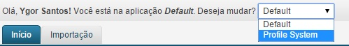

# Criando uma aplicação

A aplicação é o ambiente o qual os formulários estão agrupados.

O objetivo de agrupar os formulários em aplicações é para permitir que possamos criar diferentes visões de uma mesma Entidade de Dados do VTEX Master Data.

Vamos criar uma aplicação.

1. Entre no VTEX CRM através da url: http://{minhaloja}.vtexcrm.com.br;

2. Clique em Configurações;

3. Clique em Aplicações;

4. Clique em "Novo";

5. Preencha o nome da aplicação e clique em Salvar;

6. Pronto. Sua aplicação foi criada.

7. Para mudar de aplicação, atualize a página clicando na aba "Início";

8. Mude de aplicação selecionando "Profile System";

9. O sistema atualizará a página e você estará na aplicação "Profile System";

Vamos agora criar o formulário "Cliente".
