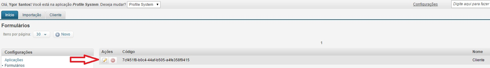

# Adicionando filtros na listagem

Existe a possibilidade de adicionarmos filtros na listagem de documentos. Esse filtro tem o limite de 6 campos.
Contudo, para que apareça, o campo deve ser configurado como Filtro nas configurações da Entidade de Dados do VTEX Master Data.

Para adicionar filtros na listagem:

1. Em configurações, clique em "Formulários";
<a href="../img/config-2.jpg" target="\_blank">

</a>

2. Clique em "Editar";
<a href="../img/form-edit-update-1.jpg" target="\_blank">

</a>

3. Preencha o campo "Filtros" com o nome dos campos configurados como Filtro no VTEX Master Data;
<a href="../img/form-edit-filter-1.jpg" target="\_blank">

</a>
obs: ```isNewsletterOptIn```, que corresponde ao campo ```Recebe Newsletter?``` em nosso exemplo

4. Clique em "Salvar";

5. Clique na aba "Cliente" e visulize o filtro na listagem;
<a href="../img/form-list-2.jpg" target="\_blank">

</a>

### Realizando um Filtro

Obs: Antes de realizar este filtro, adicionamos um novo cliente que não recebe Newsletter.

1. Clique no nome do campo do filtro para exibir as opções;

2. Clique em uma opção do filtro e clique em "Filtrar";
<br />
<a href="../img/form-sheet-list-filter-1.jpg" target="\_blank">

</a>

3. A listagem será atualizada;

4. Para limpar os filtros podemos clicar na aba "Cliente" ou no botão de limpar filtros;
<br />
<a href="../img/form-sheet-list-filter-clear-1.jpg" target="\_blank">

</a>
