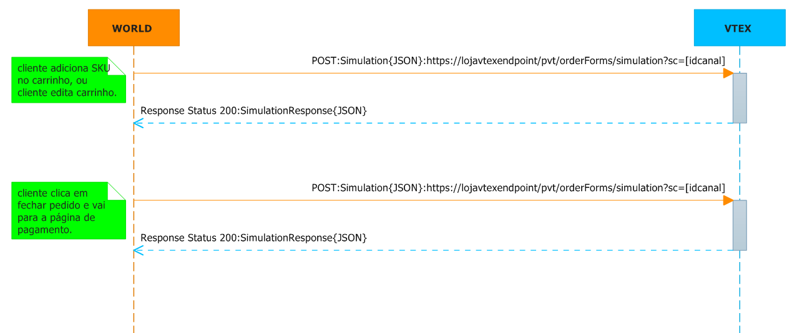

##Marketplace ou Aplicativos vendendo para Sellers usando o VTEX Marketplace Switch

Este documento tem por finalidade auxiliar na integração de aplicativos com o _VTEX Marketplace Switch_. Este modelo contempla troca de catalogo, atualização de condição comercial (preço, estoque) de um _SKU_, além de auxiliar na descida de pedido e traking de entrega.

> ALGUNS CONCEITOS:
>> _VTEX Marketplace Switch_ = Concentrador de Sellers (lojas integradas ao Switch).</br>
>> _Aplicativos_ = Dono da vitrine (cara com o cliente final), responsável por expor e vender o SKU.</br>
>> _SKU_ = Item a ser trocado e vendido entre Marketplace e Seller.</br>
>> _Endpoint_ = Ponto de acesso de um serviço na internet, serviço pronto para receber uma requisição e devolver uma resposta.</br>


####Ações que deverão ser tomadas pelo aplicativo não hospedado na VTEX para implementação da integração:

1. Implementar o endpoint para receber notificação de mudança de preço e estoque - VTEX Marketplace Switch vai chamar endpoint do aplicativo. Toda vez que o SKU mudar o preço e ou o estoque no VTEX Marketplace Switch, o VTEX Marketplace Switch vai chamar esse endpoint do aplicativo, simplesmente comunicando a mudança. Ao receber esse request o aplicativo vem buscar o preço e estoque no VTEX Marketplace Switch no metodo de consulta politica comercial que vamos falar mais abaixo.

 _exemplo da chamada:_</br>
 ``` https://marketplace.com.br/api/notification/ ```

 [Exemplo Completo: Enviar Notificação de Mudança](#a1)

2. Implementar busca de dados de SKU no VTEX Marketplace Switch - Aplicativo vai chamar endpoint do VTEX Marketplace Switch. Toda vez que o serviço de notificação de mudança do VTEX Marketplace Switch avisar sobre uma SKU, e o aplicativo ainda nao tem a SKU catalogada, o aplicativo vem no VTEX Marketplace Switch buscar os dados da SKU.

 _exemplo da chamada:_</br>
 ```http://sandboxintegracao.vtexcommercestable.com.br/api/catalog_system/pvt/sku/stockkeepingunitbyid/310118183 ```

 [Exemplo Completo: Buscar Dados de SKU](#a2)

3. Implementar busca de politica comercial (preço e estoque, frete, tipo entrega e custo) - Aplicativo vai chamar endpoint do VTEX Marketplace Switch. Toda vez que o serviço de notificação de mudança do VTEX Marketplace Switch avisar sobre mudança de uma SKU (já catalogada), o aplicativo busca preço e ou estoque no VTEX Marketplace Switch pra se atualizar.

 _exemplo da chamada:_</br>
 ``` http://sandboxintegracao.vtexcommercestable.com.br/api/checkout/pub/orderForms/simulation?sc=1&affiliateId=LBB ```

 [Exemplo Completo: Consultar Política Comercial no VTEX Marketplace Switch](#a3)
 [Exemplo Completo: simula Carrinho no VTEX Marketplace Switch](#a8)

>Os metodos de buscar condições comerciais e simular carrinho são os mesmos.

4. Implementar rotina que coloca um pedido no VTEX Marketplace Switch - Aplicativo vai chamar endpoint do VTEX Marketplace Switch. O Aplicativo irá usar esse enpoint para colocar um pedido no VTEX Marketplace Switch.

 _exemplo da chamada:_</br>
 ``` https://sandboxintegracao.vtexcommercestable.com.br/api/checkout/pub/orders?sc=1&affiliateId=LBB ```

 [Exemplo Completo: Colocar um Pedido no VTEX Marketplace Switch](#a4)

5. Implementar rotina que informa pagamento no VTEX Marketplace Switch - Aplicativo vai chamar endpoint do VTEX Marketplace Switch. O aplicativo irá usar esse enpoint para informar um pagamento no PCI gateway do VTEX Marketplace Switch.

 _exemplo da chamada:_</br>
 ``` https://sandboxintegracao.vtexpayments.com.br/split/564031077937/payments ```

 [Exemplo Completo: Informa Pagamento no VTEX Marketplace Switch](#a5)

6. Implementar rotina que informa sucesso na criação do pedido no VTEX Marketplace Switch - Aplicativo vai chamar endpoint do VTEX Marketplace Switch. O aplicativo irá usar esse enpoint para fechar o processo de criação de pedido do VTEX Marketplace Switch.

 _exemplo da chamada:_</br>
 ``` https://sandboxintegracao.vtexcommercestable.com.br/checkout/gatewayCallback/564032167396/Success ```

 [Exemplo Completo: Finaliza Fluxo de Fechamento de Pedido no VTEX Marketplace Switch](#a6)

7. Implementar rotina que informa sucesso na aprovação do pagamento no PCI gateway do VTEX Marketplace Switch - Aplicativo vai chamar endpoint do PCI gateway do VTEX Marketplace Switch. O aplicativo irá usar esse enpoint para aprovar o pagamento no PCI gateway do VTEX Marketplace Switch.

 _exemplo da chamada:_</br>
 ``` https://sandboxintegracao.vtexpayments.com.br/api/pvt/payments/C75C19DDC66F41A6B8EF8E06CBCC5C5F/payment-notification ```

 [Exemplo Completo: Informa sucesso do pagamento PCI gateway do do VTEX Marketplace Switch](#a7)

8. Ouve o feed de status de pedido - Endpoint do VTEX Marketplace Switch. O aplicativo deve se subescrever no feed de status de pedidos, ouvir e tratar o status que lhe interessa e confirmar os status que vai ignorar.

 [Exemplo Completo: Ouvir feed de status de pedido](#a9)</br>


 - - -

##Abaixo segue o passo a passo detalhado de cada fluxo:

###Troca de Catalogo de SKU e Atualização de Condição Comercial de SKU

Fluxo de troca de catalogo de SKU e atualização de preço, estoque, frete, SLAs de entrega:


###Inserção e Atualização de SKU - Fluxo

* Dentro do VTEX Marketplace Switch, será criado um *afiliado, que é o interessado em receber o catálogo e as atualizações de condições comerciais.

* O afiliado, deverá implementar um endpoint onde receberá informações sobre alterações de condição comercial de SKUs.

* Na loja VTEX, cada vez que uma SKU comercializado pelo afiliado sofrer uma alteração na condição comercial, ou for reindexado, o endpoint de notificação do afiliado será chamado.

* Quando o afiliado recebe uma notificação que um SKU mudou a condição comercial, o afiliado deve checar se já comercializa aquela SKU daquela loja que comunicou.

  * **Caso SIM**: O afiliado consulta a condição comercial no VTEX Marketplace Switch e se atualiza.

  * **Caso NÃO**: O afiliado busca a SKU no VTEX Marketplace Switch, insere no seu catalogo, e depois repete o cenário do "Caso SIM".


> As requisições de notificação de mudança devem ser tratadas assincronamente, ou seja, recebe a notificação, enfileira, e depois processa, evitando assim a honeração dos sistemas envolvidos.

<a name="a1"></a>
###Notificação de Mudança

Notifica o Marketplace Não VTEX que houve uma mudança nas condições comerciais (preço, estoque, SLAs de entrega) de uma SKU - Endpoint do Afiliado (Aplicativo)

endpoint: ``` https://[endpointdoafiliado}/api/notification/ ```</br>
verb: **POST**</br>
Content-Type: **application/json**</br>
Accept: **application/json**</br>

_request:_

```json
{
	"IdSku" : "1634", //id da sku da VTEX
	"An" : "sandboxintegracao", //loja vtex
	"IdAffiliate":"PRT", // id do afilado cadastrado na loja vtex
	"StockModified": true, //mudou estoque?
	"PriceModified": true //mudou preço?
}
```

<a name="a3"></a>
###Busca de Condições Comerciais

Acessa a loja VTEX pegando as condições comerciais (preço, estoque, SLAs de entrega) de uma SKU  - Endpoint do VTEX Marketplace Switch

endpoint: ``` https://sandboxintegracao.vtexcommercestable.com.br/api/checkout/pub/orderForms/simulation?sc=[idpoliticacomercial]&affiliateId=[idafiliado] ```
verb: **POST**</br>
Content-Type: **application/json**</br>
Accept: **application/json**</br>
Parametro: **sc** // sc é a politica comercial praticada</br>
Parametro: **affiliateId** // o id do afiliado cadastrado na loja VTEX</br>

_request:_

```json
{
  "items": [ // lista de itens
    {
      "id": "310118183", //identificado do SKU no Marketplace Switch
      "quantity": 1, // quantidade solicitada
      "seller": "netshoes" //identificado do Seller no Marketplace Switch
    },
    {
      "id": "310118171",
      "quantity": 1,
      "seller": "fastshop"
    }
  ],
  "postalCode": null, //opcional, CEP
  "country": null //opcional, sigla do país
}
```

_response:_

```json
{
  "items": [ //lista de itens, caso os itens estiverem indispoíveis o retorn será uma lisat vazia []
    {
      "id": "310118183", //identificado do SKU no Marketplace Switch
      "requestIndex": 0,
      "quantity": 1, //quantidade que consegue atender
      "seller": "netshoes", //identificado do Seller no Marketplace Switch
      "tax": 0,
      "priceValidUntil": null,
      "price": 31490, //preço POR, pode ser nulo
      "listPrice": 31490, //preço DE, pode ser nulo
      "sellingPrice": 31490, //preço de venda
      "offerings": [],
      "priceTags": [],
      "measurementUnit": "un",
      "unitMultiplier": 1
    },
    {
      "id": "310118171",
      "requestIndex": 1,
      "quantity": 1,
      "seller": "fastshop",
      "tax": 0,
      "priceValidUntil": null,
      "price": 28284,
      "listPrice": 28284,
      "sellingPrice": 28284,
      "offerings": [],
      "priceTags": [],
      "measurementUnit": "un",
      "unitMultiplier": 1
    }
  ],
  "ratesAndBenefitsData": {
    "attachmentId": "ratesAndBenefitsData",
    "rateAndBenefitsIdentifiers": [],
    "teaser": []
  },
  "paymentData": {
    "installmentOptions": [
      {
        "paymentSystem": "2",
        "bin": null,
        "paymentName": "Visa",
        "paymentGroupName": "creditCardPaymentGroup",
        "value": 59774,
        "installments": [
          {
            "count": 1,
            "hasInterestRate": false,
            "interestRate": 0,
            "value": 59774,
            "total": 59774,
            "sellerMerchantInstallments": [
              {
                "id": "SHOPFACILNETSHOES",
                "count": 1,
                "hasInterestRate": false,
                "interestRate": 0,
                "value": 31490,
                "total": 31490
              },
              {
                "id": "SHOPFACILFASTSHOP",
                "count": 1,
                "hasInterestRate": false,
                "interestRate": 0,
                "value": 28284,
                "total": 28284
              }
            ]
          }
        ]
      }
    ],
    "paymentSystems": [
      {
        "id": 2,
        "name": "Visa",
        "groupName": "creditCardPaymentGroup",
        "validator": null,
        "stringId": "2",
        "template": "creditCardPaymentGroup-template",
        "requiresDocument": true,
        "isCustom": false,
        "description": null,
        "requiresAuthentication": false
      }
    ],
    "payments": [],
    "giftCards": [],
    "giftCardMessages": [],
    "availableAccounts": []
  },
  "selectableGifts": [],
  "marketingData": null,
  "postalCode": "05577000", //CEP
  "country": "BRA", //sigla do país
  "logisticsInfo": [ // lista de informaçãoes de lojistica
    {
      "itemIndex": 0,
      "stockBalance": 10, //estoque
      "quantity": 1, //quantidade atendida
      "shipsTo": [],
      "slas": [] // só retorna quando vier o CEP
    },
    {
      "itemIndex": 1,
      "stockBalance": 20,
      "quantity": 1,
      "shipsTo": [],
      "slas": []
    }
  ],
  "messages": [] //mensagens de não conformidade.
}
```

>Exemplo de messages
```json
    "messages": [
    {
      "code": "cannotBeDelivered",
      "text": "O item Produto Único Sku Unico não pode ser entregue para o CEP selecionado",
      "status": "error"
    }
  ]
```

<a name="a2"></a>
###Busca Informações de uma SKU

Acessa uma loja VTEX e busca dados de uma SKU - Endpoint do VTEX Marketplace Switch

endpoint: ``` http://[loja].vtexcommercestable.com.br/api/catalog_system/pvt/sku/stockkeepingunitbyid/[idsku] ```
verb: **GET**</br>
Accept: **application/json**</br>
Parametro: **idSku** // identificador do SKU</br>


_response:_

```json
{
    "Id": 1634, //id da sku
    "ProductId": 1634, //id do produto pai da sku
    "NameComplete": "Primer Lisse Minute Clarins - Base Facial Alisadora 15ml", //nome completo
    "ProductName": "Primer Lisse Minute Clarins - Base Facial Alisadora",
    "ProductDescription": "<strong>Primer Lisse Minute</strong> deixa a pele imediatante alisada e suave ao toque. O primer da <strong>Clarins</strong> atenua as imperfeições e reduz a aparência dos poros. A pele fica linda a pronta para receber a make!</br>Com o rosto limpo aplique o primer com os dedos ou com um pincel. Espalhe bem começando pela zona T (testa, nariz e queixo) em direção aos cantos externos do rosto.",
    "SkuName": "15ml",// nome da SKU
    "IsActive": true, // está ativa?
    "IsTransported": true,
    "IsInventoried": true,
    "IsGiftCardRecharge": false,
    "ImageUrl": "http://epocacosmeticos.vteximg.com.br/arquivos/ids/162097-55-55/primer-lisse-minute-15ml-clarins.jpg",
    "DetailUrl": "/primer-lisse-minute-clarins-base-facial-alisadora/p", //link do produto na loja
    "CSCIdentification": null,
    "BrandId": "2000050",//identificador da marca
	"BrandName": "Clarins", //nome da marca
    "Dimension": {//dimensões
        "cubicweight": 0.2083,
        "height": 10,
        "length": 10,
        "weight": 100,
        "width": 10
    },
    "IsKit": false,
    "KitItems": [],
    "Services": [//serviços
        {
            "Id": 1098,
            "Name": "Embalagem presente",
            "IsFile": false,
            "IsGiftCard": false,
            "IsRequired": false,
            "Options": [
                {
                    "Id": 1098,// identificador do serviço
                    "Name": "Embalagem presente",//nome do serviço
                    "Description": "Embalagem presente",
                    "PriceName": "Embalagem presente",
                    "ListPrice": 1, //preço DE do serviço
                    "Price": 1 //preço POR do serviço
                }
            ],
            "Attachments": []
        }
    ],
    "Categories": [],
    "Attachments": [],
    "Collections": [],
    "SkuSellers": [ //lista de sellers que vende essa sku
        {
            "SkuCommercialOffer": {
                "DeliverySlaSamples": [
                    {
                        "Region": {
                            "Id": "1",
                            "Name": "RJ",
                            "CountryCode": "BRA",
                            "ZipCode": "22080010"
                        },
                        "DeliverySlaPerTypes": [
                            {
                                "TypeName": "Normal",
                                "Price": 9.9,
                                "Time": "00:00:00"
                            }
                        ]
                    }
                ],
                "Price": 174,
                "ListPrice": 174,
                "AvailableQuantity": 22
            },
            "SellerId": "1",
            "StockKeepingUnitId": 1634,
            "SellerStockKeepingUnitId": "1634",
            "IsActive": true,
            "FreightCommissionPercentage": 0,
            "ProductCommissionPercentage": 0
        }
    ],
    "SkuPriceSheet": [],
    "Images": [ //imagens, a primeira é a principal
        {
            "ImageUrl": "http://epocacosmeticos.vteximg.com.br/arquivos/ids/162097/primer-lisse-minute-15ml-clarins.jpg",
            "ImageName": null,
            "FileId": 162097
        }
    ],
    "SkuSpecifications": [ //variações
        {
            "FieldId": 283,
            "FieldName": "Variação",
            "FieldValueIds": [ //identificador da variação
                2688
            ],
            "FieldValues": [ //valor da variação
                "15ml"
            ]
        }
    ],
    "ProductSpecifications": [],
    "ProductClustersIds": "135,149,150,151,152,153,154,155,156,157,158,159,160,161,219,310,358,366,406,407,408,451,473,480,486,525,535,546,549,552,561,569",
    "ProductCategoryIds": "/1000004/1000012/1000040/", //arvore de identificadores de categorias
    "ProductCategories": {
        "1000004": "Maquiagem", //identificador e nome da categoria
        "1000012": "Primer e Finalizador",
        "1000040": "Fixador da Maquiagem"
    },
    "CommercialConditionId": 1,
    "RewardValue": 0,
    "AlternateIds": {
        "Ean": "3380814700219",
        "RefId": "005899"
    },
    "AlternateIdValues": [
        "3380814700219",
        "005899"
    ],
    "EstimatedDateArrival": null,
    "MeasurementUnit": "un",
    "UnitMultiplier": 1,
    "InformationSource": "Indexer",
    "ModalType": null
}
```

- - -

###Simulação de Carrinho e Informação de Pagamento

Este tópico tem por objetivo auxiliar o na simulação de carrinho entre um aplicativo e o VTEX Marketplace Switch.

###No Carrinho e no Pagamento

Quando um produto é inserido no carrinho do aplicativo, ou faz se alguma edição no carrinho, uma consulta de simulaçao de carrinho deverá ser feita no VTEX Marketplace Switch para checar a validade das condições comerciais (preço, estoque, frete e SLAs de entrega). Quando o cliente vai para o pagamento, uma outra simulação de carrinho deverá ser realizada.

_Fluxo de chamadas no carrinho e no pagamento:_



<a name="a8"></a>
###Simulação de Carrinho

Acessa a loja VTEX simulando um carrinho, para checar as condições comerciais e as SLAs de entrega - Endpoint do VTEX Marketplace Switch

endpoint: ``` https://[loja].vtexcommercestable.com.br/api/checkout/pub/orderForms/simulation?sc=[idcanal]&affiliateId=[idafiliado] ```
verb: **POST**</br>
Content-Type: **application/json**</br>
Accept: **application/json**</br>
Parametro: **sc** // sc é o canal de vendas</br>
Parametro: **affiliateId** // affiliateId é o id do afiliado cadastrado na loja VTEX</br>

_request:_

```json
{
  "items": [ // lista de itens
    {
      "id": "310118183", //identificado do SKU no Marketplace Switch
      "quantity": 1, // quantidade solicitada
      "seller": "netshoes" //identificado do Seller no Marketplace Switch
    },
    {
      "id": "310118171",
      "quantity": 1,
      "seller": "fastshop"
    }
  ],
  "postalCode": "05577000", //opcional, CEP
  "country": "BRA" //opcional, sigla do país
}
```

_response:_

```json
{
  "items": [ //lista de itens, caso os itens estiverem indispoíveis o retorn será uma lisat vazia []
    {
      "id": "310118183", //identificado do SKU no Marketplace Switch
      "requestIndex": 0,
      "quantity": 1, //quantidade que consegue atender
      "seller": "netshoes", //identificado do Seller no Marketplace Switch
      "tax": 0,
      "priceValidUntil": null,
      "price": 31490, //preço POR, pode ser nulo
      "listPrice": 31490, //preço DE, pode ser nulo
      "sellingPrice": 31490, //preço de venda
      "offerings": [],
      "priceTags": [],
      "measurementUnit": "un",
      "unitMultiplier": 1
    },
    {
      "id": "310118171",
      "requestIndex": 1,
      "quantity": 1,
      "seller": "fastshop",
      "tax": 0,
      "priceValidUntil": null,
      "price": 28284,
      "listPrice": 28284,
      "sellingPrice": 28284,
      "offerings": [],
      "priceTags": [],
      "measurementUnit": "un",
      "unitMultiplier": 1
    }
  ],
  "ratesAndBenefitsData": {
    "attachmentId": "ratesAndBenefitsData",
    "rateAndBenefitsIdentifiers": [],
    "teaser": []
  },
  "paymentData": {
    "installmentOptions": [
      {
        "paymentSystem": "2",
        "bin": null,
        "paymentName": "Visa",
        "paymentGroupName": "creditCardPaymentGroup",
        "value": 59774,
        "installments": [
          {
            "count": 1,
            "hasInterestRate": false,
            "interestRate": 0,
            "value": 59774,
            "total": 59774,
            "sellerMerchantInstallments": [
              {
                "id": "SHOPFACILNETSHOES",
                "count": 1,
                "hasInterestRate": false,
                "interestRate": 0,
                "value": 31490,
                "total": 31490
              },
              {
                "id": "SHOPFACILFASTSHOP",
                "count": 1,
                "hasInterestRate": false,
                "interestRate": 0,
                "value": 28284,
                "total": 28284
              }
            ]
          }
        ]
      }
    ],
    "paymentSystems": [
      {
        "id": 2,
        "name": "Visa",
        "groupName": "creditCardPaymentGroup",
        "validator": null,
        "stringId": "2",
        "template": "creditCardPaymentGroup-template",
        "requiresDocument": true,
        "isCustom": false,
        "description": null,
        "requiresAuthentication": false
      }
    ],
    "payments": [],
    "giftCards": [],
    "giftCardMessages": [],
    "availableAccounts": []
  },
  "selectableGifts": [],
  "marketingData": null,
  "postalCode": "05577000", //CEP
  "country": "BRA", //sigla do país
  "logisticsInfo": [ // lista de informaçãoes de lojistica
    {
      "itemIndex": 0,
      "stockBalance": 10, //estoque
      "quantity": 1, //quantidade atendida
      "shipsTo": [],
      "slas": [ //lista de acordos de entrega, caso não enviado CEP retorna lista vazia[]
        {
          "id": "Normal", //identificador do tipo de entrega
          "name": "Normal",
          "deliveryIds": [],
          "shippingEstimate": "15bd", //dias uteis estimados para a entrega.
          "shippingEstimateDate": null,
          "lockTTL": null,
          "availableDeliveryWindows": [],
          "deliveryWindow": null,
          "price": 0, //preco da entrega
          "listPrice": 0,
          "tax": 0
        }
      ]
    },
    {
      "itemIndex": 1,
      "stockBalance": 20,
      "quantity": 1,
      "shipsTo": [],
      "slas": [
        {
          "id": "Normal",
          "name": "Entrega Normal",
          "deliveryIds": [],
          "shippingEstimate": "2bd",
          "shippingEstimateDate": null,
          "lockTTL": null,
          "availableDeliveryWindows": [],
          "deliveryWindow": null,
          "price": 240,
          "listPrice": 240,
          "tax": 0
        }
      ]
    }
  ],
  "messages": [] //mensagens de não conformidade.
}
```

>Caso o CEP e Pais não for enviado, não será retornado informações de SLA de entrega. slas[] vazio.


###Enviar Pedido e Informar Pagamento

Este tópico tem por objetivo auxiliar um aplicativo enviar um pedido, iformar um pagamento e fechar o processo de pedido no VTEX Marketplace Switch.

<a name="a4"></a>
###Enviar Pedido

Quando o pedido é fechado em um aplicativo, um POST deve ser feito no VTEX Marketplace Switch, para que essa possa receber a ordem de pedido - Endpoint do VTEX Marketplace Switch

endpoint: ``` https://[loja].vtexcommercestable.com.br/api/checkout/pub/orders?sc=1&affiliateId=LBB ```
verb: **PUT**</br>
Content-Type: **application/json**</br>
Accept: **application/json**</br>
Parametro: **sc** // sc é o canal de vendas cadastrado na VTEX.</br>
Parametro: **affiliateId** // affiliateId é o id do afiliado cadastrado n loja VTEX</br>

_request:_

```json
{
  "items": [ //lista de itens
    {
      "id": "310117693", //identificador da SKU
      "quantity": 1, //quantidade desejada
      "seller": "1", //identificador do Seller
      "price": 2690, //preço da SKU
      "bundleItems": [] //serviços
    }
  ],
  "clientProfileData": { // dados do cliente
    "email": "jonasrj@hotmail.com.br", //e-mail do cliente final
    "firstName": "Jonas", //nome do cliente final
    "lastName": "Alves de Oliveira", //sobrenome do cliente final
    "document": "08896581885", //documento do cliente final
    "phone": "399271258", //fone do cliente final
    "corporateName": null, //opcional, razão social
    "tradeName": null, //opcional, nome fantasia
    "corporateDocument": null, //opcional, CNPJ
    "stateInscription": null, //opcional, inscrição estadual
    "corporatePhone": null, //opcional, fone
    "isCorporate": false //opcional, é pessoa jurídica
  },
  "shippingData": { //dados de entrega
    "id": "shippingData",
    "address": {
      "addressType": "1", //tipos endereço, 1=residencial
      "receiverName": "Jonas Alves de Oliveira", //nome do destinatário
      "addressId": "Casa", //identificador do endereço
      "postalCode": "13476103", //CEP
      "city": "Americana", //cidade
      "state": "SP", //UF
      "country": "BRA", //país
      "street": "JOÃO DAMÁZIO GOMES", //rua
      "number": "311", //número na rua
      "neighborhood": "SÃO JOSÉ", //bairro
      "complement": null, //complemento do endereço
      "reference": "Bairro Praia Azul / Posto de Saúde 17" //referencia do endereço
    },
    "logisticsInfo": [ //dados de entrega
      {
        "itemIndex": 0,
        "selectedSla": "Normal", //tipo da entrega
        "lockTTL": "7d", //dias para segurar a reserva
        "price": 500, //custo da entrega
        "deliveryWindow": null //opcional, janela de entrega
      }
    ]
  },
  "paymentData": { //dados do pagamento
    "payments": [ //pagamento
      {
        "value": 3190, //valor do pagamento
        "referenceValue": 3190, //valor do pagamento sem juros
        "installments": 1, //numero de parcelas
        "paymentSystem": "201" //identificador do pagamento customizado
      }
    ]
  },
  "gift-cards": []
}
```

_response:_

```json
{
  "orderForm": null,
  "transactionData": { //dados da transação de pagamento
    "merchantTransactions": [
      {
        "id": "SANDBOXINTEGRACAO",
        "transactionId": "055D31E878604BA2B9091F9B1959B9CF", //identificador da transação de pagamento
        "merchantName": "SANDBOXINTEGRACAO",
        "payments": [
          {
            "paymentSystem": "201", //identificador do pagamento customizado
            "bin": null,
            "accountId": null,
            "value": 3190, //valor do pagamento
            "referenceValue": 3190, //valor do pagamento sem juros
            "giftCardRedemptionCode": null,
            "giftCardProvider": null,
            "giftCardId": null
          }
        ]
      }
    ],
    "receiverUri": "https://sandboxintegracao.vtexpayments.com.br/split/563790004322/payments", // url para colocar o pagamento
    "gatewayCallbackTemplatePath": "/checkout/gatewayCallback/563790004322/{messageCode}"
  },
  "orders": [
    {
      "orderId": "563790004322-01", // identificador do pedido gerado
      "orderGroup": "563790004322", // agrupador do pedido
      "state": "payment-pending", // status do pagamento
      "value": 3190, //valor do pagamento
      "items": [ //dados dos itens do pedido
        {
          "uniqueId": "D4AA40DCE43B407C95569F9793E3C0DC",
          "id": "310117693", // identificador da SKU
          "productId": "310116559", // agrupador da SKU
          "refId": "004966", // codigo de referencia
          "name": "Il Frutteto Romã com Pêssego Nesti Dante - Sabonete Frutal em Barra 250g", //nome do item
          "skuName": "250g", //nome da SKU
          "modalType": null,
          "priceValidUntil": null,
          "tax": 0,
          "price": 2690, //preço POR
          "listPrice": 2690, //preço DE
          "manualPrice": null,
          "sellingPrice": 2690, //preço de vendido
          "rewardValue": 0,
          "isGift": false, //é presente?
          "additionalInfo": { // informações adicionais
            "brandName": "Nesti Dante", // nome da marca
            "brandId": "2000070", //identificador da marca
            "offeringInfo": null,
            "offeringType": null,
            "offeringTypeId": null
          },
          "preSaleDate": null,
          "productCategoryIds": "/1000023/1000111/", arvóre de categoria
          "productCategories": { //identificador das categorias
            "1000023": "Corpo e Banho",
            "1000111": "Sabonete e Gel de Banho"
          },
          "defaultPicker": null,
          "handlerSequence": 0,
          "handling": false,
          "quantity": 1, //quantidade vendida
          "seller": "1",
          "imageUrl": "http://sandboxintegracao.vteximg.com.br/arquivos/ids/155728-55-55/il-frutteto-250g-nesti-dante.jpg",
          "detailUrl": "/il-frutteto-roma-com-pessego-nesti-dante-sabonete-frutal-em-barra/p",
          "components": [],
          "bundleItems": [],
          "attachments": [],
          "itemAttachment": {
            "name": null,
            "content": {}
          },
          "attachmentOfferings": [],
          "offerings": [],
          "priceTags": [],
          "availability": "available",
          "measurementUnit": "un",
          "unitMultiplier": 1
        }
      ],
      "sellers": [ //seller que vendem essa SKU
        {
          "id": "1",
          "name": "Sandbox-integracao",
          "logo": "http://portal.vtexcommercestable.com.br/arquivos/logo.jpg"
        }
      ],
      "totals": [ //totais dos pedidos
        {
          "id": "Items",
          "name": "Total dos Itens",
          "value": 2690
        },
        {
          "id": "Discounts",
          "name": "Total dos Descontos",
          "value": 0
        },
        {
          "id": "Shipping",
          "name": "Total do Frete",
          "value": 500
        },
        {
          "id": "Tax",
          "name": "Total da Taxa",
          "value": 0
        }
      ],
      "clientProfileData": { //dados do cliente
        "attachmentId": "clientProfileData",
        "email": "jonasrj@hotmail.com.br",
        "firstName": "Jon**",
        "lastName": "Alv** ** ********",
        "document": "*8*9*5*1*8*",
        "documentType": "cpf",
        "phone": "*****1258",
        "corporateName": null,
        "tradeName": null,
        "corporateDocument": null,
        "stateInscription": null,
        "corporatePhone": null,
        "isCorporate": false
      },
      "ratesAndBenefitsData": {
        "attachmentId": "ratesAndBenefitsData",
        "rateAndBenefitsIdentifiers": [],
        "teaser": []
      },
      "shippingData": { //dados de entrega
        "attachmentId": "shippingData",
        "address": {
          "addressType": "residential",
          "receiverName": "Jon** ***** ** ********",
          "addressId": "Casa",
          "postalCode": "*****103",
          "city": "Ame******",
          "state": "SP",
          "country": "BRA",
          "street": "JOÃ* ******* **MES",
          "number": "***",
          "neighborhood": "SÃO ****",
          "complement": null,
          "reference": "****** ***** **** * ***** ** ***** **",
          "geoCoordinates": []
        },
        "logisticsInfo": [ //todos os dados de entrega dessa SKU
          {
            "itemIndex": 0,
            "selectedSla": "Normal",
            "slas": [
              {
                "id": "Normal",
                "name": "Normal",
                "deliveryIds": [
                  {
                    "courierId": "2",
                    "warehouseId": "1_1",
                    "dockId": "1",
                    "courierName": "Normal",
                    "quantity": 1
                  }
                ],
                "shippingEstimate": "4bd",
                "shippingEstimateDate": null,
                "lockTTL": "14d",
                "availableDeliveryWindows": [],
                "deliveryWindow": null,
                "price": 500,
                "listPrice": 500,
                "tax": 0
              },
              {
                "id": "Entrega Agendada",
                "name": "Entrega Agendada",
                "deliveryIds": [
                  {
                    "courierId": "1",
                    "warehouseId": "1_1",
                    "dockId": "1",
                    "courierName": "Transportadora",
                    "quantity": 1
                  }
                ],
                "shippingEstimate": "4bd",
                "shippingEstimateDate": null,
                "lockTTL": "14d",
                "availableDeliveryWindows": [
                  {
                    "startDateUtc": "2015-09-30T07:00:00+00:00",
                    "endDateUtc": "2015-09-30T12:00:00+00:00",
                    "price": 1,
                    "lisPrice": 1,
                    "tax": 0
                  },
                  {
                    "startDateUtc": "2015-10-05T07:00:00+00:00",
                    "endDateUtc": "2015-10-05T12:00:00+00:00",
                    "price": 1,
                    "lisPrice": 1,
                    "tax": 0
                  },
                  {
                    "startDateUtc": "2015-10-07T07:00:00+00:00",
                    "endDateUtc": "2015-10-07T12:00:00+00:00",
                    "price": 1,
                    "lisPrice": 1,
                    "tax": 0
                  },
                  {
                    "startDateUtc": "2015-10-12T07:00:00+00:00",
                    "endDateUtc": "2015-10-12T12:00:00+00:00",
                    "price": 1,
                    "lisPrice": 1,
                    "tax": 0
                  }
                ],
                "deliveryWindow": null,
                "price": 1500,
                "listPrice": 1500,
                "tax": 0
              }
            ],
            "shipsTo": [],
            "itemId": "310117693"
          }
        ],
        "availableAddresses": [ //todos os endereços desse cliente
          {
            "addressType": "residential",
            "receiverName": "Jon** ***** ** ********",
            "addressId": "Casa",
            "postalCode": "*****103",
            "city": "Ame******",
            "state": "SP",
            "country": "BRA",
            "street": "JOÃ* ******* **MES",
            "number": "***",
            "neighborhood": "SÃO ****",
            "complement": null,
            "reference": "****** ***** **** * ***** ** ***** **",
            "geoCoordinates": []
          }
        ]
      },
      "paymentData": {
        "attachmentId": "paymentData",
        "transactionId": "055D31E878604BA2B9091F9B1959B9CF",
        "payments": [],
        "giftCards": [],
        "transactions": [
          {
            "isActive": true,
            "transactionId": "055D31E878604BA2B9091F9B1959B9CF",
            "merchantName": "SANDBOXINTEGRACAO",
            "payments": []
          }
        ],
        "merchantName": "SANDBOXINTEGRACAO"
      },
      "clientPreferencesData": null,
      "giftRegistryData": null,
      "marketingData": null,
      "storePreferencesData": {
        "countryCode": "BRA",
        "checkToSavePersonDataByDefault": false,
        "templateOptions": {
          "toggleCorporate": false
        },
        "timeZone": "E. South America Standard Time",
        "currencyCode": "BRL",
        "currencyLocale": 1046,
        "currencySymbol": "R$",
        "currencyFormatInfo": {
          "currencyDecimalDigits": 2,
          "currencyDecimalSeparator": ",",
          "currencyGroupSeparator": ".",
          "currencyGroupSize": 3,
          "startsWithCurrencySymbol": true
        }
      },
      "openTextField": null,
      "changeData": null,
      "salesChannel": "1",
      "followUpEmail": "dda5e0841f3b4c7299e5c9c5e04aa8f7@ct.vtex.com.br",
      "creationDate": "2015-09-23T19:00:06.4499638Z",
      "lastChange": "2015-09-23T19:00:11.7539981Z",
      "timeZoneCreationDate": "2015-09-23T16:00:06.4499638",
      "timeZoneLastChange": "2015-09-23T16:00:11.7539981",
      "isCompleted": false,
      "hostName": "sandboxintegracao",
      "merchantName": null,
      "userType": "",
      "roundingError": 0
    }
  ]
}
```

_retorno de erro:_

```json
{
	"error": {
	"code": "1",
	"message": "O verbo 'GET' não é compatível com a rota '/api/fulfillment/pvt/orders'",
	"exception": null
	}
}
```

<a name="a5"></a>
###Informa Pagamento

Informa o pagamento do pedido - Endpoint do VTEX Marketplace Switch. Nesse modelo um pagamento customizado dever
ser enviado, para que se complete o fluxo do pedido.

endpoint: ``` https://sandboxintegracao.vtexpayments.com.br/split/[iddogrupodopedido]/payments ```
verb: **POST**</br>
Content-Type: **application/json**</br>
Accept: **application/json**</br>
Parametro: **iddogrupodopedido** //identificador retornado no insert do pedido</br>

_request:_

```json
{
  "callbackUrl": "", //opciona, enviar vazio
  "paymentsArray": "[{\"paymentSystem\": 201, //identificador do meio de pagamento
                      \"paymentSystemName\": \"FastShop\", //nome do meio de pagamento
                      \"groupName\": \"\",
                      \"currencyCode\":\"BRL\", //moeda
                      \"installments\": 1, //numero de parcelas
                      \"value\": 3190, //valor total do pagamento
                      \"installmentsInterestRate\": 0, //taxa de juros
                      \"installmentsValue\": 3190, //valor da parcela
                      \"referenceValue\": 3190, //valer sem juros
                      \"fields\": //quando cartão
                                    { \"document\": \"\", //documento do cartão
                                    \"accountId\": \"\", //identificador do profile do cartão
                                    \"addressId\": \"\", //identificador do endereço de cobrança
                                    \"cardNumber\":\"\", //numero do cartao
                                    \"holderName\": \"\", //nome do cartão
                                    \"dueDate\": \"\", //data de validade do cartão
                                    \"validationCode\": \"\" }, //código de segurança do cartão
                      \"transaction\": { \"id\": \"DC55BE31E64B47999ED2FFD001725D07\", //identificador da transação retornado no insert do pedido
                                         \"merchantName\": \"SANDBOXINTEGRACAO\", //merchant name retornado no insert do pedido
                                         \"payments\": null}}]"
}
```


_exemplo sem comentários:_
```json
{
  "callbackUrl": "",
  "paymentsArray": "[{\"paymentSystem\": 201, \"paymentSystemName\": \"FastShop\", \"groupName\": \"\",\"currencyCode\":\"\",\"installments\": 1, \"value\": 3190, \"installmentsInterestRate\": 0, \"installmentsValue\": 3190, \"referenceValue\": 3190, \"fields\": { \"document\": \"\", \"accountId\": \"\",\"addressId\": \"\",\"cardNumber\":\"\", \"holderName\": \"\", \"dueDate\": \"\", \"validationCode\": \"\" },\"transaction\": { \"id\": \"DC55BE31E64B47999ED2FFD001725D07\", \"merchantName\": \"SANDBOXINTEGRACAO\", \"payments\": null}}]"
}
```

_response:_

```json
200
```

<a name="a6"></a>
###Fechamento do Fluxo de Descida de Pedido

Fecha o fluxo de fechamento de pedido - Endpoint do VTEX Marketplace Switch. Esta chamada serve para fechar o fluxo de fechamento do pedido no VTEX Marketplace Switch. O retorno de sucesso desse metodo é um status code 302.

endpoint: ``` https://sandboxintegracao.vtexcommercestable.com.br/checkout/gatewayCallback/[iddogrupodopedido]/Success ```
verb: **GET**</br>
Content-Type: **application/json**</br>
Accept: **application/json**</br>
Parametro: **iddogrupodopedido** //identificador retornado no insert do pedido</br>

_response:_

```json
302
```

<a name="a7"></a>
###Aprovar o Pagamento

Informa o pagamento do pedido - Endpoint do VTEX Marketplace Switch

endpoint: ``` https://sandboxintegracao.vtexpayments.com.br/api/pvt/payments/[idpagamento]/payment-notification ```
verb: **GET**</br>
Content-Type: **application/json**</br>
Accept: **application/json**</br>
Parametro: **idpagamento** //identificador do pagamento</br>

_response:_

```json
302
```

<a name="a9"></a>
###Ouvir o Feed de Status de Pedido

Ouve o feed de status de pedido - Endpoint do VTEX Marketplace Switch. O aplicativo deve se increver no feed de status de pedidos, ouvir e tratar o status que lhe interessa e confirmar. Os tatus que vai ignorar devem somente ser confirmados.

http://lab.vtex.com/docs/oms/api/latest/feed/index.html

> 1) Quanto tempo o registro fica na fila do feed antes de ser excluído automaticamente?
>> R.: Uma semana

> 2) Por que mesmo a fila estando "cheia", hora vem 5 registros, hora vem 10 registros?
>> R.: Os dados são particionados. Por isso pode acontecer isso (é normal).

> 3) Consigo aumentar a quantidade de registros que são entregues a cada requisição?
>> R.: Pode se usar o parâmetro maxLot (ex: maxLot=3) e o maximo é 10.

> 4) Existe alguma change de um status deixar se ser enviado na fila?
>> R.: Não. A princípio só um  desastre (nos Data Centers) - nada é 100% seguro.
       Obs.: Após o início do consumo dos itens do feed, não é aconselhado parar de consumir-los por mais de 4 dias.

> 5) Se 2 sistemas difererentes desejam consumir o feed para objetivos diferentes, é necessário criar uma outra app-key.
>> R.: Sim. Se usar o mesmo usuário vai concorrer e consumir a mesma fila.

> 6) o que faço com os status que não me interessa?
>> R.: Eles devem ser descartados confirmado os mesmo na fila.


>POR LER ATE AQUI
>>Na ferramenta POSTMAN usando esse link ``` https://www.getpostman.com/collections/00738f3e2732d6aa736a ``` é possível importar uma coleção de requests. Nela tem um exemplo de cada request citado nesse documento.
---
Autor: _Jonas Bolognim_</br>
Propriedade:_VTEX &copy;_</br>
