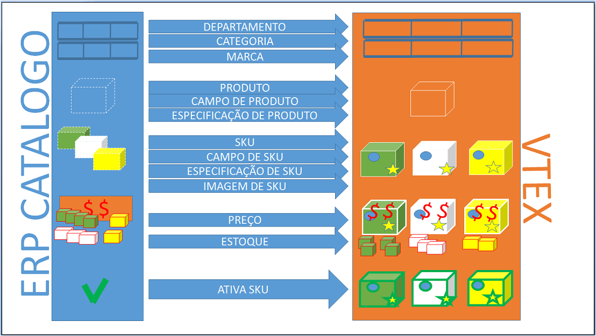

# Complete of Catalog, Price and Inventory

This document is intended to assist on the catalog integration (department, category, brand, images, fields, field values, SKUs activation), price and inventory of the ERP for a  store hosted in smartcheckout version of VTEX. In this type of integration most of the store's management is ERP.



### Catalog Complete Flow


In this scenario of complete flow, most of product data and SKUs are handled through the ERP (brand, images, category, activation, etc ...). The handling of specification fields in this model can be done through REST API, but the best practice would be for the VTEX admin.

To integrate the ERP catalog to one of the store on VTEX, you must use the webservice from the own store, which by definition will attend in https://webservice-nomedaloja.vtexcommerce.com.br/service.svc?wsdl. The access credentials to the webservice must be requested with the store administrator. 

In the future, besides SOAP service (webservice) we're gonna offer catalog integration through REST APIs (JSON) well defined and with high performance.

### Organization of products inside the store

Usually, inside the store the products are organized at marketing structures formed by:

1. **Department** - category whose id of father category is **null**,
2. **Category** - category whose id of father category is a **department**,
3. **Subcategory**.  category whose id of father category is a **category**

*Example:*
*Department/Category/Subcategory/Product*
*Tools/Electric/Drills/Super Drill*

### Department


Following below, examples of calls and answers of Department and Categories through the method “CategoryInsertUpdate”:

_request:_

````xml
<soapenv:Envelope xmlns:soapenv="http://schemas.xmlsoap.org/soap/envelope/" xmlns:tem="http://tempuri.org/" xmlns:vtex="http://schemas.datacontract.org/2004/07/Vtex.Commerce.WebApps.AdminWcfService.Contracts">
<soapenv:Header/>
	<soapenv:Body>
		<tem:CategoryInsertUpdate>
			<tem:category>
				<!--descrição do departamento-->
				<vtex:Description>Departamento de Artesanato</vtex:Description>
				<!--departamento está ativo?-->
				<vtex:IsActive>true</vtex:IsActive>
				<!--palavras chaves do departamento-->
				<vtex:Keywords>Departamento Keywords</vtex:Keywords>
				<!--nome do departamento-->
				<vtex:Name>Departamento Artesanato</vtex:Name>
				<!--titulo do departamento-->
				<vtex:Title>Departamento Artesanato</vtex:Title>
			</tem:category>
		</tem:CategoryInsertUpdate>
	</soapenv:Body>
</soapenv:Envelope>
````

_response:_

```xml
<s:Envelope xmlns:s="http://schemas.xmlsoap.org/soap/envelope/">
	<s:Body>
		<CategoryInsertUpdateResponse xmlns="http://tempuri.org/">
			<CategoryInsertUpdateResult xmlns:a="http://schemas.datacontract.org/2004/07/Vtex.Commerce.WebApps.AdminWcfService.Contracts" xmlns:i="http://www.w3.org/2001/XMLSchema-instance">
				<a:AdWordsRemarketingCode i:nil="true"/>
				<a:Description>Departamento de Artesanato</a:Description>
				<a:FatherCategoryId i:nil="true"/>
				<!--identificador do departamento inserido-->
				<a:Id>1000018</a:Id>
				<a:IsActive>true</a:IsActive>
				<a:Keywords>Departamento Keywords</a:Keywords>
				<a:LomadeeCampaignCode i:nil="true"/>
				<a:Name>Departamento Artesanato</a:Name>
				<a:Title>Departamento Artesanato</a:Title>
			</CategoryInsertUpdateResult>
		</CategoryInsertUpdateResponse>
	</s:Body>
</s:Envelope>
```

### Category

_request:_

```xml
<soapenv:Envelope xmlns:soapenv="http://schemas.xmlsoap.org/soap/envelope/" xmlns:tem="http://tempuri.org/" xmlns:vtex="http://schemas.datacontract.org/2004/07/Vtex.Commerce.WebApps.AdminWcfService.Contracts">
<soapenv:Header/>
	<soapenv:Body>
		<tem:CategoryInsertUpdate>
			<tem:category>
				<!--descrição da categoria-->
				<vtex:Description>Artesanato de Barro</vtex:Description>
				<!--identificador do departamento pai, inserido acima-->
				<vtex:FatherCategoryId>1000018</vtex:FatherCategoryId>
				<!--a categoria está ativa?-->
				<vtex:IsActive>true</vtex:IsActive>
				<!--palavras chave da categoria-->
				<vtex:Keywords>Barro</vtex:Keywords>
				<!--nome da categoria-->
				<vtex:Name>Artesanato de Barro</vtex:Name>
				<!--título da categoria-->
				<vtex:Title>Artesanato de Barro</vtex:Title>
			</tem:category>
		</tem:CategoryInsertUpdate>
	</soapenv:Body>
</soapenv:Envelope>
```

_response_:

```xml
<s:Envelope xmlns:s="http://schemas.xmlsoap.org/soap/envelope/">
	<s:Body>
		<CategoryInsertUpdateResponse xmlns="http://tempuri.org/">
			<CategoryInsertUpdateResult xmlns:a="http://schemas.datacontract.org/2004/07/Vtex.Commerce.WebApps.AdminWcfService.Contracts" xmlns:i="http://www.w3.org/2001/XMLSchema-instance">
				<a:AdWordsRemarketingCode i:nil="true"/>
				<a:Description>Artesanato de Barro</a:Description>
				<a:FatherCategoryId>1000018</a:FatherCategoryId>
				<!--identificador da categoria inserida-->
				<a:Id>1000019</a:Id>
				<a:IsActive>true</a:IsActive>
				<a:Keywords>Barro</a:Keywords>
				<a:LomadeeCampaignCode i:nil="true"/>
				<a:Name>Artesanato de Barro</a:Name>
				<a:Title>Artesanato de Barro</a:Title>
			</CategoryInsertUpdateResult>
		</CategoryInsertUpdateResponse>
	</s:Body>
</s:Envelope>
```

### SubCategory

_request:_

```xml
<soapenv:Envelope xmlns:soapenv="http://schemas.xmlsoap.org/soap/envelope/" xmlns:tem="http://tempuri.org/" xmlns:vtex="http://schemas.datacontract.org/2004/07/Vtex.Commerce.WebApps.AdminWcfService.Contracts">
<soapenv:Header/>
	<soapenv:Body>
		<tem:CategoryInsertUpdate>
			<tem:category>
				<!--descrição da sub categoria-->
				<vtex:Description>Barro Vermelho</vtex:Description>
				<!--identificador da categoria inserida acima-->
				<vtex:FatherCategoryId>1000019</vtex:FatherCategoryId>
				<!--a sub categoria está ativa?-->
				<vtex:IsActive>true</vtex:IsActive>
				<!--palavras chave da sub categoria-->
				<vtex:Keywords>Barro Vermelho</vtex:Keywords>
				<!--nome da sub categoria-->
				<vtex:Name>Artesanato de Barro Vermelho</vtex:Name>
				<!--titulo da sub categoria-->
				<vtex:Title>Artesanato de Barro Vermelho</vtex:Title>
			</tem:category>
		</tem:CategoryInsertUpdate>
	</soapenv:Body>
</soapenv:Envelope>
```

_response:_

```xml
<s:Envelope xmlns:s="http://schemas.xmlsoap.org/soap/envelope/">
	<s:Body>
		<CategoryInsertUpdateResponse xmlns="http://tempuri.org/">
			<CategoryInsertUpdateResult xmlns:a="http://schemas.datacontract.org/2004/07/Vtex.Commerce.WebApps.AdminWcfService.Contracts" xmlns:i="http://www.w3.org/2001/XMLSchema-instance">
				<a:AdWordsRemarketingCode i:nil="true"/>
				<a:Description>Barro Vermelho</a:Description>
				<a:FatherCategoryId>1000019</a:FatherCategoryId>
				<!--identificador da sub categoria inserida-->
				<a:Id>1000020</a:Id>
				<a:IsActive>true</a:IsActive>
				<a:Keywords>Barro Vermelho</a:Keywords>
				<a:LomadeeCampaignCode i:nil="true"/>
				<a:Name>Artesanato de Barro Vermelho</a:Name>
				<a:Title>Artesanato de Barro Vermelho</a:Title>
			</CategoryInsertUpdateResult>
		</CategoryInsertUpdateResponse>
	</s:Body>
</s:Envelope>
```

### Brand


Example of Brand insertion through "BrandInsertUpdate" method:

_request:_

```xml
<soapenv:Envelope xmlns:soapenv="http://schemas.xmlsoap.org/soap/envelope/" xmlns:tem="http://tempuri.org/" xmlns:vtex="http://schemas.datacontract.org/2004/07/Vtex.Commerce.WebApps.AdminWcfService.Contracts">
<soapenv:Header/>
	<soapenv:Body>
		<tem:BrandInsertUpdate>
			<tem:brand>
				<!--descrição da marca-->
				<vtex:Description>Marca DuBom</vtex:Description>
				<!--a marca está ativa?-->
				<vtex:IsActive>true</vtex:IsActive>
				<!--palavras chave da marca-->
				<vtex:Keywords>DuBom Keywords</vtex:Keywords>
				<!--nome da marca-->
				<vtex:Name>DuBom</vtex:Name>
				<!--titulo da marca-->
				<vtex:Title>DuBom</vtex:Title>
			</tem:brand>
		</tem:BrandInsertUpdate>
	</soapenv:Body>
</soapenv:Envelope>
```

_response:_

```xml
<s:Envelope xmlns:s="http://schemas.xmlsoap.org/soap/envelope/">
   <s:Body>
      <BrandInsertUpdateResponse xmlns="http://tempuri.org/">
         <BrandInsertUpdateResult xmlns:a="http://schemas.datacontract.org/2004/07/Vtex.Commerce.WebApps.AdminWcfService.Contracts" xmlns:i="http://www.w3.org/2001/XMLSchema-instance">
			<a:AdWordsRemarketingCode i:nil="true"/>
			<a:Description>Marca DuBom</a:Description>
			<!--identificador da marca inserida-->
			<a:Id>2000011</a:Id>
			<a:IsActive>true</a:IsActive>
			<a:Keywords>DuBom Keywords</a:Keywords>
			<a:LomadeeCampaignCode i:nil="true"/>
			<a:Name>DuBom</a:Name>
			<a:Title>DuBom</a:Title>
         </BrandInsertUpdateResult>
      </BrandInsertUpdateResponse>
   </s:Body>
</s:Envelope
```


### Products and SKUs


[[Developer] - Express Catalog Integration](../express-catalog/index.html)

### Products ot SKUs Fields

The products specification fields must be added to the direct category of them and they must be used with IsStockKeepingUnit = false. The SKUs specification fields must be added to the direct cateogry of them it must be used with IsStockKeepingUnit = true. There aren't webservice methods to add Fileds, a API REST Beta must be used to this purpose. Ex:The product "T-Shirt" has required specifications **color** and **size**, hece, you need to add the field on the t-shirt category informing that every product in this category (and below it) is required to have these fields, **color** and **size**, filled. 

<!--a title="add a product field" href="http://bridge.vtexlab.com.br/vtex.bridge.web_deploy/swagger/ui/index.html#!//CATALOG/CATALOG_Sugestion_0" target="_blank">[Developer beta] - Adding a Product Field Request</a-->


### Field Values

After creating product fields, it is necessary to create their inne values. Find an example below of a field value creation using "ProductEspecificationInsert" method:

_request:_

```xml
<soapenv:Envelope xmlns:soapenv="http://schemas.xmlsoap.org/soap/envelope/" xmlns:tem="http://tempuri.org/" xmlns:arr="http://schemas.microsoft.com/2003/10/Serialization/Arrays">
   <soapenv:Header/>
   <soapenv:Body>
      <tem:ProductEspecificationInsert>
         <!--number, identificador do produto que esta rebendo o valor de campo-->
         <tem:idProduct>31018369</tem:idProduct>
         <!--string, identificador do campo, o nome do campo-->
         <tem:fieldName>Material</tem:fieldName>
         <!--array, lista de valores do campo-->
         <tem:fieldValues>
            <!--string, valor do campo-->
            <arr:string>ceramica</arr:string>
         </tem:fieldValues>
      </tem:ProductEspecificationInsert>
   </soapenv:Body>
</soapenv:Envelope>
```

_response:_

```xml
<s:Envelope xmlns:s="http://schemas.xmlsoap.org/soap/envelope/">
   <s:Body>
      <ProductEspecificationInsertResponse xmlns="http://tempuri.org/"/>
   </s:Body>
</s:Envelope>
```

If you want to insert a field value defined as just SKU field, use the following method "StockKeepingUnitEspecificationInsert":

_request:_

```xml
<soapenv:Envelope xmlns:soapenv="http://schemas.xmlsoap.org/soap/envelope/" xmlns:tem="http://tempuri.org/" xmlns:arr="http://schemas.microsoft.com/2003/10/Serialization/Arrays">
   <soapenv:Header/>
   <soapenv:Body>
      <tem:StockKeepingUnitEspecificationInsert>
         <!--number, identificador do SKU dono do campo-->
         <tem:idSku></tem:idSku>
         <!--string, identificador do campo, nome do campo-->
         <tem:fieldName></tem:fieldName>
         <!--array, lista de valores dos campos-->
         <tem:fieldValues>
            <!--string, valor de campo-->
            <arr:string></arr:string>
         </tem:fieldValues>
      </tem:StockKeepingUnitEspecificationInsert>
   </soapenv:Body>
</soapenv:Envelope>
```

_response:_

```xml
<s:Envelope xmlns:s="http://schemas.xmlsoap.org/soap/envelope/">
   <s:Body>
      <StockKeepingUnitEspecificationInsertResponse xmlns="http://tempuri.org/"/>
   </s:Body>
</s:Envelope>
```

### SKUs Images

Request example to insert SKU image. There aren't methods to delete images. 

_request:_
```xml
<soapenv:Envelope xmlns:soapenv="http://schemas.xmlsoap.org/soap/envelope/" xmlns:tem="http://tempuri.org/">
<soapenv:Header/>
	<soapenv:Body>
		<tem:ImageServiceInsertUpdate>
			<!--url da imagem-->
			<tem:urlImage>https://encrypted-tbn3.gstatic.com/images?q=tbn:ANd9GcQ6Lu0obmddsQX3JELe04hUs_hSelsmU8_W1yn5ztgdAk5SJC7D</tem:urlImage>
			<!--nome da imagem-->
			<tem:imageName>Barro Vermelho Escuro</tem:imageName>
			<!--identificador do SKu que irá receber a imagem-->
			<tem:stockKeepingUnitId>31018371</tem:stockKeepingUnitId>
		</tem:ImageServiceInsertUpdate>
	</soapenv:Body>
</soapenv:Envelope>
```

_response:_

```xml
<s:Envelope xmlns:s="http://schemas.xmlsoap.org/soap/envelope/">
	<s:Body>
	  <ImageServiceInsertUpdateResponse xmlns="http://tempuri.org/"/>
	</s:Body>
</s:Envelope>
```

_request 2:_

```xml
<soapenv:Envelope xmlns:soapenv="http://schemas.xmlsoap.org/soap/envelope/" xmlns:tem="http://tempuri.org/">
<soapenv:Header/>
	<soapenv:Body>
		<tem:ImageServiceInsertUpdate>
			<tem:urlImage>http://1.bp.blogspot.com/_ZANjG3oA2BI/TCJfvX-7daI/AAAAAAAADZ0/yO5MwjMtjdI/s400/vaso_5cm.jpg</tem:urlImage>
			<tem:imageName>Barro Vermelho Claro</tem:imageName>
			<tem:stockKeepingUnitId>31018372</tem:stockKeepingUnitId>
			<tem:fileId>31018372</tem:fileId>
		</tem:ImageServiceInsertUpdate>
	</soapenv:Body>
</soapenv:Envelope>
```

_response 2:_

```xml
<s:Envelope xmlns:s="http://schemas.xmlsoap.org/soap/envelope/">
   <s:Body>
      <ImageServiceInsertUpdateResponse xmlns="http://tempuri.org/"/>
   </s:Body>
</s:Envelope>
```

### Inventory and Price

Once the products and SKUs are already registered on VTEX platform, it is necessary to add inventory and price.


### Price

If a valid price was not sent on the moment of adding a new SKU, it is necessary to insert a new price to it. This may be done directly on VTEX admin (_urldaloja/admin/Site/SkuTabelaValor.aspx_), or using  API REST methods.

**Pricing**.

Insert and Update price through Pricing API:

<a title="Insert or Update a SKU price" href="http://bridge.vtexlab.com.br/vtex.bridge.web_deploy/swagger/ui/index.html#!/PRICING/PRICING_Set" target="_blank">[Developer] - Request to Insert or Update a SKU price</a>


Complete **Pricing API** may be found at: [http://lab.vtex.com/docs/pricing/api/latest/pricing/index.html](http://lab.vtex.com/docs/pricing/api/latest/pricing/index.html)

### Inventory


Insert and update SKUs stock through Logistics API:

<a title="Insert and update SKUs stock" href="http://bridge.vtexlab.com.br/vtex.bridge.web_deploy/swagger/ui/index.html#!/LOGISTIC/LOGISTIC_SetBalance" target="_blank">[Developer] - Insert and update SKUs stock Request</a>

Complete **Logistics API** may be found at: [http://lab.vtex.com/docs/logistics/api/latest/warehouse/index.html](http://lab.vtex.com/docs/logistics/api/latest/warehouse/index.html)


### Activate SKUs

After creating all the SKUs and filling the required information (image, stock, price, specifications) it's time to activate them. Activating SKU Request:

_request:_

```xml
<soapenv:Envelope xmlns:soapenv="http://schemas.xmlsoap.org/soap/envelope/" xmlns:tem="http://tempuri.org/">
<soapenv:Header/>
	<soapenv:Body>
		<tem:StockKeepingUnitActive>
			<!--identificador da SKU que deseja tentar ativar-->
			<tem:idStockKeepingUnit>31018371</tem:idStockKeepingUnit>
		</tem:StockKeepingUnitActive>
	</soapenv:Body>
</soapenv:Envelope>
```

_response:_

```xml
<s:Envelope xmlns:s="http://schemas.xmlsoap.org/soap/envelope/">
   <s:Body>
      <StockKeepingUnitActiveResponse xmlns="http://tempuri.org/"/>
   </s:Body>
</s:Envelope>
```

_request 2:_

```xml
<soapenv:Envelope xmlns:soapenv="http://schemas.xmlsoap.org/soap/envelope/" xmlns:tem="http://tempuri.org/">
<soapenv:Header/>
	<soapenv:Body>
		<tem:StockKeepingUnitActive>
			<tem:idStockKeepingUnit>31018372</tem:idStockKeepingUnit>
		</tem:StockKeepingUnitActive>
	</soapenv:Body>
</soapenv:Envelope>
```

_response 2:_

```xml
<s:Envelope xmlns:s="http://schemas.xmlsoap.org/soap/envelope/">
   <s:Body>
      <StockKeepingUnitActiveResponse xmlns="http://tempuri.org/"/>
   </s:Body>
</s:Envelope>
```

### SKUs Update

After creating a SKU, if an update is necessary, you must use the same method inserting the SKU id on the body. Price update must **NOT** be done by insert/update SKU method.

Price pudate must be done directly through **Pricing** REST API:
<a title="Insert and Update SKU price" href="http://bridge.vtexlab.com.br/vtex.bridge.web_deploy/swagger/ui/index.html#!/PRICING/PRICING_Set" target="_blank">[Developer] - Insert and Update SKU price Request</a>

_request:_

```xml
<soapenv:Envelope xmlns:soapenv="http://schemas.xmlsoap.org/soap/envelope/" xmlns:tem="http://tempuri.org/" xmlns:vtex="http://schemas.datacontract.org/2004/07/Vtex.Commerce.WebApps.AdminWcfService.Contracts">
<soapenv:Header/>
	<soapenv:Body>
		<tem:StockKeepingUnitInsertUpdate>
			<tem:stockKeepingUnitVO>
				<!--number, cubagem = peso cubico -->
				<vtex:CubicWeight>100</vtex:CubicWeight>
				<!--number, altura com embalagem e metros-->
				<vtex:Height>1.800</vtex:Height>
				<!--bool, se não atender requisitos de ativação(imagem, preço, estoque, espec., outros reqs obrig.), não será ativado-->
				<vtex:IsActive>true</vtex:IsActive>
				<!--bool, disponibilidade -->
				<vtex:IsAvaiable>true</vtex:IsAvaiable>
				<!--bool, é um KIT? -->
				<vtex:IsKit>false</vtex:IsKit>
				<!--number, comprimento com embalagem em metros -->
				<vtex:Length>1.52</vtex:Length>
				<!--decimal, ** ler obs -->
				<vtex:ListPrice>150.0</vtex:ListPrice>
				<!--prefixo do estoque (id estoque = 1_1, mandar 1) -->
				<vtex:ModalId>1</vtex:ModalId>
				<!--string, opicional, tipo de carga, necessita configuração de transportadora especial quando preenchido -->
				<vtex:ModalType>Vidro</vtex:ModalType>
				<!--string, nome da SKU -->
				<vtex:Name>Vaso Artesanal de Barro Laranja Escuro </vtex:Name>
				<!--decimal,  preço, "POR", opcional **ler obs-->
				<vtex:Price>110.0</vtex:Price>
				<!--number, identificador do produto pai da SKU -->
				<vtex:ProductId>31018369</vtex:ProductId>
				<!--number, peso real em kilos -->
				<vtex:RealHeight>1.740</vtex:RealHeight>
				<!--number, altural real em metros -->
				<vtex:RealLength>1.60</vtex:RealLength>
				<!--number, peso real em kilos -->
				<vtex:RealWeightKg>2.750</vtex:RealWeightKg>
				<!--number, comprimento real em metros -->
				<vtex:RealWidth>1.7</vtex:RealWidth>
				<!--number, identificador da SKU no ERP -->
				<vtex:RefId>00123456</vtex:RefId>
				<!--number, opcional, numero de pontos dessa SKU -->
				<vtex:RewardValue>0</vtex:RewardValue>
				<!--lista de string, EANs do produto -->
				<vtex:StockKeepingUnitEans>
				<vtex:StockKeepingUnitEanDTO>
				<vtex:Ean>0123456789123</vtex:Ean>
				</vtex:StockKeepingUnitEanDTO>
				</vtex:StockKeepingUnitEans>
				<!--number, unidade de multipliçao para venda -->
				<vtex:UnitMultiplier>1</vtex:UnitMultiplier>
				<!--number, peso em kilos-->
				<vtex:WeightKg>1.5</vtex:WeightKg>
				<!--number, largura com embalagem em metros -->
				<vtex:Width>2.780</vtex:Width>
			</tem:stockKeepingUnitVO>
		</tem:StockKeepingUnitInsertUpdate>
	</soapenv:Body>
</soapenv:Envelope>
```

* Id and RefId fieds define if it is an insertion or an update, in case of existing id or RefId, it is an update.

** In case of null price updated, it will not send price information.

_response:_

```xml
<s:Envelope xmlns:s="http://schemas.xmlsoap.org/soap/envelope/">
	<s:Body>
	<StockKeepingUnitInsertUpdateResponse xmlns="http://tempuri.org/">
		<StockKeepingUnitInsertUpdateResult xmlns:a="http://schemas.datacontract.org/2004/07/Vtex.Commerce.WebApps.AdminWcfService.Contracts" xmlns:i="http://www.w3.org/2001/XMLSchema-instance">
		<a:CommercialConditionId i:nil="true"/>
		<a:CostPrice>1</a:CostPrice>
		<a:CubicWeight>100</a:CubicWeight>
		<a:DateUpdated>2014-10-29T19:03:17.718427</a:DateUpdated>
		<a:EstimatedDateArrival i:nil="true"/>
		<a:Height>1.800</a:Height>
		<a:Id>31018371</a:Id>
		<a:InternalNote i:nil="true"/>
		<a:IsActive>false</a:IsActive>
		<a:IsAvaiable>false</a:IsAvaiable>
		<a:IsKit>false</a:IsKit>
		<a:Length>1.52</a:Length>
		<a:ListPrice>150.0</a:ListPrice>
		<a:ManufacturerCode i:nil="true"/>
		<a:MeasurementUnit>un</a:MeasurementUnit>
		<a:ModalId>1</a:ModalId>
		<a:ModalType>Vidro</a:ModalType>
		<a:Name>Vaso Artesanal de Barro Laranja Escuro</a:Name>
		<a:Price>110.0</a:Price>
		<a:ProductId>31018369</a:ProductId>
		<a:ProductName>Vaso Artesanal de Barro Vermelho</a:ProductName>
		<a:RealHeight>1.740</a:RealHeight>
		<a:RealLength>1.60</a:RealLength>
		<a:RealWeightKg>2.750</a:RealWeightKg>
		<a:RealWidth>17</a:RealWidth>
		<a:RefId>00123456</a:RefId>
		<a:RewardValue>0</a:RewardValue>
		<a:StockKeepingUnitEans>
		<a:StockKeepingUnitEanDTO>
		<a:Ean>0123456789123</a:Ean>
		</a:StockKeepingUnitEanDTO>
		</a:StockKeepingUnitEans>
		<a:UnitMultiplier>1</a:UnitMultiplier>
		<a:WeightKg>2.780</a:WeightKg>
		<a:Width>1.550</a:Width>
		</StockKeepingUnitInsertUpdateResult>
	</StockKeepingUnitInsertUpdateResponse>
	</s:Body>
</s:Envelope>
```

### Service

There are services (gift packs, warranty, etc.) that may be realted to SKUs. To use it in this matter, firstly, a service must be created. After creating it, you must insert a price to this service and then relate it to a SKU, Example:

_Criando o serviço._

_request:_

```xml
<soapenv:Envelope xmlns:soapenv="http://schemas.xmlsoap.org/soap/envelope/" xmlns:tem="http://tempuri.org/" xmlns:vtex="http://schemas.datacontract.org/2004/07/Vtex.Commerce.WebApps.AdminWcfService.Contracts">
   <soapenv:Header/>
   <soapenv:Body>
      <tem:ServiceInsertUpdate>
         <tem:service>
		    <!--number, id do serviço -->
            <vtex:Id>134</vtex:Id>
		    <!--bool, está ativo ? -->
            <vtex:IsActive>true</vtex:IsActive>
		    <!--bool, é um arquivo ? -->
            <vtex:IsFile>false</vtex:IsFile>
		    <!--bool, é GiftCard ? -->
            <vtex:IsGiftCard>false</vtex:IsGiftCard>
		    <!--bool, é obrigatório ? -->
            <vtex:IsRequired>false</vtex:IsRequired>
		    <!--bool, está visível no carrinho ? -->
            <vtex:IsVisibleOnCart>true</vtex:IsVisibleOnCart>
		    <!--bool, exibe no Produto ? -->
            <vtex:IsVisibleOnProduct>true</vtex:IsVisibleOnProduct>
		    <!--bool, exibe no Serviço ? -->
            <vtex:IsVisibleOnService>true</vtex:IsVisibleOnService>
		    <!--bool, nome do serviço -->
            <vtex:Name>Embalagem para presente</vtex:Name>
         </tem:service>
      </tem:ServiceInsertUpdate>
   </soapenv:Body>
</soapenv:Envelope>
```

_response:_

```xml
<s:Envelope xmlns:s="http://schemas.xmlsoap.org/soap/envelope/">
   <s:Body>
      <ServiceInsertUpdateResponse xmlns="http://tempuri.org/">
         <ServiceInsertUpdateResult xmlns:a="http://schemas.datacontract.org/2004/07/Vtex.Commerce.WebApps.AdminWcfService.Contracts" xmlns:i="http://www.w3.org/2001/XMLSchema-instance">
            <a:Id>134</a:Id>
            <a:IsActive>true</a:IsActive>
            <a:IsFile>false</a:IsFile>
            <a:IsGiftCard>false</a:IsGiftCard>
            <a:IsRequired>false</a:IsRequired>
            <a:IsVisibleOnCart>true</a:IsVisibleOnCart>
            <a:IsVisibleOnProduct>true</a:IsVisibleOnProduct>
            <a:IsVisibleOnService>true</a:IsVisibleOnService>
            <a:Name>Embalagem para presente</a:Name>
         </ServiceInsertUpdateResult>
         <serviceId>134</serviceId>
      </ServiceInsertUpdateResponse>
   </s:Body>
</s:Envelope>
```

_Inserting price on the service._

_request:_

```xml
<soapenv:Envelope xmlns:soapenv="http://schemas.xmlsoap.org/soap/envelope/" xmlns:tem="http://tempuri.org/" xmlns:vtex="http://schemas.datacontract.org/2004/07/Vtex.Commerce.WebApps.AdminWcfService.Contracts">
   <soapenv:Header/>
   <soapenv:Body>
      <tem:ServicePriceInsertUpdate>
         <tem:servicePrice>
			<!-- number, id de preço do serviço -->
            <vtex:Id>1</vtex:Id>
			<!-- decimal, preço "POR" do serviço  -->
            <vtex:ListPrice>5.0</vtex:ListPrice>
			<!-- string, nome do serviço -->
            <vtex:Name>Embalagem para presente</vtex:Name>
			<!-- decimal, preço "DE" do serviço -->
            <vtex:Price>10.0</vtex:Price>
			<!-- number, id do serviço -->
            <vtex:ServiceId>134</vtex:ServiceId>
         </tem:servicePrice>
      </tem:ServicePriceInsertUpdate>
   </soapenv:Body>
</soapenv:Envelope>
```
*This method may also be use to update service price.

_response:_

```xml
<s:Envelope xmlns:s="http://schemas.xmlsoap.org/soap/envelope/">
   <s:Body>
      <ServicePriceInsertUpdateResponse xmlns="http://tempuri.org/">
         <ServicePriceInsertUpdateResult xmlns:a="http://schemas.datacontract.org/2004/07/Vtex.Commerce.WebApps.AdminWcfService.Contracts" xmlns:i="http://www.w3.org/2001/XMLSchema-instance">
            <a:Id>1</a:Id>
            <a:ListPrice>5.0</a:ListPrice>
            <a:Name>Embalagem para presente</a:Name>
            <a:Price>10.0</a:Price>
            <a:Service>
               <a:Id>134</a:Id>
               <a:IsActive>true</a:IsActive>
               <a:IsFile>false</a:IsFile>
               <a:IsGiftCard>false</a:IsGiftCard>
               <a:IsRequired>false</a:IsRequired>
               <a:IsVisibleOnCart>true</a:IsVisibleOnCart>
               <a:IsVisibleOnProduct>true</a:IsVisibleOnProduct>
               <a:IsVisibleOnService>true</a:IsVisibleOnService>
               <a:Name>Embalagem para presente</a:Name>
            </a:Service>
            <a:ServiceId>134</a:ServiceId>
         </ServicePriceInsertUpdateResult>
         <servicePriceId>1</servicePriceId>
      </ServicePriceInsertUpdateResponse>
   </s:Body>
</s:Envelope>
```

_Relating a service to a SKU._

_request:_

```xml
<soapenv:Envelope xmlns:soapenv="http://schemas.xmlsoap.org/soap/envelope/" xmlns:tem="http://tempuri.org/" xmlns:vtex="http://schemas.datacontract.org/2004/07/Vtex.Commerce.WebApps.AdminWcfService.Contracts">
   <soapenv:Header/>
   <soapenv:Body>
      <tem:StockKeepingUnitServiceInsertUpdate>
         <tem:stockKeepingUnitService>
			<!-- string, descrição do serviço -->
            <vtex:Description>Embalagem para presente</vtex:Description>
			<!-- number, id da inserção de serviço no SKU -->
            <vtex:Id>123</vtex:Id>
			<!-- bool, está ativo ? -->
            <vtex:IsActive>true</vtex:IsActive>
			<!-- string, nome do serviço -->
            <vtex:Name>Embalagem para presente</vtex:Name>
			<!-- number, id do serviço -->
            <vtex:ServiceId>134</vtex:ServiceId>
			<!-- number, id do preço do serviço -->
            <vtex:ServicePriceId>1</vtex:ServicePriceId>
			<!-- number, id do SKU -->
            <vtex:StockKeepingUnitId>31018371</vtex:StockKeepingUnitId>
         </tem:stockKeepingUnitService>
      </tem:StockKeepingUnitServiceInsertUpdate>
   </soapenv:Body>
</soapenv:Envelope>
```

*This method may also be used to update service information.

_response:_

```xml
<s:Envelope xmlns:s="http://schemas.xmlsoap.org/soap/envelope/">
   <s:Body>
      <StockKeepingUnitServiceInsertUpdateResponse xmlns="http://tempuri.org/">
         <StockKeepingUnitServiceInsertUpdateResult xmlns:a="http://schemas.datacontract.org/2004/07/Vtex.Commerce.WebApps.AdminWcfService.Contracts" xmlns:i="http://www.w3.org/2001/XMLSchema-instance">
            <a:Description>Embalagem para presente</a:Description>
            <a:Id>123</a:Id>
            <a:IsActive>true</a:IsActive>
            <a:Name>Embalagem para presente</a:Name>
            <a:ServiceId>134</a:ServiceId>
            <a:ServicePrice>
               <a:Id>1</a:Id>
               <a:ListPrice>5.0000</a:ListPrice>
               <a:Name>Embalagem para presente</a:Name>
               <a:Price>10.0000</a:Price>
               <a:Service>
                  <a:Id>134</a:Id>
                  <a:IsActive>true</a:IsActive>
                  <a:IsFile>false</a:IsFile>
                  <a:IsGiftCard>false</a:IsGiftCard>
                  <a:IsRequired>false</a:IsRequired>
                  <a:IsVisibleOnCart>true</a:IsVisibleOnCart>
                  <a:IsVisibleOnProduct>true</a:IsVisibleOnProduct>
                  <a:IsVisibleOnService>true</a:IsVisibleOnService>
                  <a:Name>Embalagem para presente</a:Name>
               </a:Service>
               <a:ServiceId>134</a:ServiceId>
            </a:ServicePrice>
            <a:ServicePriceId>1</a:ServicePriceId>
            <a:StockKeepingUnitId>31018371</a:StockKeepingUnitId>
         </StockKeepingUnitServiceInsertUpdateResult>
         <stockKeepingUnitServiceId>123</stockKeepingUnitServiceId>
      </StockKeepingUnitServiceInsertUpdateResponse>
   </s:Body>
</s:Envelope>
```


### Orders and Tracking


To integrate orders, find more at: [[Guide] Order, Invoice and Tracking Integration](../pedido-e-tracking/index.html).

---

autor: _Jonas Bolognim_
propriedade: _VTEX_
