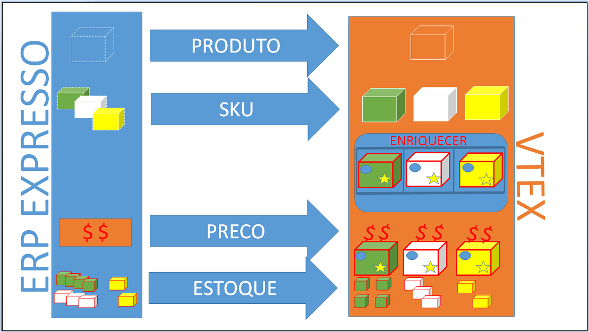

# Fast Integration of Catalog, Price and inventory

This document is intended to assist on the catalog, price and inventory integration of the ERP for a store hosted in smartcheckout version of VTEX, in a fast way. In this type of integration most of the store's management is on the VTEX admin, being the ERP only the source where products and SKUs are born. 

### Catalog Basic Flow (Express)


In this scenario of basic flow, only the basic data of products and SKUs are handled by the ERP, and all enrichment (brand, images, category, activation, etc ...) will be done by the store's admin on the VTEX platform. 

To integrate the ERP to the store's catalog on VTEX, you must use the webservice from the own store, which by definition will attend in https://webservice-STORENAME.vtexcommerce.com.br/service.svc?wsdl. The access credentials to the webservice must be requested with the store administrator. 

In the future, besides SOAP service (webservice) we're gonna offer catalog integration through REST APIs (JSON) well defined and with high performance.


### Organization of products inside the store


Usually, inside the store the products are organized at marketing structures formed by:

1. **Department** - category whose id of father category is **null**,
2. **Category** - category whose id of father category is a **department**,
3. **Subcategory** - category whose id of father category is a **category**.

_Example:_

* Department/Category/SubCategory/Product
* Tools/Electric Tools/Drills/Super Drill

The registration of marketing structure must be done directly on the admin of the own store. (_http://STORENAME.com.br/admin/Site/Categories.aspx_), to attend the integration came from the ERP, a standard department is created for products that comes from the ERP, what means that every product drops on the store's admin in this standard department and then at the moment of enrichment is placed in the desired category. 

**Marca**
Brand Creation of brands also must be done by the VTEX admin. To drop the product from the ERP, create a standard brand and then at the moment of enrichment, inside the VTEX admin, place in the correct brand.


### Products and SKUs


> What's the difference between product and SKU?

 **Product** is the most generic definition of something that is offered to the customer, for example, *Refrigerator*, *T-shirt*, *Ball*.

**SKU** are the initials of “stock keeping unit” in English, in Portuguese it is Unidade de Manutenção de Estoque, what means that a SKU defines a variation of a product, for example, *110V White Refrigerato*r, *Large Yellow T-Shirt*.

In the registration model of products and SKUs of VTEX, a SKU will always be a son of a product (there isn't SKU without product), even if this product doesn't have variations, and in this case will be 1 SKU to 1 product, for example product *Jabulani Ball* with the *Jabulani Ball SKU* .


### Integration of Products and SKUs


After the variations and the store marketing structure be defined, the next step is send the products and ERP SKUs to the VTEX store.

_Flow:_



### Product


Adding a product using "ProductInsertUpdate" method:

_request:_

```xml
<soapenv:Envelope xmlns:soapenv="http://schemas.xmlsoap.org/soap/envelope/" xmlns:tem="http://tempuri.org/" xmlns:vtex="http://schemas.datacontract.org/2004/07/Vtex.Commerce.WebApps.AdminWcfService.Contracts" xmlns:arr="http://schemas.microsoft.com/2003/10/Serialization/Arrays">
<soapenv:Header/>
	<soapenv:Body>
		<tem:ProductInsertUpdate>
			<tem:productVO>
			<!--int, identificdor da marca-->
			<vtex:BrandId>2000011</vtex:BrandId>
			<!--int, identificdor da categoria-->
			<vtex:CategoryId>1000020</vtex:CategoryId>
			<!--int, identificdor do departamento-->
			<vtex:DepartmentId>1000018</vtex:DepartmentId>
			<!--string, descrição completa do produto-->
			<vtex:Description>Vaso de barro vermelho, feito a mão com barro do mar vermelho</vtex:Description>
			<!--string, descrição curta do produto-->
			<vtex:DescriptionShort>Vaso de barro vermelho artesanal</vtex:DescriptionShort>
			<!--int, opcional, identificador no ERP caso int-->
            <vtex:Id>1234567</vtex:Id>
			<!--bool, se não atender requisitos de ativação(ter SKUs ativas), não será ativado-->
			<vtex:IsActive>true</vtex:IsActive>
			<!--bool, vai ser visível no site-->
			<vtex:IsVisible>true</vtex:IsVisible>
			<!--string, palavras chaves relevantes para a busca-->
			<vtex:KeyWords> Barro, vaso, vermelho</vtex:KeyWords>
			<!--lista de inteiros, pra qual canal de vendas = loja principal = 1-->
			<vtex:ListStoreId>
			   	<arr:int>1</arr:int>
				<arr:int>2</arr:int>
			</vtex:ListStoreId>
			<!--meta tag de description (SEO)-->
			<vtex:MetaTagDescription>feito a mão com barro do mar vermelho</vtex:MetaTagDescription>
			<!--string, nome do produto-->
			<vtex:Name>Vaso Artesanal de Barro Vermelho</vtex:Name>
			<!--string, identificador do produto no ERP-->
			<vtex:RefId>1234567890</vtex:RefId>
			<!--string, titulo do produto-->
			<vtex:Title>Vaso Artesanal de Barro Vermelho</vtex:Title>
			</tem:productVO>
		</tem:ProductInsertUpdate>
	</soapenv:Body>
</soapenv:Envelope>
```

_response:_

```xml
<s:Envelope xmlns:s="http://schemas.xmlsoap.org/soap/envelope/">
   <s:Body>
      <ProductInsertUpdateResponse xmlns="http://tempuri.org/">
         <ProductInsertUpdateResult xmlns:a="http://schemas.datacontract.org/2004/07/Vtex.Commerce.WebApps.AdminWcfService.Contracts" xmlns:i="http://www.w3.org/2001/XMLSchema-instance">
            <a:AdWordsRemarketingCode i:nil="true"/>
            <a:BrandId>2000011</a:BrandId>
            <a:CategoryId>1000020</a:CategoryId>
            <a:DepartmentId>1000018</a:DepartmentId>
            <a:Description>Vaso de barro vermelho, feito a mão com barro do mar vermelho</a:Description>
            <a:DescriptionShort>Vaso de barro vermelho artesanal</a:DescriptionShort>
			<!--identificador do produto inserido-->
            <a:Id>31018369</a:Id>
            <a:IsActive>false</a:IsActive>
            <a:IsVisible>true</a:IsVisible>
            <a:KeyWords>Barro, vaso, vermelho</a:KeyWords>
            <a:ListStoreId xmlns:b="http://schemas.microsoft.com/2003/10/Serialization/Arrays">
               <b:int>1</b:int>
               <b:int>2</b:int>
            </a:ListStoreId>
            <a:LomadeeCampaignCode i:nil="true"/>
            <a:MetaTagDescription>feito a mão com barro do mar vermelho</a:MetaTagDescription>
            <a:Name>Vaso Artesanal de Barro Vermelho</a:Name>
            <a:RefId>1234567890</a:RefId>
            <a:ReleaseDate i:nil="true"/>
            <a:ShowWithoutStock>true</a:ShowWithoutStock>
            <a:SupplierId i:nil="true"/>
            <a:TaxCode i:nil="true"/>
            <a:Title>Vaso Artesanal de Barro Vermelho</a:Title>
         </ProductInsertUpdateResult>
      </ProductInsertUpdateResponse>
   </s:Body>
</s:Envelope>
```


### SKU


Once all products are inserted, which theoretically are the fathers of SKUs, it's the moment to send daughters SKUs of products. Following bellow, an Example of the call and answer of a SKU insertion using the method "StockKeepingUnitInsertUpdate":

_request:_

```xml
<soapenv:Envelope xmlns:soapenv="http://schemas.xmlsoap.org/soap/envelope/" xmlns:tem="http://tempuri.org/" xmlns:vtex="http://schemas.datacontract.org/2004/07/Vtex.Commerce.WebApps.AdminWcfService.Contracts">
<soapenv:Header/>
	<soapenv:Body>
		<tem:StockKeepingUnitInsertUpdate>
			<tem:stockKeepingUnitVO>
			<!--decimal, cubagem = peso cubico -->
			<vtex:CubicWeight>100</vtex:CubicWeight>
			<!--decimal, altura com embalagem e metros-->
			<vtex:Height>1.800</vtex:Height>
			<!--int, opcional, identificador da sku no ERP caso int-->
            <vtex:Id>00123456</vtex:Id>
			<!--bool, se não atender requisitos de ativação(imagem, preço, estoque, espec., outros reqs obrig.), não será ativado-->
			<vtex:IsActive>true</vtex:IsActive>
			<!--bool, disponibilidade -->
			<vtex:IsAvaiable>true</vtex:IsAvaiable>
			<!--bool, é um KIT? -->
			<vtex:IsKit>false</vtex:IsKit>
			<!--decimal, comprimento com embalagem em metros -->
			<vtex:Length>1.52</vtex:Length>
			<!--decimal, ** ler obs -->
			<vtex:ListPrice>150.0</vtex:ListPrice>
			<!--number, prefixo do estoque (id estoque = 1_1, mandar 1) -->
			<vtex:ModalId>1</vtex:ModalId>
			<!--string, opicional, tipo de carga, necessita configuração de transportadora especial quando preenchido -->
			<vtex:ModalType>Vidro</vtex:ModalType>
			<!--string, nome da SKU -->
			<vtex:Name>Vaso Artesanal de Barro Vermelho Escuro </vtex:Name>
			<!--decimal,  preço, "POR", opcional **ler obs-->
			<vtex:Price>110.0</vtex:Price>
			<!--int, identificador do produto pai da SKU -->
			<vtex:ProductId>31018369</vtex:ProductId>
			<!--decimal, peso real em kilos -->
			<vtex:RealHeight>1.740</vtex:RealHeight>
			<!--decimal, altural real em metros -->
			<vtex:RealLength>1.60</vtex:RealLength>
			<!--decimal, peso real em kilos -->
			<vtex:RealWeightKg>2.750</vtex:RealWeightKg>
			<!--decimal, comprimento real em metros -->
			<vtex:RealWidth>1.7</vtex:RealWidth>
			<!--string, identificador da SKU no ERP -->
			<vtex:RefId>00123456</vtex:RefId>
			<!--number, opcional, numero de pontos dessa SKU -->
			<vtex:RewardValue>0</vtex:RewardValue>
			<!--lista de string, EANs do produto -->
			<vtex:StockKeepingUnitEans>
			   <vtex:StockKeepingUnitEanDTO>
			   		<vtex:Ean>0123456789123</vtex:Ean>
			   </vtex:StockKeepingUnitEanDTO>
			</vtex:StockKeepingUnitEans>
			<!--int, unidade de multipliçao para venda -->
			<vtex:UnitMultiplier>1</vtex:UnitMultiplier>
			<!--decimal, peso em kilos-->
			<vtex:WeightKg>1.5</vtex:WeightKg>
			<!--decimal, largura com embalagem em metros -->
			<vtex:Width>2.780</vtex:Width>
			</tem:stockKeepingUnitVO>
		</tem:StockKeepingUnitInsertUpdate>
	</soapenv:Body>
</soapenv:Envelope>
```

_response:_

```xml
<s:Envelope xmlns:s="http://schemas.xmlsoap.org/soap/envelope/">
   <s:Body>
      <StockKeepingUnitInsertUpdateResponse xmlns="http://tempuri.org/">
         <StockKeepingUnitInsertUpdateResult xmlns:a="http://schemas.datacontract.org/2004/07/Vtex.Commerce.WebApps.AdminWcfService.Contracts" xmlns:i="http://www.w3.org/2001/XMLSchema-instance">
            <a:CommercialConditionId i:nil="true"/>
            <a:CostPrice>1</a:CostPrice>
            <a:CubicWeight>100</a:CubicWeight>
            <a:DateUpdated>2014-10-29T19:03:17.718427</a:DateUpdated>
            <a:EstimatedDateArrival i:nil="true"/>
            <a:Height>1.800</a:Height>
			<!--identificador do sku inserido-->
            <a:Id>31018371</a:Id>
            <a:InternalNote i:nil="true"/>
            <a:IsActive>false</a:IsActive>
            <a:IsAvaiable>false</a:IsAvaiable>
            <a:IsKit>false</a:IsKit>
            <a:Length>1.52</a:Length>
            <a:ListPrice>150.0</a:ListPrice>
            <a:ManufacturerCode i:nil="true"/>
            <a:MeasurementUnit>un</a:MeasurementUnit>
            <a:ModalId>1</a:ModalId>
            <a:ModalType>Vidro</a:ModalType>
            <a:Name>Vaso Artesanal de Barro Vermelho Escuro</a:Name>
            <a:Price>110.0</a:Price>
            <a:ProductId>31018369</a:ProductId>
            <a:ProductName>Vaso Artesanal de Barro Vermelho</a:ProductName>
            <a:RealHeight>1.740</a:RealHeight>
            <a:RealLength>1.60</a:RealLength>
            <a:RealWeightKg>2.750</a:RealWeightKg>
            <a:RealWidth>17</a:RealWidth>
            <a:RefId>00123456</a:RefId>
            <a:RewardValue>0</a:RewardValue>
            <a:StockKeepingUnitEans>
               <a:StockKeepingUnitEanDTO>
                  <a:Ean>0123456789123</a:Ean>
               </a:StockKeepingUnitEanDTO>
            </a:StockKeepingUnitEans>
            <a:UnitMultiplier>1</a:UnitMultiplier>
            <a:WeightKg>2.780</a:WeightKg>
            <a:Width>1.550</a:Width>
         </StockKeepingUnitInsertUpdateResult>
      </StockKeepingUnitInsertUpdateResponse>
   </s:Body>
</s:Envelope>
```

**PS**

The SKU price cannot be sent at the moment of SKU insertion. When a price isn't sent at the moment of a SKU creation, in the SKU table for obligation,  is created a fictitious price of 99999.00, and on the system "Pricing" of VTEX the price isn't inserted. 

### Price and Inventory


Once registered products and SKUs in the VTEX store, is necessary to feed the inventory and set the price on the price table (if at the moment of inserting, the SKU has not sent the price).


### Price


If at the moment of SKU insertion wasn't sent a valid price to the SKU,  is necessary to insert its price. It can be done directly on the admin store on VTEX (urldaloja / admin / site / SkuTabelaValor.aspx), or using the REST API from the **Pricing** system.


Through API of the Pricing, insert or update price in SKUs: 

<a title="inserir ou atualizar preço na SKUs" href="http://bridge.vtexlab.com.br/vtex.bridge.web_deploy/swagger/ui/index.html#!/PRICING/PRICING_Set" target="_blank">[Developer] - Exemplo de chamada para inserir ou atualizar preço nas SKUs</a>


[Developer] - Example of the call to insert and update price in SKUs
The full documentation about the API of Pricing can be found at: http://lab.vtex.com/docs/pricing/api/latest/pricing/index.html


### Inventory

It can be done directly on the admin store on VTEX (_STORENAME/admin/logistics/#/dashboard_), fast way:

1. Create a carrier  - <a title="criar a transportadora" href="http://www.youtube.com/watch?v=IkIM53OXvVo" target="_blank">[Video]</a>,
2. Create a warehouse <a title="criar a doca" href="https://www.youtube.com/watch?v=fNJ3JBoEoW0" target="_blank">[Video]</a>,
3. Create an inventory - <a title="criar o estoque" href="http://www.youtube.com/watch?v=FijZQoaWiDM" target="_blank">[Video]</a>.


Create the inventory, create the shipping company and create the docks on the admin of VTEX, and then use the **Logistics** REST API to handle the inventory.


Through API doLogistics, insert or update the inventories in SKUs: 

<a title="inserir ou atualizar os estoques na SKUs" href="http://bridge.vtexlab.com.br/vtex.bridge.web_deploy/swagger/ui/index.html#!/LOGISTIC/LOGISTIC_SetBalance" target="_blank">[Developer] - Example of the call to insert and update inventory in SKUs</a>

The full documentation about the API of **Logistics** can be found at: [http://lab.vtex.com/docs/logistics/api/latest/warehouse/index.html](http://lab.vtex.com/docs/logistics/api/latest/warehouse/index.html)

### Orders
For the integration of orders see the topic [[Guide] Order, invoice and Tracking Integration](http://lab.vtex.com/docs/integracao/guide/erp/pedido-e-tracking/index.html).

---

autor:_Jonas Bolognim_
propriedade: _VTEX_
