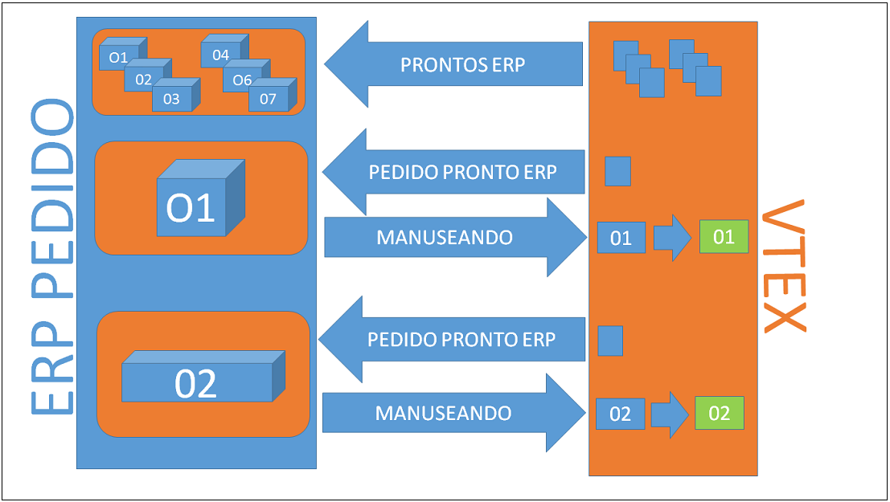
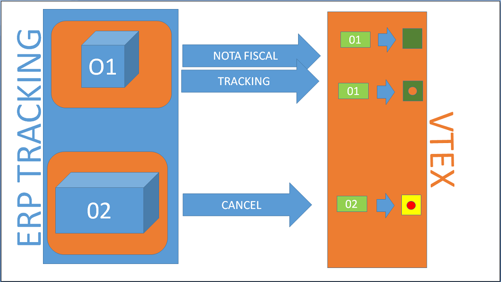

# Order, invoice and Tracking Integration 

This document is intended to assist on the order integration between a store hosted in smartcheckout version of VTEX with the ERP. The flow is to read the ready orders for the ERP on VTEX, insert the orders in the ERP, send the invoice and tracking and/or cancellation order to the store on VTEX.

## Orders

Get the ready orders list for the ERP on VTEX and insert the orders in the ERP, updating the VTEX that the order is already in the ERP.

_Flow:_

### Get the Orders List for status in the API of OMS

Through the API of OMS, get the ready orders list for the ERP paged:

<a title="obter lista de pedidos por status" href="http://bridge.vtexlab.com.br/vtex.bridge.web_deploy/swagger/ui/index.html#!/OMS/OMS_Orders" target="_blank">[Developer] - Example of a call to get an orders list for status</a>

This example returns a list with the summary of each order, where each one must make a call in the REST API of OMS to get the complete order giving the "orderId" of the order.

### Get an order by the identifier in the API of OMS

Through the API of OMS, get an order by the identifier:

<a title="obter pedido por identificador" href="http://bridge.vtexlab.com.br/vtex.bridge.web_deploy/swagger/ui/index.html#!/OMS/OMS_Order_0" target="_blank">[Developer] - EExample of a call to get an order by the identifier.</a> 

### Get Possible Order Payment Transaction Information 

If necessary to get possible date of payment transaction of an order (as an example, billing address), you must access the Payments REST API giving the *TID ("paymentData.transactions.transactionId": "33CD3CC4D11A4FA49A2C9EE20D771F98") of VTEX gateway. 

In the response, in addition of a transaction summary, will be possible to get the URLs of access to the detail transaction.

<a title="obter dados possíveis de pagamento" href="http://bridge.vtexlab.com.br/vtex.bridge.web_deploy/swagger/ui/index.html#!/PCI/PCI_Get" target="_blank">[Developer] -Example of a call to get possible date of payment transaction of an order</a> 

### Order is in the ERP - Preparing Delivery

Once you have the data obtained from the OMS API of VTEX, persists if the order in the ERP and informs if the VTEX that the order is being handled by the ERP. 

<a title="pedido sendo tratado" href="http://bridge.vtexlab.com.br/vtex.bridge.web_deploy/swagger/ui/index.html#!/OMS/OMS_StartHandling" target="_blank">[Developer] - Example of a call to inform OMS that the order is already in the ERP</a> 

## Invoice and Tracking

Once the order in the ERP and order status in VTEX store as preparing delivery, it's the time of invoice and delivery tracking. 

_Flow:_

#### Sending Invoice

After receiving the order, the ERP sends the order's invoice and notifies the VTEX store about it.

Sending invoices can be partial, thus forcing the sender to inform besides the values of the invoice, the items that is being sending in the partial invoice.

<a title="enviando Nota Fiscal para o MOS" href="http://bridge.vtexlab.com.br/vtex.bridge.web_deploy/swagger/ui/index.html#!/OMS/OMS_Order" target="_blank">[Developer] - Ecample of call to send an invoice to OMS</a> 

#### Sending Tracking

Once informed the invoice, it's time of delivery tracking. The ERP or the shipping company can send tracking information of order through the OMS API of VTEX.

<a title="enviando tracking para o OMS" href="http://bridge.vtexlab.com.br/vtex.bridge.web_deploy/swagger/ui/index.html#!/OMS/OMS_Order" target="_blank">[Developer] - Example of call to send Tracking to OMS</a> 

The **Invoice** and **Tracking** can be sent in the same call, it's just to fill all data of DTO (transport object) of POST.

### Requesting Cancellation

The order dropped to the ERP, but for some reason it was canceled. The ERP invokes a  request of cancellation to the OMS API of VTEX store. If the order is still in a state where it can be canceled, it will be canceled. One order will just be canceled if it still doesn't have an Invoice.

<a title="solicitando cancelamento" href="http://bridge.vtexlab.com.br/vtex.bridge.web_deploy/swagger/ui/index.html#!/OMS/OMS_Cancel" target="_blank">[Developer] - Example of a call to cancel an Order in the OMS</a>  

---

autor:_Jonas Bolognim_  
propriedade: _VTEX_  