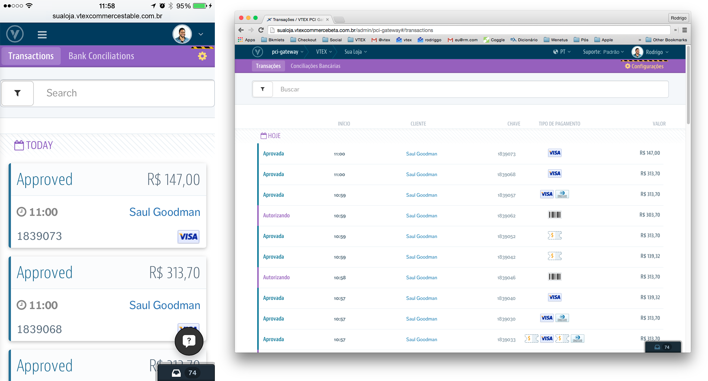

# VTEX PCI Gateway

## Visão Geral

O VTEX PCI Gateway é o módulo responsável por intermediar e gerenciar todas as transações e pagamentos entre a sua loja VTEX, operadoras financeiras e os seus clientes. Nele você faz consultas como status das transações, estornos, cancelamentos, capturas e também configurações como condições para as formas de pagamento.

## Começando a usar

Criado para oferecer a flexibilidade máxima em relação às configurações de pagamento, o VTEX PCI Gateway processa as transações com base em alguns conceitos de negócio. Entenda cada um deles:

1. [Gateway de Pagamento](gateway-de-pagamento/index.html)
2. [Afiliação de Gateway](afiliacao-de-gateway/index.html)
3. [Condições de Pagamento](condicoes-de-pagamento/index.html)
4. [Meio de Pagamento Customizado](meio-de-pagamento-customizado/index.html)
