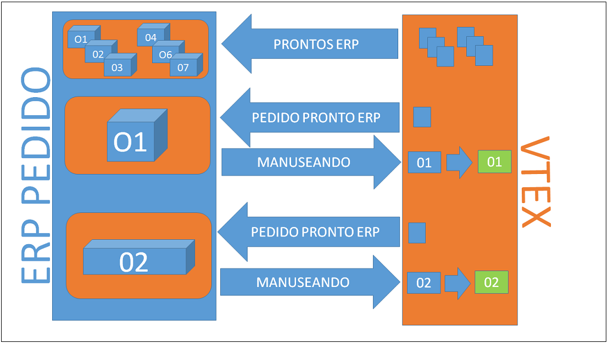
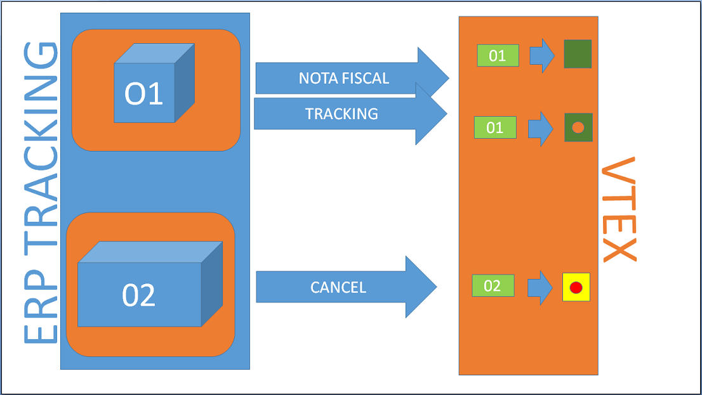

#Integração de Pedido, Nota Fiscal e Tracking

Este documento tem por objetivo auxiliar na integração de pedidos entre uma loja hospedada na versão smartcheckout da VTEX com o ERP. O fluxo consiste em ler os pedidos prontos pro ERP na VTEX, inserir os pedidos no ERP, enviar para a loja na VTEX as informações de nota fiscal e tracking e ou cancelamento de pedido.  

## Pedidos

Obter a lista de pedidos prontos para o ERP na VTEX e inserir os pedidos no ERP, atualizando a VTEX que o pedido já está no ERP.

_Fluxo:_

###Obter a Lista de Pedidos por Status na API do OMS
{: #1 .slug-text}

Através da API do OMS pegar a lista de pedidos prontos para o ERP paginados:

<a title="obter lista de pedidos por status" href="http://bridge.vtexlab.com.br/vtex.bridge.web_deploy/swagger/ui/index.html#!/OMS/OMS_Orders" target="_blank">[Developer] - Exemplo de chamada para obter uma lista de pedidos por status</a>

Esse exemplo retorna uma lista com o resumo de cada pedido, onde para cada pedido, deve se fazer uma chamada na API REST do OMS para pegar o pedido completo passando o "orderId" do pedido.

###Obter um Pedido Pelo Identificador na API do OMS
{: #2 .slug-text}

Através da API do OMS pegar um pedido pelo identificador:

<a title="obter pedido por identificador" href="http://bridge.vtexlab.com.br/vtex.bridge.web_deploy/swagger/ui/index.html#!/OMS/OMS_Order_0" target="_blank">[Developer] - Exemplo de chamada para obter um  pedido pelo identificador.</a> 

###Obter Informações Possíveis de Transação de Pagamento de Pedido
{: #3 .slug-text}

Caso necessário obter dados possíveis de transação de pagamento de um pedido (como endereço de cobrança por exemplo), deve se acessar a API REST de **Payments** passando o *TID ("paymentData.transactions.transactionId": "33CD3CC4D11A4FA49A2C9EE20D771F98") do gateway VTEX.

No retorno, além de um resumo da transação, poderá obter se as URLs de acesso aos detalhes transação.  

<a title="obter dados possiveis de pagamento" href="http://bridge.vtexlab.com.br/vtex.bridge.web_deploy/swagger/ui/index.html#!/PCI/PCI_Get" target="_blank">[Developer] - Exemplo de chamada para obter dados possiveis de transação de pagamento de um pedido</a> 

###Pedido Está no ERP - Preparando Entrega
{: #4 .slug-text}

Uma vez tendo os dados de pedidos obtidas na API do OMS da VTEX, persiste se o pedido
no respectivo ERP e informa se a VTEX que o pedido está sendo tratado pelo ERP.

<a title="pedido sendo tratado" href="http://bridge.vtexlab.com.br/vtex.bridge.web_deploy/swagger/ui/index.html#!/OMS/OMS_StartHandling" target="_blank">[Developer] - Exemplo de chamada para avisar OMS que o pedido já se encontra no ERP</a> 

##Nota Fiscal e Tracking
{: #5 .slug-text}

Uma vez o pedido no ERP e o status do pedido na loja VTEX como preparando entrega, vem a parte da Nota Fiscal e do Rastreamento de Entrega.  

_Fluxo:_

#### Envio de Nota Fiscal

Após receber o pedido, o ERP emite a nota fiscal do pedido e informa a loja VTEX sobre a mesma.

O envio de notas fiscais pode ser parcial, obrigando assim ao enviador informar além dos valores da nota fiscal, os items que está mandando na nota fiscal parcial.  

<a title="enviando Nota Fiscal para o MOS" href="http://bridge.vtexlab.com.br/vtex.bridge.web_deploy/swagger/ui/index.html#!/OMS/OMS_Order" target="_blank">[Developer] - Exemplo de chamada para enviar Nota Fiscal para o OMS</a> 

#### Envio de Tracking

Uma vez informado a Nota Fiscal, vem a parte de rastreamento da entrega.
O ERP ou a transportadora podem enviar informações de rastreamento do pedido através da API do OMS VTEX.

<a title="enviando tracking para o OMS" href="http://bridge.vtexlab.com.br/vtex.bridge.web_deploy/swagger/ui/index.html#!/OMS/OMS_Order" target="_blank">[Developer] - Exemplo de chamada para enviar Tracking de Entrega para o OMS</a> 

A **Nota Fiscal** e o **Tracking** podem ser enviados na mesma chamada, basta preencher todos os dados do DTO (objeto de transporte) do POST.

###Solicitando Cancelamento
{: #6 .slug-text}

O pedido desceu pro ERP, mas por algum motivo foi cancelado. O ERP invoca uma solicitação de cancelamento
para a API do OMS da loja VTEX. Caso o pedido ainda esteja num estado em que se possa cancelar, o mesmo será cancelado.
Um pedido só será cancelado caso ainda não tenha Nota Fiscal.

<a title="solicitando cancelamento" href="http://bridge.vtexlab.com.br/vtex.bridge.web_deploy/swagger/ui/index.html#!/OMS/OMS_Cancel" target="_blank">[Developer] - Exemplo de chamada para solicitar cancelamento no OMS</a>  

---

autor:_Jonas Bolognim_  
propriedade: _VTEX_  