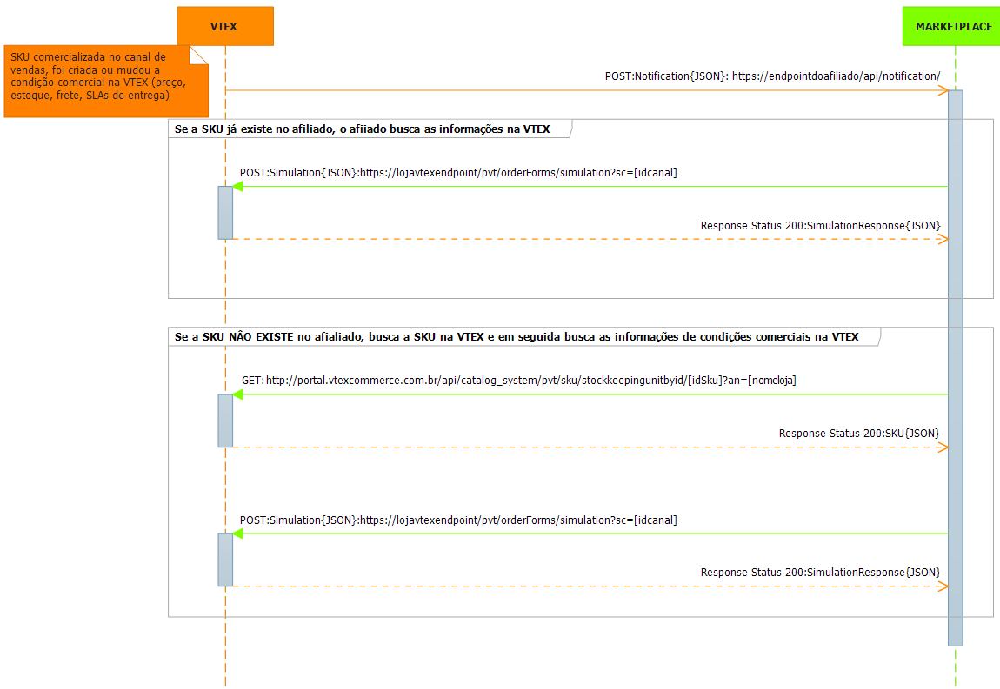

##Marketplace Não VTEX vendendo para Sellers VTEX com Pagamento

Este documento tem por objetivo auxiliar na troca de catalogo, atualização de condição comercial (preço, estoque, frete, SLAs de entrega) de um SKU* entre uma loja hospedada na versão smartcheckout da VTEX e um Marketplace (Afiliado) Não VTEX e também auxiliar na descida de pedido, transação de pagamento e envio de autorização de despacho para o Seller VTEX.

- - -

###Troca de Catalogo de SKU e Atualização de Condição Comercial de SKU
{: #1 .slug-text}

Fluxo de troca de catalogo de SKU e atualização de preço, estoque, frete, SLAs de entrega:
 

###Inserção e Atualização de SKU - Fluxo

* Caso se queira uma condição comercial diferenciada para o Marketplace, na *loja VTEX deverá ser criado um novo canal de vendas, podendo assim criar sortimento e promoções diferenciadas da loja principal.  

* Dentro da loja hospedada na VTEX, será criado um *afiliado, que é o interessado em receber o catálogo e as atualizações de condições comerciais.  

* O afiliado, deverá implementar um endpoint onde receberá informações sobre alterações de condição comercial de SKUs.  

* Na loja VTEX, cada vez que uma SKU comercializado pelo afiliado sofrer uma alteração na condição comercial, ou for reindexado, o endpoint de notificação do afiliado será chamado.  

* Quando o afiliado recebe uma notificação que um SKU mudou a condição comercial, o afiliado deve checar se já comercializa aquela SKU daquela loja que comunicou.  

  * **Caso SIM**: O afiliado consulta a condição comercial na VTEX e se atualiza.

  * **Caso NÃO**: O afiliado busca a SKU na loja, insere no seu catalogo, e depois repete o cenário do "Caso SIM".

###Notificação de Mudança
 

Notifica o Marketplace Não VTEX que houve uma mudança nas condiçoes comerciais (preço, estoque, SLAs de entrega) de uma SKU - Endpoint do Afiliado (Marketplace)

endpoint: **https://endpointdoafiliado/api/notification/**  
verb: **POST**  
Content-Type: **application/json**  
Accept: **application/json**

_request:_  

  
{ 
	"IdSku" : "1634", //id da sku da VTEX
	"An" : "sandboxintegracao", //loja vtex
	"IdAffiliate":"PRT", // id do afilado cadastrado na loja vtex
	"StockModified": true, //mudou estoque?
	"PriceModified": true //mudou preço?
}
  

###Busca de Condições Comerciais
{: #2 .slug-text}  

Acessa a loja VTEX pegando as condições comerciais (preço, estoque, SLAs de entrega) de uma SKU  - Endpoint da Loja VTEX

endpoint: **https://[loja].vtexcommercestable.com.br/api/fulfillment/pvt/orderForms/simulation?sc=[idcanal]&affiliateId=[idafiliado]**  
verb: **POST**  
Content-Type: **application/json**  
Accept: **application/json**  
Parametro: **sc** // sc é o canal de vendas cadastrado no marketplace  
Parametro: **affiliateId** // o id do afiliado cadastrado na loja VTEX 

_request:_  

  
{
    "postalCode":"22251-030",            //obrigatório se country estiver preenchido
    "country":"BRA",                     //obrigatório se postalCode estiver preenchido    
    "items": [                           //obrigatório: deve conter pelo menos um objeto item
        {
            "id":"287611",               //obrigatório, string
            "quantity":1,                //obrigatório-quantidade do item a ser simulada, int
            "seller":"1"                 //loja pricipal usar sempre 1
        },
        {
            "id":"5837",
            "quantity":5,
            "seller":"1"
        }
    ]
}
  

_response:_

  
{
    "items": [                                                     //pode vir um array vazio, caso item indisponivel
        {
			"id": "287611",                                        //obrigatório, string
			"requestIndex": 0,                                     //obrigatório, int - representa a posição desse item no array original (request)
			"price": 7390,                                         //Os dois dígitos menos significativos são os centavos //obrigatório, int
			"listPrice": 7490,                                     //Os dois dígitos menos significativos são os centavos //obrigatório, int
			"quantity": 1,                                         //obrigatório, int
			"seller": "1",                                         //id do seller cadastrado na loja // obrigatório, string,
			"merchantName": "sandboxintegracao",				   //se retornado significa que o pagamento deverá ser enviado, esse campo deverá ser enviado junto com o pedido também
			"priceValidUntil": "2014-03-01T22:58:28.143"           //data, pode ser nulo
			"offerings":[                                           //Array opcional, porém não pode ser nulo: enviar array vazio ou não enviar a propriedade
				{
				    "type":"Garantia",                               //obrigatório, string
				    "id":"5",                                       //obrigatório, string
				    "name":"Garantia de 1 ano",                       //obrigatório, string
				    "price":10000                                   //Os dois dígitos menos significativos são os centavos //obrigatório, int
				},
				{
				    "type":"Embalagem de Presente",
				    "id":"6",
				    "name":"Embalagem de Presente",
				    "price":250                                       
				}
			]
        },
        {
			"id": "5837",
			"requestIndex": 1,
			"price": 890,                                          // Os dois dígitos menos significativos são os centavos
			"listPrice": 990,                                      // Os dois dígitos menos significativos são os centavos
			"quantity": 5,
			"seller": "1",	
			"merchantName": "sandboxintegracao",
			"priceValidUntil": null
        }
    ],
    "logisticsInfo": [                                            //obrigatório (se vier vazio é considerado que o item não está disponível) -  todos os itens devem ter os mesmos SLAs
        {
            "itemIndex": 0,                                       //obrigatório, int - representa os dados de sla do item de resposta (response)
            "stockBalance": 99,                                   //obrigatório  quando o CEP foi passado no request, estoque, int
            "quantity": 1,                                        //obrigatório quando o CEP foi passado no request, qauntidade pasada no request, int
            "shipsTo": [ "BRA", "USA" ],                          //obrigatório, array de string com as siglas dos países de entrega
            "slas": [                                             //obrigatório quando o CEP foi passado no request. Pode ser um array vazio na ausencia do CEP
                {
                    "id": "Expressa",                             //obrigatório, id tipo entrega, string
                    "name": "Entrega Expressa",                   //obrigatório, nome do tipo entrega, string
                    "shippingEstimate": "2bd",                    // bd == "business days" //obrigatório, string
                    "price": 1000                                 // Os dois dígitos menos significativos são os centavos, obrigatório, int
                    "availableDeliveryWindows": [                 //opcional, podendo ser um array vazio
                    ]
                },
                {
                    "id": "Agendada",
                    "name": "Entrega Agendada",
                    "shippingEstimate": "5d",                     // d == "days, bd == "business days"
                    "price": 800,
                    "availableDeliveryWindows": [
                         {
                            "startDateUtc": "2013-02-04T08:00:00+00:00",       //date, obrigatório se for enviado delivery window
                            "endDateUtc": "2013-02-04T13:00:00+00:00",         //date, obrigatório se for enviado delivery window
                            "price": 0        //int, obrigatório se for enviado delivery window - o valor total da entrega agendada é o valor base mais o valor desse campo
                        },
                    ]
                }
            ]
        },
        {
            "itemIndex": 1,
            "stockBalance": 1237,
            "quantity": 5,
            "shipsTo": [ "BRA" ],
            "slas": [ 
                {
                    "id": "Normal",
                    "name": "Entrega Normal",
                    "shippingEstimate": "5bd",                                  // bd == "business days"
                    "price": 200
                }
            ]
        }
    ],
    "country":"BRA",                                           //string, nulo se não enviado
    "postalCode":"22251-030"                                   //string, nulo se não enviado    
}
  

###Busca Informações de uma SKU
{: #3 .slug-text}  

Acessa uma loja VTEX e busca dados de uma SKU - Endpoint da Loja VTEX

endpoint: **http://[loja].vtexcommercestable.com.br/api/catalog_system/pvt/sku/stockkeepingunitbyid/[idsku]**  
verb: **GET**   
Accept: **application/json**  
Parametro: **idSku** identificador do SKU 

_response:_  

 
{
    "Id": 1634, //id da sku
    "ProductId": 1634, //id do produto pai da sku
    "NameComplete": "Primer Lisse Minute Clarins - Base Facial Alisadora 15ml", //nome completo
    "ProductName": "Primer Lisse Minute Clarins - Base Facial Alisadora",
    "ProductDescription": "<strong>Primer Lisse Minute</strong> deixa a pele imediatante alisada e suave ao toque. O primer da <strong>Clarins</strong> atenua as imperfeições e reduz a aparência dos poros. A pele fica linda a pronta para receber a make! Com o rosto limpo aplique o primer com os dedos ou com um pincel. Espalhe bem começando pela zona T (testa, nariz e queixo) em direção aos cantos externos do rosto.",
    "SkuName": "15ml",// nome da SKU
    "IsActive": true, // está ativa?
    "IsTransported": true,
    "IsInventoried": true,
    "IsGiftCardRecharge": false,
    "ImageUrl": "http://epocacosmeticos.vteximg.com.br/arquivos/ids/162097-55-55/primer-lisse-minute-15ml-clarins.jpg",
    "DetailUrl": "/primer-lisse-minute-clarins-base-facial-alisadora/p", //link do produto na loja
    "CSCIdentification": null,
    "BrandId": "2000050",//identificador da marca
	"BrandName": "Clarins", //nome da marca
    "Dimension": {//dimensões
        "cubicweight": 0.2083,
        "height": 10,
        "length": 10,
        "weight": 100,
        "width": 10
    },
    "IsKit": false,
    "KitItems": [],
    "Services": [//serviços
        {
            "Id": 1098,
            "Name": "Embalagem presente",
            "IsFile": false,
            "IsGiftCard": false,
            "IsRequired": false,
            "Options": [
                {
                    "Id": 1098,// identificador do serviço
                    "Name": "Embalagem presente",//nome do serviço
                    "Description": "Embalagem presente",
                    "PriceName": "Embalagem presente",
                    "ListPrice": 1, //preço DE do serviço
                    "Price": 1 //preço POR do serviço
                }
            ],
            "Attachments": []
        }
    ],
    "Categories": [],
    "Attachments": [],
    "Collections": [],
    "SkuSellers": [
        {
            "SkuCommercialOffer": {
                "DeliverySlaSamples": [
                    {
                        "Region": {
                            "Id": "1",
                            "Name": "RJ",
                            "CountryCode": "BRA",
                            "ZipCode": "22080010"
                        },
                        "DeliverySlaPerTypes": [
                            {
                                "TypeName": "Normal",
                                "Price": 9.9,
                                "Time": "00:00:00"
                            }
                        ]
                    }
                ],
                "Price": 174,
                "ListPrice": 174,
                "AvailableQuantity": 22
            },
            "SellerId": "1",
            "StockKeepingUnitId": 1634,
            "SellerStockKeepingUnitId": "1634",
            "IsActive": true,
            "FreightCommissionPercentage": 0,
            "ProductCommissionPercentage": 0
        }
    ],
    "SkuPriceSheet": [],
    "Images": [ //imagens, a primeira é a principal
        {
            "ImageUrl": "http://epocacosmeticos.vteximg.com.br/arquivos/ids/162097/primer-lisse-minute-15ml-clarins.jpg",
            "ImageName": null,
            "FileId": 162097
        }
    ],
    "SkuSpecifications": [ //variações
        {
            "FieldId": 283,
            "FieldName": "Variação",
            "FieldValueIds": [ //identificador da variação
                2688
            ],
            "FieldValues": [ //valor da variação
                "15ml"
            ]
        }
    ],
    "ProductSpecifications": [],
    "ProductClustersIds": "135,149,150,151,152,153,154,155,156,157,158,159,160,161,219,310,358,366,406,407,408,451,473,480,486,525,535,546,549,552,561,569",
    "ProductCategoryIds": "/1000004/1000012/1000040/", //arvore de identificadores de categorias
    "ProductCategories": {
        "1000004": "Maquiagem", //identificador e nome da categoria
        "1000012": "Primer e Finalizador",
        "1000040": "Fixador da Maquiagem"
    },
    "CommercialConditionId": 1,
    "RewardValue": 0,
    "AlternateIds": {
        "Ean": "3380814700219",
        "RefId": "005899"
    },
    "AlternateIdValues": [
        "3380814700219",
        "005899"
    ],
    "EstimatedDateArrival": null,
    "MeasurementUnit": "un",
    "UnitMultiplier": 1,
    "InformationSource": "Indexer",
    "ModalType": null
}
  

- - -

###Simulação de Carrinho e Página de Pagamento
{: #5 .slug-text} 

Este tópico tem por objetivo auxiliar o na simulação de carrinho, e consulta de formas de pagamento e  parcelamentos entre um Marketplace não VTEX com uma loja VTEX.

###No Carrinho e no Pagamento

Quando um produto é inserido no carrinho no Marketplace Não VTEX, ou faz se alguma edição no carrinho, uma consulta de simulaçao de carrinho deverá ser feita na loja VTEX para checar a validade das condiçoes comerciais (preço, estoque, frete e SLAs de entrega). Quando o cliente vai para o pagamento, uma consulta as formas de pagamento, aos parcelmentos e uma outra simulçao de carrinho deverá ser realizada.

_Fluxo de chamadas no carrinho e no pagamento:_    

  

###Simulaçao de Carrinho

Acessa a loja VTEX simulando um carrinho, para checar as condiçoes comerciais e as SLAs de entrega - Endpoint loja VTEX

endpoint: **https://[loja].vtexcommercestable.com.br/api/fulfillment/pvt/orderForms/simulation?sc=[idcanal]&affiliateId=[idafiliado]**  
verb: **POST**  
Content-Type: **application/json**  
Accept: **application/json**  
Parametro: **sc** // sc é o canal de vendas  
Parametro: **affiliateId** // affiliateId é o id do afiliado cadastrado na loja VTEX

_request:_  

 
{
    "postalCode":"22251-030",            //obrigatório se country estiver preenchido, string
    "country":"BRA",                     //obrigatório se postalCode estiver preenchido, string      
    "items": [                           //obrigatório: deve conter pelo menos um objeto item
        {
            "id":"287611",               //obrigatório, string
            "quantity":1,                //obrigatório-quantidade do item a ser simulada, int
            "seller":"seller1"           //sigla do do seller criado no admin // obrigatório, string
        },
        {
            "id":"5837",
            "quantity":5,
            "seller":"seller1"
        }
    ]
}
  

_response:_  

 
{
    "items": [                                                     //pode vir um array vazio
        {
            "id": "287611",                                        //obrigatório, string
            "requestIndex": 0,                                     //obrigatório, int - representa a posição desse item no array original,
            "price": 7390,                                         // Os dois dígitos menos significativos são os centavos //obrigatório, int
            "listPrice": 7490,                                     // Os dois dígitos menos significativos são os centavos //obrigatório, int
            "quantity": 1,                                         //obrigatório, int
            "seller": "1",                                         // Id do seller cadastrado na loja // obrigatório, string,
			"merchantName": "sandboxintegracao",							   // referente ao pagamento, será usado ao enviar o pedido
            "priceValidUntil": "2014-03-01T22:58:28.143"           //data, pode ser nulo
            "offerings":[                                           //Array opcional, porém não pode ser nulo: enviar array vazio ou não enviar a propriedade
                {
                    "type":"Garantia",                               //obrigatório, string
                    "id":"5",                                       //obrigatório, string
                    "name":"Garantia de 1 ano",                       //obrigatório, string
                    "price":10000                                   //Os dois dígitos menos significativos são os centavos //obrigatório, int
                },
                {
                    "type":"Embalagem de Presente",
                    "id":"6",
                    "name":"Embalagem de Presente",
                    "price":250                                       
                }
            ]
        },
        {
            "id": "5837",
            "requestIndex": 1,
            "price": 890,                                          // Os dois dígitos menos significativos são os centavos
            "listPrice": 990,                                      // Os dois dígitos menos significativos são os centavos
            "quantity": 5,
            "seller": "1",
			"merchantName": "sandboxintegracao",							   
            "priceValidUntil": null
        }
    ],
    "logisticsInfo": [                                            //**, obrigatório (se vier vazio é considerado que o item não está disponível) -  todos os itens devem ter os mesmos SLAs
        {
            "itemIndex": 0,                                       //obrigatório, int - representa os dados de sla do item de resposta (response)
            "stockBalance": 99,                                   //obrigatório  quando o CEP foi passado no request, estoque, int
            "quantity": 1,                                        //obrigatório quando o CEP foi passado no request, qauntidade pasada no request, int
            "shipsTo": [ "BRA", "USA" ],                          //obrigatório, array de string com as siglas dos países de entrega
            "slas": [                                             //obrigatório quando o CEP foi passado no request. Pode ser um array vazio
                {
                    "id": "Expressa",                             //obrigatório, id tipo entrega, string
                    "name": "Entrega Expressa",                   //obrigatório, nome do tipo entrega, string
                    "shippingEstimate": "2bd",                    // bd == "business days" //obrigatório, string
                    "price": 1000                                 // Os dois dígitos menos significativos são os centavos, obrigatório, int
                    "availableDeliveryWindows": [                 //opcional, podendo ser um array vazio
                    ]
                },
                {
                    "id": "Agendada",
                    "name": "Entrega Agendada",
                    "shippingEstimate": "5d",                     // d == "days, bd == "business days"
                    "price": 800,
                    "availableDeliveryWindows": [
                         {
                            "startDateUtc": "2013-02-04T08:00:00+00:00",       //date, obrigatório se for enviado delivery window
                            "endDateUtc": "2013-02-04T13:00:00+00:00",         //date, obrigatório se for enviado delivery window
                            "price": 0        //int, obrigatório se for enviado delivery window - o valor total da entrega agendada é o valor base mais o valor desse campo
                        },
                    ]
                }
            ]
        },
        {
            "itemIndex": 1,
            "stockBalance": 1237,
            "quantity": 5,
            "shipsTo": [ "BRA" ],
            "slas": [
                {
                    "id": "Normal",
                    "name": "Entrega Normal",
                    "shippingEstimate": "5bd",                                  // bd == "business days"
                    "price": 200
                }
            ]
        }
    ],
    "country":"BRA",                                           //string, nulo se não enviado
    "postalCode":"22251-030"                                   //string, nulo se não enviado    
}
  

**Caso o CEP e Pais não for enviado, não será retornado informações de SLA de entrega

###Consulta as Formas de Pagamento Disponíveis no Seller
{: #6 .slug-text} 

Acessa a loja VTEX para consultar a formas de pagamento disponíveis - Endpoint loja VTEX

endpoint: **https://[loja].vtexpayments.com.br/api/pvt/merchants/payment-systems**  
verb: **GET**  
Content-Type: **application/json**  
Accept: **application/json**  

_response:_  

 
[
    {
        "id": 6, //identificador da forma de pagamento
        "name": "Boleto Bancário", //nome da forma de pagamento
        "connectorId": 0,
        "requiresDocument": false,
        "implementation": "Vtex.PaymentGateway.BankIssuedInvoice.BankIssuedInvoicePayment",
        "connectorImplementation": "Vtex.PaymentGateway.Connectors.BankIssuedInvoiceBBConnector",
        "groupName": "bankInvoice",
        "isCustom": false,
        "isSelfAuthorized": false,
        "allowInstallments": false,
        "isAvailable": true, // esta disponível?
        "description": null,
        "validator": {
            "regex": null,
            "mask": null,
            "cardCodeMask": null,
            "cardCodeRegex": null,
            "weights": null,
            "useCvv": false,
            "useExpirationDate": false,
            "useCardHolderName": false,
            "useBillingAddress": false,
            "validCardLengths": null
        },
        "dueDate": "2015-01-19T14:49:14.4767186Z"
    },
    {
        "id": 2, //identificador da forma de pagamento
        "name": "Visa", //nome da forma de pagamento
        "connectorId": 0,
        "requiresDocument": true,
        "implementation": "Vtex.PaymentGateway.CreditCard.Visa",
        "connectorImplementation": "Vtex.PaymentGateway.Connectors.AdyenConnector",
        "groupName": "creditCard",
        "isCustom": false,
        "isSelfAuthorized": false,
        "allowInstallments": true, // habilita parcelamento?
        "isAvailable": true, // esta disponível?
        "description": null,
        "validator": {
            "regex": "^4", // regular expression de validação
            "mask": "9999 9999 9999 9999", // mascara de validação
            "cardCodeMask": "999", // mascara do cvv
            "cardCodeRegex": "^[0-9]{3}$", // regilar expression que valida o cvv
            "weights": [2,1,2,1,2,1,2,1,2,1,2,1,2,1,2,1,2,1,2],
            "useCvv": true, //cvv é obrigatório?
            "useExpirationDate": true, //usa data de expiração?
            "useCardHolderName": true, //nome do portador obrigatório?
            "useBillingAddress": true, //usa enderço de cobrança?
            "validCardLengths": null
        },
        "dueDate": "2015-01-17T14:49:14.4767186Z"
    },
    {
        "id": 4,
        "name": "Mastercard",
        "connectorId": 0,
        "requiresDocument": true,
        "implementation": "Vtex.PaymentGateway.CreditCard.Mastercard",
        "connectorImplementation": "Vtex.PaymentGateway.Connectors.AdyenConnector",
        "groupName": "creditCard",
        "isCustom": false,
        "isSelfAuthorized": false,
        "allowInstallments": true,
        "isAvailable": true,
        "description": null,
        "validator": {
            "regex": "^5(1(0(0(0([0-9])|[1-9][0-9])|[1-9][0-9]{0})|[1-9][0-9]{0})|3(0(4(0([0-9]))|[0-3][0-9]{0}))|2[0-9]{0})|^5(3(0(4(2([0-9])|[3-9][0-9])|[5-9][0-9]{0})|[1-9][0-9]{0})|5(9(9(9([0-9])|[0-8][0-9])|[0-8][0-9]{0})|[0-8][0-9]{0})|4[0-9]{0})",
            "mask": "9999 9999 9999 9999",
            "cardCodeMask": "999",
            "cardCodeRegex": "^[0-9]{3}$",
            "weights": [2,1,2,1,2,1,2,1,2,1,2,1,2,1,2,1,2,1,2],
            "useCvv": true,
            "useExpirationDate": true,
            "useCardHolderName": true,
            "useBillingAddress": true,
            "validCardLengths": null
        },
        "dueDate": "2015-01-17T14:49:14.4767186Z"
    }
]
  

###Consulta os Parcelamentos no Seller
{: #7 .slug-text} 

Consulta a loja VTEX para buscar os parcelamentos por forma de pagamento e promoções de SKU - Endpoint loja VTEX

endpoint: **https://[loja].vtexpayments.com.br/api/pvt/installments/options**  
verb: **POST**  
Content-Type: **application/json**  
Accept: **application/json**  

_request:_  

 
{
  "PaymentSystemsIds":[2,4], //ids das formas de pagamento
  "SubtotalAsInt":81200, // valor que se deseja parcelar
  "Items":[ // array de itens que desja parcelar
    {
      	"PriceAsInt":81200, //preço da SKU
     	"Quantity":1, // quantida da SKU que deseja parcelar
     	"Id":2000037, // identificador da SKU
     	"SellerId":"1",
    	"SalesChannel":4
    }
  ]
}
  

_response:_  

 
[
    {
        "paymentSystem": 2, //identificador da forma de pagamento
        "name": "Visa 3 vezes sem juros", //nome do parcelamento
        "groupName": "creditCard",
        "value": 81200, //valor total do parcelamento
        "installments": [
            {
                "count": 3, //numero de parcelas
                "value": 27066, //valor da parcela
                "interestRate": 0, //taxa de juros
                "hasInterestRate": false //tem juros?
            },
            {
                "count": 2,
                "value": 40600,
                "interestRate": 0,
                "hasInterestRate": false
            },
            {
                "count": 1,
                "value": 81200,
                "interestRate": 0,
                "hasInterestRate": false
            }
        ]
    },
    {
        "paymentSystem": 4,
        "name": "Mastercard 3 vezes sem juros",
        "groupName": "creditCard",
        "value": 81200,
        "installments": [
            {
                "count": 3,
                "value": 27066,
                "interestRate": 0,
                "hasInterestRate": false
            },
            {
                "count": 2,
                "value": 40600,
                "interestRate": 0,
                "hasInterestRate": false
            },
            {
                "count": 1,
                "value": 81200,
                "interestRate": 0,
                "hasInterestRate": false
            }
        ]
    }
]
  

- - -

###Enviar Pedido, Enviar Pagamento e Autorizar Despacho
{: #7 .slug-text} 

Este tópico tem por objetivo auxiliar um Marketplace não VTEX enviar um pedido, enviar uma transação de pagamento, e enviar autorização para despacho (proceder com o fulfillment do pedido).

Caso se queira uma condição comercial diferenciada para o Marketplace não VTEX, na loja VTEX deverá ser criado um novo canal de vendas, podendo assim criar promoções diferenciadas (desconto, frete, etc) somente para o canal desejado. Caso não tenha condição comercial diferenciada, deve se usar o canal de vendas da loja principal (sc=1).

_Fluxo de chamadas de descida de pedido, pagamento e autorização para despachar:_    

 

###Enviar Pedido

Quando o pedido é fechado em um Marketplace não VTEX, um POST deve ser feito na loja VTEX, para que essa possa receber a ordem de pedido - Endpoint Loja VTEX

endpoint: **https://[loja].vtexcommercestable.com.br/api/fulfillment/pvt/orders?sc=[idcanal]&affiliateId=[idafiliado]**  
verb: **POST**  
Content-Type: **application/json**  
Accept: **application/json**  
Parametro: **sc** // sc é o canal de vendas cadastrado na VTEX.  
Parametro: **affiliateId** // affiliateId é o id do afiliado cadastrado n loja VTEX

_request:_  

 
{
	"marketplaceOrderId": "959311095", //identificador do pedido no marketplace
	"marketplaceServicesEndpoint": "https://urlmarketplace/", //leia o tópico implementando MarketplaceServicesEndpoint Actions
	"marketplacePaymentValue": 11080, //valor que o marketplace se compromete a pagar para o Seller
	"items": [
	  {
	    "id": "2002495",
	    "quantity": 1,
	    "seller": "1",
	    "commission": 0,
	    "freightCommission": 0,
	    "price": 9990,
	    "bundleItems": [], //serviços. Ex: embalagem pra presente.
	    "itemAttachment": { 
	      "name": null,
	      "content": {}
	    },
	    "attachments": [], //customização do item, Ex:camisa com o numero 10
	    "priceTags": [],
	    "measurementUnit": null, unidade de medida
	    "unitMultiplier": 0, unidade multipladora,Ex: venda por quilo
	    "isGift": false
	  }
	],
	"clientProfileData": {
	  "id": "clientProfileData",
	  "email": "32172239852@gmail.com.br",
	  "firstName": "Jonas",
	  "lastName": "Alves de Oliveira",
	  "documentType": null,
	  "document": "3244239851",
	  "phone": "399271258",
	  "corporateName": null,
	  "tradeName": null,
	  "corporateDocument": null,
	  "stateInscription": null,
	  "corporatePhone": null,
	  "isCorporate": false,
	  "userProfileId": null
	},
	"shippingData": {
	  "id": "shippingData",
	  "address": {
	    "addressType": "Residencial",
	    "receiverName": "Jonas Alves de Oliveira",
	    "addressId": "Casa",
	    "postalCode": "13476103",
	    "city": "Americana",
	    "state": "SP",
	    "country": "BRA",
	    "street": "JOÃO DAMÁZIO GOMES",
	    "number": "311",
	    "neighborhood": "SÃO JOSÉ",
	    "complement": null,
	    "reference": "Bairro Praia Azul / Posto de Saúde 17",
	    "geoCoordinates": []
	  },
	  "logisticsInfo": [
	    {
	      "itemIndex": 0,
	      "selectedSla": "Normal",
	      "lockTTL": "8d",
	      "shippingEstimate": "7d",
	      "price": 1090,
	      "deliveryWindow": null
	    }
	  ]
	},
	"paymentData":{
		"merchantName":"sandboxintegracao" //campo recebido na simulação de carrinho
	},
	"openTextField": null,
	"marketingData": null,
	"paymentData":null
}
  		

_response:_

 	    
{
	"marketplaceOrderId": "959311095",
	"orderId": "123543123", //id do pedido que foi gerado na loja VTEX
	"followUpEmail": "75c70c09dbb3498c9b3bbdee59bf0687@ct.vtex.com.br",
	"items": [
	  {
	    "id": "2002495",
	    "quantity": 1,
	    "seller": "1",
	    "commission": 0,
	    "freightCommission": 0,
	    "price": 9990,
	    "bundleItems": [],
	    "priceTags": [],
	    "measurementUnit": "un",
	    "unitMultiplier": 1,
	    "isGift": false
	  }
	],
	"clientProfileData": {
	  "id": "clientProfileData",
	  "email": "5c77abaea35f4cb6824b9326942c00e5@ct.vtex.com.br",
	  "firstName": "JONAS",
	  "lastName": "ALVES DE OLIVEIRA",
	  "documentType": "cpf",
	  "document": "32133239851",
	  "phone": "1592712979",
	  "corporateName": null,
	  "tradeName": null,
	  "corporateDocument": null,
	  "stateInscription": null,
	  "corporatePhone": null,
	  "isCorporate": false,
	  "userProfileId": null
	},
	"shippingData": {
	  "id": "shippingData",
	  "address": {
	    "addressType": "Residencial",
	    "receiverName": "JONAS ALVES DE OLIVEIRA",
	    "addressId": "Casa",
	    "postalCode": "13476103",
	    "city": "Americana",
	    "state": "SP",
	    "country": "BRA",
	    "street": "JOÃO DAMÁZIO GOMES",
	    "number": "121",
	    "neighborhood": "SÃO JOSÉ",
	    "complement": null,
	    "reference": "Bairro Praia Azul / Posto de Saúde 17",
	    "geoCoordinates": []
	  },
	  "logisticsInfo": [
	    {
	      "itemIndex": 0,
	      "selectedSla": "Normal",
	      "lockTTL": "8d",
	      "shippingEstimate": "5d",
	      "price": 1090,
	      "deliveryWindow": null
	    }
	  ]
	},
	"paymentData":{
		"merchantName":"sandboxintegracao",
		"merchantPaymentReferenceId":"500225" //inteiro, id do pagamento, número que será enviado junto com o pagamento para conciliação.
	}
}
  		

_retorno de erro:_  

 
{
	"error": {
	"code": "1",
	"message": "O verbo 'GET' não é compatível com a rota '/api/fulfillment/pvt/orders'",
	"exception": null
	}
}
  

###Enviar Pagamento - Iniciar Transação, Enviar Dados de Pagamento, Enviar Dados de Anti-Fraude e Autorização de Pagamento

Após enviar o pedido e receber o response com o paymentData.merchantPaymentReferenceId, o processo de transação de pagamento do pedido deverá ser enviado.

###Iniciar Transação
{: #8 .slug-text} 

Inicia uma transação de pagamento usando o paymentData.merchantPaymentReferenceId recebi no retorno de inserção de pedido - Endpoint Loja VTEX

endpoint: **https://[loja].vtexpayments.com.br/api/pvt/transactions**  
verb: **POST**  
Content-Type: **application/json**  
Accept: **application/json**  

_request:_  

 
{
  "value":3190, //valor do pagamento
  "referenceId":"500225", //paymentData.merchantPaymentReferenceId retornado no momento que inseriu o pedido
  "channel":"sandboxintegracao", //nome do gateway de pagamento
  "urn":""
}
 

_response:_  

 
{
    "id": "BB55ED929FF749E6BE5A835E4C811B77",
    "transactionId": "BB55ED929FF749E6BE5A835E4C811B77", // identificador da transação criada
    "referenceKey": "500225",
    "interactions": {
        "href": "/api/pvt/transactions/BB55ED929FF749E6BE5A835E4C811B77/interactions"
    },
    "settlements": {
        "href": "/api/pvt/transactions/BB55ED929FF749E6BE5A835E4C811B77/settlements"
    },
    "payments": {
        "href": "/api/pvt/transactions/BB55ED929FF749E6BE5A835E4C811B77/payments"
    },
    "refunds": {
        "href": "/api/pvt/transactions/BB55ED929FF749E6BE5A835E4C811B77/refunds"
    },
    "timeoutStatus": 0,
    "totalRefunds": 0,
    "status": "Started",
    "value": 3190,
    "receiverUri": "https://sandboxintegracao.vtexpayments.com.br:443/api/pvt/transactions/BB55ED929FF749E6BE5A835E4C811B77/payments/",
    "startDate": "2015-01-26T18:40:31.4040955Z",
    "authorizationToken": null,
    "authorizationDate": null,
    "commitmentToken": null,
    "commitmentDate": null,
    "refundingToken": null,
    "refundingDate": null,
    "cancelationToken": null,
    "cancelationDate": null,
    "fields": [
        {
            "name": "channel",
            "value": "sandboxintegracao"
        }
    ],
    "ipAddress": null,
    "userAgent": null,
    "acceptHeader": null,
    "antifraudTid": null,
    "channel": "sandboxintegracao",
    "urn": null,
    "softDescriptor": null
}
 

###Enviar Dados de Pagamento
{: #9 .slug-text} 

Envia os dados referentes ao pagamento, debaixo da transação iniciada - Endpoint Loja VTEX

endpoint: **https://[loja].vtexpayments.com.br/api/pvt/payments**  
verb: **POST**  
Content-Type: **application/json**  
Accept: **application/json**  

_request:_  

 
{
  "callbackUrl": "",
  "paymentsArray": "[
    {
      \"paymentSystem\": 2, //identificador da forma de pagamento
      \"paymentSystemName\": \"Visa\", //nome da forma de pagamento
      \"groupName\": \"creditCard\", //grupo da forma de pagamento, tipo
      \"currencyCode\": \"BRL\", //código da moeda
      \"installments\": 1, //numero de parcelas
      \"value\": 3190, //caso sem juros: valor total do pedido; caso parcelado com juros: multiplar o valor das parcelas com juros pelo numero de parcelas
      \"installmentsInterestRate\": 0, //juros de parcelamento
      \"installmentsValue\": 3190, //valor da parcela
      \"referenceValue\": 3190, //valor total do pedidos sem juros
      \"fields\": {
        \"document\": \"80417345615\", //documento do cartão
        \"accountId\": \"\",
        \"addressId\": \"\",
        \"cardNumber\": \"4444333322221111\", //numero do cartao, quando cartão
        \"carHolder\": \"JONAS ALVES DE OLIVEIRA\", //nome do cartão, quando cartão
        \"expireDate\": \"0617\", //mes, ano da validade do cartão
        \"cvv2\": \"171\" //codigo de validação do cartão
      },
      \"transaction\": {
        \"id\": \"BB55ED929FF749E6BE5A835E4C811B77\",//identificador da transação
        \"merchantName\": \"sandboxintegracao\",//mercahnname
        \"payments\": null
      }
    }
  ]"
}
 

_response:_  

 
200
 

###Enviar Dados Adicional
{: #10 .slug-text} 

Envia dados adicionais que serão usados pelo sistema de anti-fraude - Endpoint Loja VTEX

endpoint: **https://[loja].vtexpayments.com.br/api/pvt/transactions/[transactionid]/additional-data**  
verb: **POST**  
Content-Type: **application/json**  
Accept: **application/json**  
Parametro: **transactionid** // identificador da transação  Ex: BB55ED929FF749E6BE5A835E4C811B77

_request:_  

 
[
	{
	    "name": "cart",
	    "value": "{\"items\":[
		{
						\"id\":\"122323\",
						\"name\":\"Tenis Adidas Preto I Tenis Adidas Preto I Tenis Adidas Preto I Tenis Adidas Preto I Tenis Adidas Preto I ABCDEFG\",
						\"value\":1075,
						\"quantity\":1,
						\"shippingDiscount\":0,
						\"discount\":50
		}
		],\"freight\":800,
		\"tax\":0
		}"
	}, 
	{
	    "name": "clientProfileData",
	    "value": "{\"email\":\"ellen.silva@vtex.com.br\",\"firstName\":\"Ellen\",\"lastName\":\"Silva\",\"document\":\"02647420955\",\"phone\":\"+551433118100\",\"corporateName\":null,\"tradeName\":null,\"corporateDocument\":null,\"stateInscription\":null,\"postalCode\":\"22011-050\",\"address\":{\"receiverName\":\"Ellen\",\"postalCode\":\"22011050\",\"city\":\"RIO DE JANEIRO\",\"state\":\"RJ\",\"country\":\"BRA\",\"street\":\"RUA  GENERAL AZEVEDO PIMENTEL\",\"number\":\"12345\",\"neighborhood\":\"COPACABANA\",\"complement\":\"APTO 302\",\"reference\":null},\"gender\":null,\"birthDate\":null,\"corporatePhone\":null,\"isCorporate\":false}"
	}, 
	{
	    "name": "shippingData",
	    "value": "{\"receiverName\":\"ELLEN\",\"postalCode\":\"65035430\",\"city\":\"SAO LUIS\",\"state\":\"MA\",\"country\":\"BRA\",\"street\":\"AV NEWTON BELLO \",\"number\":\"777\",\"neighborhood\":\"MONTE CATELO\",\"complement\":\"APTO 302\",\"reference\":null}"
	}
]
 

_response:_  

 

 

###Autorização de Pagamento  
{: #11 .slug-text} 

Envia uma autorização confirmando a autorização do pagamento enviado - Endpoint Loja VTEX

endpoint: **https://[loja].vtexpayments.com.br/api/pvt/transactions/BB55ED929FF749E6BE5A835E4C811B77/authorization-request**  
verb: **POST**  
Content-Type: **application/json**  
Accept: **application/json**  
Parametro: **transactionid** // identificador da transação  

_request:_  

 
{
    "transactionId": "BB55ED929FF749E6BE5A835E4C811B77",
    "softDescriptor": "sandboxintegracao",
    "prepareForRecurrency": false,
    "split": [
        {
            "merchant": "sandboxintegracao",
            "value": 3190,
            "remoteTransactionId": "BB55ED929FF749E6BE5A835E4C811B77"
        }
    ]
}
 

_response:_  

 

 

- - -

###Implementando Marketplace Services Endpoint Actions
{: #12 .slug-text} 

O MarketplaceServicesEndpoint serve para a loja VTEX informar ao canal de vendas a nota fiscal e tracking de pedido. O envio de notas fiscais pode ser parcial, obrigando assim ao informador informar além dos valores da nota fiscal, os items ele está mandando na nota fiscal parcial.

###Informar Nota Fiscal 

Quando a Nota Fiscal for emitida pelo Seller VTEX, está será enviada para o Marketplace no marketplaceServicesEndpoint enviado nos dados de pedido - Endpoint do Marketplace

endpoint: **https://marketplaceServicesEndpoint/pub/orders/[marketplaceorderId]/invoice**  
verb: **POST**  
Content-Type: **application/json**  
Accept: **application/json**  

_request:_   

 
{
	"type": "Output", //Output(venda)|Input(devolução)
	"invoiceNumber": "NFe-00001", //numero da nota fiscal
	"courier": "", //quando é nota fiscal, dados de tracking vem vazio
	"trackingNumber": "", //quando é nota fiscal, dados de tracking vem vazio
	"trackingUrl": "",//quando é nota fiscal, dados de tracking vem vazio
	"items": [ //itens da nota
	  {
	    "id": "345117",
	    "quantity": 1,
	    "price": 9003
	  }
	],
	"issuanceDate": "2013-11-21T00:00:00", //data da nota
	"invoiceValue": 9508 //valor da nota
}
  

_response:_  

 
{
	"date": "2014-02-07T15:22:56.7612218-02:00", //data do recibo
	"orderId": "123543123",
	"receipt": "38e0e47da2934847b489216d208cfd91" //protocolo gerado, pode ser nulo
}
  

###Informar Tracking de Transportadora

Quando o pedido for entegue a uma transportadora, as informaçãoes de tracking serão enviadas para o Marketplace no marketplaceServicesEndpoint enviado nos dados de pedido - Endpoint do Marketplace

endpoint: **https://marketplaceServicesEndpoint/pub/orders/[marketplaceorderId]/invoice**  
verb: **POST**  
Content-Type: **application/json**  
Accept: **application/json**  

_request:_  

 
{
	"type": "Output",
	"invoiceNumber": "NFe-00001",
	"courier": "Correios", //transportadora
	"trackingNumber": "SR000987654321", /tracking number
	"trackingUrl": "http://traking.correios.com.br/sedex/SR000987654321", url de tracking
	"items": [
	  {
	    "id": "345117",
	    "quantity": 1,
	    "price": 9003
	  }
	],
	"issuanceDate": "2013-11-21T00:00:00",
	"invoiceValue": 9508
}
  

_response:_  

 
{
	"date": "2014-02-07T15:22:56.7612218-02:00", //data do recibo
	"orderId": "123543123",
	"receipt": "38e0e47da2934847b489216d208cfd91" //protocolo gerado, pode ser nulo
}
  

###Enviar Solicitação de Cancelamento

Uma solicitação de cancelamento pode ser enviada para o para o Marketplace no marketplaceServicesEndpoint - Endpoint do Marketplace

endpoint: **https://marketplaceServicesEndpoint/pvt/orders/[marketplaceorderId]/cancel**  
verb: **GET**  

**A Nota Fiscal e o Tracking podem ser enviados na mesma chamada, basta prenncher todos os dados do POST.

---
Autor: *Jonas Bolognim*  
Propriedade:*VTEX &copy;*