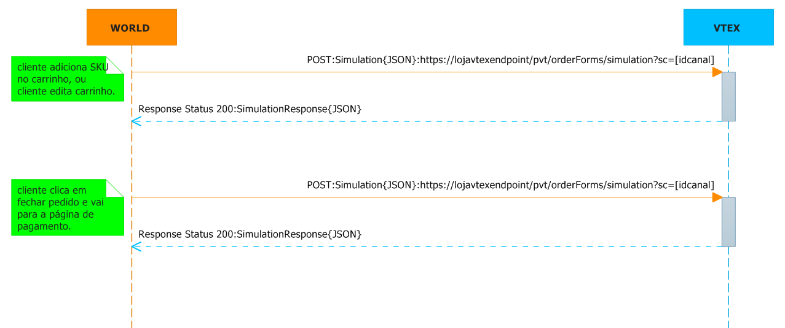

##Marketplace Não VTEX vendendo para Sellers VTEX

Este documento tem por objetivo auxiliar na troca de catalogo, atualização de condição comercial (preço, estoque, frete, SLAs de entrega) de um SKU* entre uma loja hospedada na versão smartcheckout da VTEX e um Marketplace (Afiliado) Não VTEX e também auxiliar na descida de pedido, e envio de autorização de despacho para o Seller VTEX. Neste modelo o pagamento é processado todo do lado do Marketplace.

- - -

###Troca de Catalogo de SKU e Atualização de Condição Comercial de SKU
{: #0 .slug-text}

<a href="http://lab.vtex.com/docs/integracao/guide/marketplace/canal-de-vendas-nao-vtex-com-pgto/index.html#troca-de-catalogo-de-sku-e-atualizao-de-condio-comercial-de-sku" target="_blank">[[Guide] Troca de Catalogo de SKU e Atualização de Condição Comercial de SKU Marketplace Não VTEX e Sellers VTEX]</a>   

- - -

###Simulação de Carrinho
{: #4 .slug-text} 

Este tópico tem por objetivo auxiliar o na simulação de carrinho entre um canal de vendas não VTEX com uma loja  VTEX. Simular um pedido no carrinho e na página de pagamento.

 

###No Carrinho e no Pagamento
Quando um produto é inserido no carrinho no canal de vendas não VTEX, ou faz se alguma edição no carrinho, uma consulta de simulaçao de carrinho é feita na loja VTEX para checar a validade das condiçoes comerciais(preço, estoque, frete e SLAs de entrega). Quando o cliente vai para o pagamento também pode validar o carrinho - Endpoint loja VTEX

endpoint: **https://[loja].vtexcommercestable.com.br/api/fulfillment/pvt/orderForms/simulation?sc=[idcanal]&affiliateId=[iddoafilaido]**  
verb: **POST**  
Content-Type: **application/json**  
Accept: **application/json**  
Parametro: **sc=5** // sc é o canal de vendas  
Parametro: **affiliateId=MGZ** // affiliateId é o id do afialiado cadastrado na loja VTEX

_request:_  

  
{
    "postalCode":"22251-030",            //obrigatório se country estiver preenchido, string
    "country":"BRA",                     //obrigatório se postalCode estiver preenchido, string      
    "items": [                           //obrigatório: deve conter pelo menos um objeto item
        {
            "id":"287611",               //obrigatório, string
            "quantity":1,                //obrigatório-quantidade do item a ser simulada, int
            "seller":"1"           //enviar "1" // obrigatório, string
        },
        {
            "id":"5837",
            "quantity":5,
            "seller":"1"
        }
    ]
}  
 

_response:_  

  
{
    "items": [                                                     //pode vir um array vazio
        {
            "id": "287611",                                        //obrigatório, string
            "requestIndex": 0,                                     //obrigatório, int - representa a posição desse item no array original (request)
            "price": 7390,                                         // Os dois dígitos menos significativos são os centavos //obrigatório, int
            "listPrice": 7490,                                     // Os dois dígitos menos significativos são os centavos //obrigatório, int
            "quantity": 1,                                         //obrigatório, int
            "seller": "1",                                         // Id do seller cadastrado na loja // obrigatório, string,
            "priceValidUntil": "2014-03-01T22:58:28.143"           //data, pode ser nulo
            "offerings":[                                           //Array opcional, porém não pode ser nulo: enviar array vazio ou não enviar a propriedade
                {
                    "type":"Garantia",                               //obrigatório, string
                    "id":"5",                                       //obrigatório, string
                    "name":"Garantia de 1 ano",                       //obrigatório, string
                    "price":10000                                   //Os dois dígitos menos significativos são os centavos //obrigatório, int
                },
                {
                    "type":"Embalagem de Presente",
                    "id":"6",
                    "name":"Embalagem de Presente",
                    "price":250                                       
                }
            ]
        },
        {
            "id": "5837",
            "requestIndex": 1,
            "price": 890,                                          // Os dois dígitos menos significativos são os centavos
            "listPrice": 990,                                      // Os dois dígitos menos significativos são os centavos
            "quantity": 5,
            "seller": "1",	
            "priceValidUntil": null
        }
    ],
    "logisticsInfo": [                                            //obrigatório (se vier vazio é considerado que o item não está disponível) 
        {
            "itemIndex": 0,                                       //obrigatório, int - index do array de item acima
            "stockBalance": 99,                                   //obrigatório, estoque, int
            "quantity": 1,                                        //obrigatório quando o CEP foi passado no request, quantidade pasada no request, int
            "shipsTo": [ "BRA", "USA" ],                          //obrigatório, array de string com as siglas dos países de entrega
            "slas": [                                             //obrigatório quando o CEP foi passado no request. Pode ser um array vazio
                {
                    "id": "Expressa",                             //obrigatório, id tipo entrega, string
                    "name": "Entrega Expressa",                   //obrigatório, nome do tipo entrega, string
                    "shippingEstimate": "2bd",                    // bd == "business days" //obrigatório, string
                    "price": 1000                                 // Os dois dígitos menos significativos são os centavos, obrigatório, int
                    "availableDeliveryWindows": [                 //opcional, podendo ser um array vazio
                    ]
                },
                {
                    "id": "Agendada",
                    "name": "Entrega Agendada",
                    "shippingEstimate": "5d",                     // d == "days, bd == "business days"
                    "price": 800,
                    "availableDeliveryWindows": [ //janelas de entrega pra entrega agendada
                         {
                            "startDateUtc": "2013-02-04T08:00:00+00:00",       //date, obrigatório se for enviado janela de entrega
                            "endDateUtc": "2013-02-04T13:00:00+00:00",         //date, obrigatório se for enviado janela de entrega
                            "price": 0        //int, obrigatório se for enviado delivery window - o valor total da entrega agendada é o valor base mais o valor desse campo
                        },
                    ]
                }
            ]
        },
        {
            "itemIndex": 1,
            "stockBalance": 1237,
            "quantity": 5,
            "shipsTo": [ "BRA" ],
            "slas": [
                {
                    "id": "Normal",
                    "name": "Entrega Normal",
                    "shippingEstimate": "5bd",                                  // bd == "business days"
                    "price": 200
                }
            ]
        }
    ],
    "country":"BRA",                                           //string, nulo se não enviado
    "postalCode":"22251-030"                                   //string, nulo se não enviado    
}  
 

- - -

###Enviar Pedido e Autorizar Despacho  
{: #4 .slug-text}  

Este tópico tem por objetivo auxiliar um canal de vendas não VTEX a enviar um pedido, e enviar autorização para despacho (proceder com o fulfillment do pedido).

Caso se queira uma condição comercial diferenciada para o canal de vendas não VTEX, na loja VTEX deverá ser criado um novo canal de vendas, podendo assim criar promoções diferenciadas (desconto, frete, etc) somente para o canal desejado. Caso não tenha condição comercial diferenciada, deve se usar o canal de vendas da loja principal (sc=1).

*Exemplo do fuxo de chamadas de descida de pedido, e autorização para despachar:*  

 

###Enviar Pedido
Quando o pedido é fechado em um canal de vendas não VTEX, um POST deve ser feito na loja VTEX, para que essa possa receber a ordem de pedido - Endpoint Loja Vtex

endpoint: **https://[loja].vtexcommercestable.com.br/api/fulfillment/pvt/orders?sc=[idcanal]&affiliateId=[idafiliado]**  
verb: **POST**  
Content-Type: **application/json**  
Accept: **application/json**  
Parametro: **sc=5** // sc é o canal de vendas cadastrado na VTEX.  
Parametro: **affiliateId=MGZ** // affiliateId é o id do afiliado cadastrado n loja VTEX

_request:_    

 
[
  {
    "marketplaceOrderId": "959311095",
    "marketplaceServicesEndpoint": "https://urlmarketplace/", //leia o tópico implementando MarketplaceServicesEndpoint Actions
    "marketplacePaymentValue": 11080,
    "items": [
      {
        "id": "2002495",
        "quantity": 1,
        "seller": "1",
        "commission": 0,
        "freightCommission": 0,
        "price": 9990,
        "bundleItems": [], //serviços. Ex: embalagem pra presente.
        "itemAttachment": { 
          "name": null,
          "content": {}
        },
        "attachments": [], //customização do item, Ex:camisa com o numero 10
        "priceTags": [],
        "measurementUnit": null, unidade de medida
        "unitMultiplier": 0, unidade multipladora,Ex: venda por quilo
        "isGift": false
      }
    ],
    "clientProfileData": {
      "id": "clientProfileData",
      "email": "32172239852@gmail.com.br",
      "firstName": "Jonas",
      "lastName": "Alves de Oliveira",
      "documentType": null,
      "document": "3244239851",
      "phone": "399271258",
      "corporateName": null,
      "tradeName": null,
      "corporateDocument": null,
      "stateInscription": null,
      "corporatePhone": null,
      "isCorporate": false,
      "userProfileId": null
    },
    "shippingData": {
      "id": "shippingData",
      "address": {
        "addressType": "Residencial",
        "receiverName": "Jonas Alves de Oliveira",
        "addressId": "Casa",
        "postalCode": "13476103",
        "city": "Americana",
        "state": "SP",
        "country": "BRA",
        "street": "JOÃO DAMÁZIO GOMES",
        "number": "311",
        "neighborhood": "SÃO JOSÉ",
        "complement": null,
        "reference": "Bairro Praia Azul / Posto de Saúde 17",
        "geoCoordinates": []
      },
      "logisticsInfo": [
        {
          "itemIndex": 0,
          "selectedSla": "Normal",
          "lockTTL": "8d",
          "shippingEstimate": "7d",
          "price": 1090,
          "deliveryWindow": null
        }
      ]
    },
    "openTextField": null,
    "marketingData": null,
    "paymentData":null
  }
]  
 

_response:_  

 
[
  {
    "marketplaceOrderId": "959311095",
    "orderId": "123543123", //id do pedido que foi gerado na loja VTEX
    "followUpEmail": "75c70c09dbb3498c9b3bbdee59bf0687@ct.vtex.com.br",
    "items": [
      {
        "id": "2002495",
        "quantity": 1,
        "seller": "1",
        "commission": 0,
        "freightCommission": 0,
        "price": 9990,
        "bundleItems": [],
        "priceTags": [],
        "measurementUnit": "un",
        "unitMultiplier": 1,
        "isGift": false
      }
    ],
    "clientProfileData": {
      "id": "clientProfileData",
      "email": "5c77abaea35f4cb6824b9326942c00e5@ct.vtex.com.br",
      "firstName": "JONAS",
      "lastName": "ALVES DE OLIVEIRA",
      "documentType": "cpf",
      "document": "32133239851",
      "phone": "1592712979",
      "corporateName": null,
      "tradeName": null,
      "corporateDocument": null,
      "stateInscription": null,
      "corporatePhone": null,
      "isCorporate": false,
      "userProfileId": null
    },
    "shippingData": {
      "id": "shippingData",
      "address": {
        "addressType": "Residencial",
        "receiverName": "JONAS ALVES DE OLIVEIRA",
        "addressId": "Casa",
        "postalCode": "13476103",
        "city": "Americana",
        "state": "SP",
        "country": "BRA",
        "street": "JOÃO DAMÁZIO GOMES",
        "number": "121",
        "neighborhood": "SÃO JOSÉ",
        "complement": null,
        "reference": "Bairro Praia Azul / Posto de Saúde 17",
        "geoCoordinates": []
      },
      "logisticsInfo": [
        {
          "itemIndex": 0,
          "selectedSla": "Normal",
          "lockTTL": "8d",
          "shippingEstimate": "5d",
          "price": 1090,
          "deliveryWindow": null
        }
      ]
    },
   "paymentData":null
  }
]
 

_retorno de erro:_

 
{
	"error": {
	"code": "1",
	"message": "O verbo 'GET' não é compatível com a rota '/api/fulfillment/pvt/orders'",
	"exception": null
	}
}  
 

###Enviar Autoriação Para Despachar
Quando o pagamento do pedido é concluído no canal de vendas não VTEX, um POST deverá ser feito na loja VTEX, para que o pedido possa prosseguir para tratamento - Endpoint da VTEX

endpoint: **https://[loja].vtexcommercestable.com.br/api/fulfillment/pvt/orders/[orderid]/fulfill?sc=[idcanal]**  
verb: **POST**  
Content-Type: **application/json**  
Accept: **application/json**  
Parametro: **sc=5** // sc é o canal de vendas cadastrado na VTEX.

_request:_    

 
{
	"marketplaceOrderId": "959311095" //id do pedido originado no canal de vendas
}
 

_response:_  

 
{
	"date": "2014-10-06 18:52:00",
	"marketplaceOrderId": "111",
	"orderId": "123543123",
	"receipt": "e39d05f9-0c54-4469-a626-8bb5cff169f8",
}
 

### Implementando Marketplace Services Endpoint Actions
{: #6 .slug-text}  

O MarketplaceServicesEndpoint serve para a loja VTEX informar ao canal de vendas a nota fiscal e tracking de pedido. O envio de notas fiscais pode ser parcial, obrigando assim ao informador informar além dos valores da nota fiscal, os items ele está mandando na nota fiscal parcial - Endpoint do Marketplace

endpoint: **https://marketplaceServicesEndpoint/pub/orders/[marketplaceorderId]/invoice**  
verb: **POST**  
Content-Type: **application/json**  
Accept: **application/json**  

_request:_    

 
{
    "type": "Output", //hard code
    "invoiceNumber": "NFe-00001", //numero da nota fiscal
    "courier": "", //quando é nota fiscal, dados de tracking vem vazio
    "trackingNumber": "", //quando é nota fiscal, dados de tracking vem vazio
    "trackingUrl": "",//quando é nota fiscal, dados de tracking vem vazio
    "items": [ //itens da nota
      {
        "id": "345117",
        "quantity": 1,
        "price": 9003
      }
    ],
    "issuanceDate": "2013-11-21T00:00:00", //data da nota
    "invoiceValue": 9508 //valor da nota
}

_response:_  

{
	"date": "2014-02-07T15:22:56.7612218-02:00", //data do recibo
	"orderId": "123543123",
	"receipt": "38e0e47da2934847b489216d208cfd91" //protocolo gerado, pode ser nulo
}
 

###Informar Tracking 
Quando o pedido for entregue a transportadora, informções de tracking são enviadas ao Marketplace - Endpoint do Canal de Vendas

endpoint: **https://marketplaceServicesEndpoint/pub/orders/[marketplaceorderId]/invoice**  
verb: **POST**  
Content-Type: **application/json**  
Accept: **application/json**  

_request:_    


{
    "type": "Output",
    "invoiceNumber": "NFe-00001",
    "courier": "Correios", //transportadora
    "trackingNumber": "SR000987654321", /tracking number
    "trackingUrl": "http://traking.correios.com.br/sedex/SR000987654321", url de tracking
    "items": [
      {
        "id": "345117",
        "quantity": 1,
        "price": 9003
      }
    ],
    "issuanceDate": "2013-11-21T00:00:00",
    "invoiceValue": 9508
}
 

_response:_  

  
{
	"date": "2014-02-07T15:22:56.7612218-02:00", //data do recibo
	"orderId": "123543123",
	"receipt": "38e0e47da2934847b489216d208cfd91" //protocolo gerado, pode ser nulo
}
 

###Enviar Solicitação de Cancelamento
Uma solicitação de cancelamento pode ser enviada para o Canal de Vendas não VTEX - Endpoint do Canal de Vendas

endpoint: **https://marketplaceServicesEndpoint/pvt/orders/[marketplaceorderId]/cancel**  
verb: **GET**  

**A Nota Fiscal e o Tracking podem ser enviados na mesma chamada, neste caso serão preenchidos com todos os dados do POST.

- - -

Autor: *Jonas Bolognim*  
Propriedade:*VTEX &copy;*